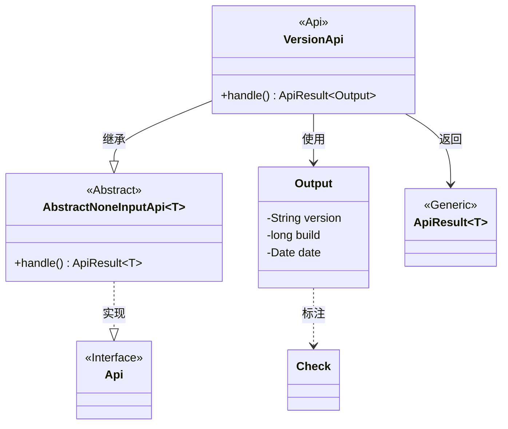
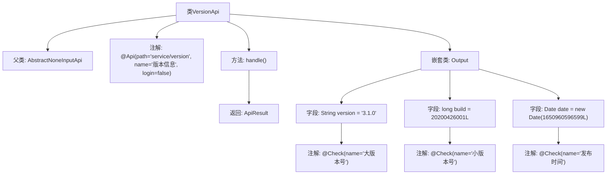

# 基础信息

|      |      |
|------|------|
| 名称 | VersionApi |
| 编码语言 | .java |
| 代码路径 | WeFe/board/board-service/src/main/java/com/welab/wefe/board/service/api/service/VersionApi.java |
| 包名 | com.welab.wefe.board.service.api.service |
| 依赖项 | ['com.welab.wefe.common.exception.StatusCodeWithException', 'com.welab.wefe.common.fieldvalidate.annotation.Check', 'com.welab.wefe.common.web.api.base.AbstractNoneInputApi', 'com.welab.wefe.common.web.api.base.Api', 'com.welab.wefe.common.web.dto.ApiResult', 'java.util.Date'] |
| 概述说明 | Java API类VersionApi提供版本信息，无需登录。输出包含大版本号3.1.0、小版本号20200426001和发布时间。 |

# 说明

该代码定义了一个名为VersionApi的API类，用于获取版本信息。API路径为"service/version"，无需登录即可访问。它继承自AbstractNoneInputApi，返回类型为VersionApi.Output。处理逻辑直接返回一个包含版本信息的Output对象实例。Output类包含三个字段：version表示大版本号，值为"3.1.0"；build表示小版本号，值为20200426001L；date表示发布时间，值为对应时间戳转换的Date对象。所有输出字段都带有Check注解标注的中文名称。

# 类列表 Class Summary

| 名称   | 类型  | 说明 |
|-------|------|-------------|
| VersionApi | class | 这是一个版本信息API类，无需登录，返回大版本号3.1.0、小版本号20200426001和发布时间2022年4月26日。 |

## 类 VersionApi

|      |      |
|------|------|
| 访问范围 | @Api(path = "service/version", name = "版本信息", login = false);public |
| 类型 | class |
| 名称 | VersionApi |
| 说明 | 这是一个版本信息API类，无需登录，返回大版本号3.1.0、小版本号20200426001和发布时间2022年4月26日。 |

### UML类图

类图描述：该图展示了VersionApi类继承自泛型类AbstractNoneInputApi<Output>，并实现了Api接口。VersionApi包含一个handle方法返回ApiResult<Output>，其内部类Output包含三个带Check注解的字段。AbstractNoneInputApi是抽象基类，ApiResult是泛型结果包装类，Api是标注接口。整体结构体现了版本信息API的类层次关系和依赖关系。

### 内部方法调用关系图

这段代码定义了一个VersionApi类，继承自AbstractNoneInputApi<Output>，用于处理版本信息查询请求。类通过@Api注解配置了API路径和名称，handle()方法返回包含版本数据的Output对象。Output嵌套类包含三个带@Check注解的字段：version表示大版本号，build表示小版本号，date表示发布时间，均预设了默认值。该流程图清晰展示了类继承关系、方法调用和字段注解的层级结构。

### 字段列表 Field List

| 名称  | 类型  | 说明 |
|-------|-------|------|

### 方法列表

| 名称  | 类型  | 说明 |
|-------|-------|------|
| handle | ApiResult<Output> | Java方法重写，返回包含空Output对象的成功ApiResult。 |

