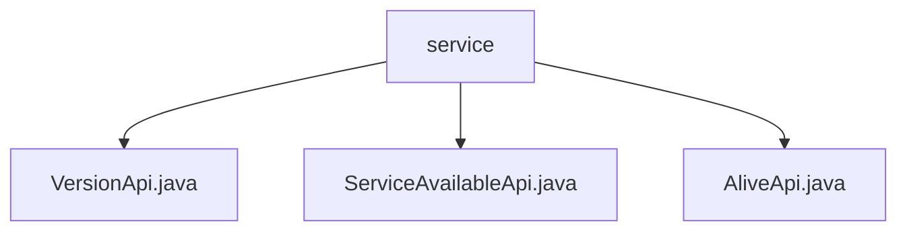

# 基础信息

|      |      |
|------|------|
| 名称 | service |
| 编码语言 | .java |
| 代码路径 | WeFe/board/board-service/src/main/java/com/welab/wefe/board/service/api/service |
| 包名 | docs.board.board-service.src.main.java.com.welab.wefe.board.service.api.service |
| 概述说明 | VersionApi提供版本信息，路径"service/version"，返回版本号、构建号和日期。ServiceAvailableApi检查服务可用性，路径"service/available"，需指定服务类型。AliveApi用于存活检测，路径"service/alive"，直接返回成功状态。 |

# 说明

## 概述  
该模块提供基础服务状态管理功能，包括版本查询、服务可用性检查和存活检测。接口规范遵循RESTful风格，例如VersionApi返回带Check注解的版本信息，ServiceAvailableApi需传入服务类型参数，AliveApi则直接返回存活状态。关键数据结构包含VersionApi.Output（版本号/构建号/日期）和ServiceAvailableCheckOutput（服务检查点）。依赖项包括AbstractApi基类和注解校验框架。例如版本信息输出包含"3.1.0"主版本和20200426001L构建号。

## 主要业务场景  
模块支持三类典型场景：部署时版本校验（类似About页面）、运行时服务监控（类似健康检查面板）和网关层心跳检测。业务流程呈链式结构，例如网关先调AliveApi确认存活，再通过ServiceAvailableApi获取详细状态。交互模式包含无参查询（AliveApi）、带参校验（ServiceAvailableApi）和静态数据返回（VersionApi）。完整功能覆盖服务生命周期的基础观测需求，如通过时间戳和构建号追踪版本迭代。

### 包内部结构视图

该流程图展示了WeFe项目中board-service模块下的API服务文件结构。根节点"service"包含三个直接子节点：VersionApi.java、ServiceAvailableApi.java和AliveApi.java，这三个Java文件都位于同一层级，属于服务API接口实现类。这种扁平化结构表明这些API文件在功能上是并列关系，共同组成服务模块的API层。

# 文件列表

| 名称   | 类型  | 说明 |
|-------|------|-------------|
| [VersionApi.java](VersionApi.md) | file | Java API类VersionApi提供版本信息，无需登录。输出包含大版本号3.1.0、小版本号20200426001和发布时间。 |
| [ServiceAvailableApi.java](ServiceAvailableApi.md) | file | ServiceAvailableApi类用于查询服务可用性，通过ServiceCheckService获取信息，支持网关过滤敏感数据。输入需指定服务类型。 |
| [AliveApi.java](AliveApi.md) | file | 这是一个无需登录的存活检测API类，路径为"service/alive"，继承自AbstractNoneInputApi，返回成功结果。 |

