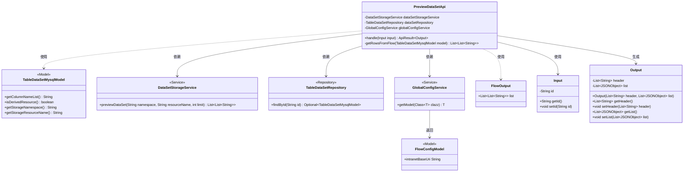

# 基础信息

|      |      |
|------|------|
| 名称 | PreviewDataSetApi |
| 编码语言 | .java |
| 代码路径 | WeFe/board/board-service/src/main/java/com/welab/wefe/board/service/api/storage/PreviewDataSetApi.java |
| 包名 | com.welab.wefe.board.service.api.storage |
| 依赖项 | ['com.alibaba.fastjson.JSONObject', 'com.welab.wefe.board.service.database.entity.data_resource.TableDataSetMysqlModel', 'com.welab.wefe.board.service.database.repository.data_resource.TableDataSetRepository', 'com.welab.wefe.board.service.service.DataSetStorageService', 'com.welab.wefe.board.service.service.globalconfig.GlobalConfigService', 'com.welab.wefe.common.StatusCode', 'com.welab.wefe.common.exception.StatusCodeWithException', 'com.welab.wefe.common.fieldvalidate.annotation.Check', 'com.welab.wefe.common.http.HttpRequest', 'com.welab.wefe.common.http.HttpResponse', 'com.welab.wefe.common.util.StringUtil', 'com.welab.wefe.common.web.api.base.AbstractApi', 'com.welab.wefe.common.web.api.base.Api', 'com.welab.wefe.common.web.dto.AbstractApiInput', 'com.welab.wefe.common.web.dto.ApiResult', 'com.welab.wefe.common.wefe.dto.global_config.FlowConfigModel', 'org.springframework.beans.factory.annotation.Autowired', 'java.util.ArrayList', 'java.util.List'] |
| 概述说明 | 预览数据集的API类，通过ID查询数据集并返回列名和数据行。支持原生和派生数据集，派生数据从流服务获取。输入为数据集ID，输出包含表头和JSON格式的数据列表。 |

# 说明

该代码定义了一个名为PreviewDataSetApi的API类，用于预览存储中的数据集合。API路径为storage/table_data_set/preview。类继承自AbstractApi，处理输入Input和输出Output。主要功能包括：通过ID查找数据集合模型，获取列名和行数据。若非派生资源，直接从存储服务获取数据；若为派生资源，则从流服务获取数据。最终将列名和行数据封装成JSON对象列表返回。输入参数为数据集ID，输出包含表头和行数据列表。

# 类列表 Class Summary

| 名称   | 类型  | 说明 |
|-------|------|-------------|
| PreviewDataSetApi | class | 预览数据集的API类，通过ID查询数据集并返回列名和数据行，支持原生和派生数据源处理。 |

## 类 PreviewDataSetApi

|      |      |
|------|------|
| 访问范围 | @Api(path = "storage/table_data_set/preview", name = "View data sets in storage");public |
| 类型 | class |
| 名称 | PreviewDataSetApi |
| 说明 | 预览数据集的API类，通过ID查询数据集并返回列名和数据行，支持原生和派生数据源处理。 |

### UML类图

这段代码描述了一个数据预览API的实现，主要功能是通过ID查询数据集并返回格式化后的预览数据。核心类PreviewDataSetApi继承自AbstractApi，通过三个服务类(DataSetStorageService/TableDataSetRepository/GlobalConfigService)协作完成数据获取，处理两种数据来源（直接存储或派生资源），最终返回包含表头和行数据的Output对象。流程图展示了各组件间的依赖关系，包括服务调用、模型使用和数据转换过程。

### 内部方法调用关系图

该流程图展示了PreviewDataSetApi类的核心处理逻辑，从依赖注入开始，通过主方法handle处理输入参数，根据数据来源不同选择直接预览或调用流服务获取数据，最终构造JSON格式的结果返回。流程包含数据查询、条件判断、服务调用和结果组装等关键步骤，清晰呈现了类内部各组件间的调用关系和数据流转路径。

### 字段列表 Field List

| 名称  | 类型  | 说明 |
|-------|-------|------|
| dataSetRepository | TableDataSetRepository | 使用@Autowired自动注入TableDataSetRepository实例。 |
| dataSetStorageService | DataSetStorageService | 使用@Autowired自动注入DataSetStorageService实例。 |
| globalConfigService | GlobalConfigService | 代码片段使用@Autowired注解自动注入GlobalConfigService实例。 |

### 方法列表

| 名称  | 类型  | 说明 |
|-------|-------|------|
| handle | ApiResult<Output> | 方法根据输入ID查询数据集，若不存在返回成功。非派生数据从存储服务预览100行，派生数据从流程获取。将数据按列名转为JSON对象列表，返回列名和JSON数据。 |
| getRowsFromFlow | List<List<String>> | 从MySQL模型获取数据行：构建URL请求接口，解析返回的JSON数据为行列表，失败时抛出异常。 |

