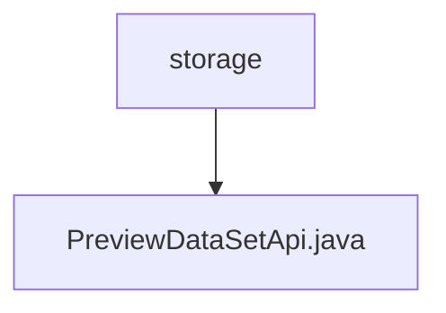

# 基础信息

|      |      |
|------|------|
| 名称 | storage |
| 编码语言 | .java |
| 代码路径 | WeFe/board/board-service/src/main/java/com/welab/wefe/board/service/api/storage |
| 包名 | docs.board.board-service.src.main.java.com.welab.wefe.board.service.api.storage |
| 概述说明 | 预览数据集的API类，通过ID查询数据集并返回列名和数据行。支持原生和派生数据集，派生数据从流服务获取。输入为数据集ID，输出包含表头和JSON格式的数据列表。 |

# 说明

该代码定义了一个名为PreviewDataSetApi的API类，用于预览存储中的数据集合。API路径为storage/table_data_set/preview。类继承自AbstractApi，处理输入Input和输出Output。主要功能包括：通过ID查找数据集合模型，获取列名和行数据。若非派生资源，直接从存储服务获取数据；若为派生资源，则从流服务获取数据。最终将列名和行数据封装成JSON对象列表返回。输入参数为数据集ID，输出包含表头和行数据列表。

### 包内部结构视图

该流程图展示了WeFe项目中board-service模块的存储API路径结构。顶层节点"storage"表示存储API目录，其下包含一个具体的API实现文件"PreviewDataSetApi.java"。这种结构清晰地反映了API接口与其实现文件的层级关系，符合典型的Java项目包结构设计。

# 文件列表

| 名称   | 类型  | 说明 |
|-------|------|-------------|
| [PreviewDataSetApi.java](PreviewDataSetApi.md) | file | 预览数据集的API类，通过ID查询数据集并返回列名和数据行。支持原生和派生数据集，派生数据从流服务获取。输入为数据集ID，输出包含表头和JSON格式的数据列表。 |

