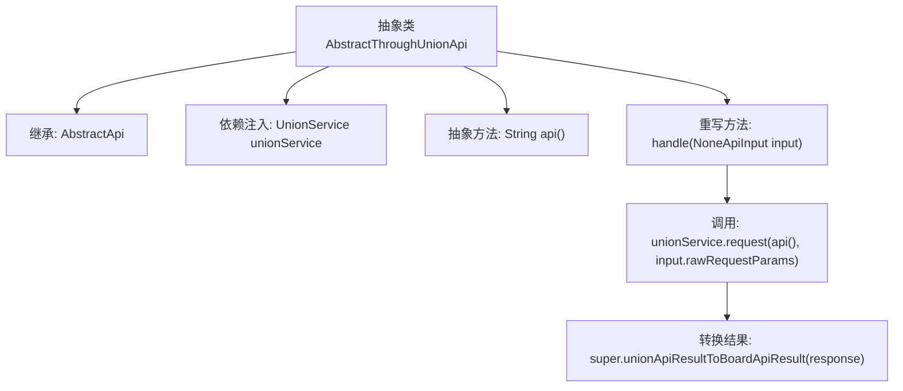

# 基础信息

|      |      |
|------|------|
| 名称 | AbstractThroughUnionApi |
| 编码语言 | .java |
| 代码路径 | WeFe/board/board-service/src/main/java/com/welab/wefe/board/service/api/union/AbstractThroughUnionApi.java |
| 包名 | com.welab.wefe.board.service.api.union |
| 依赖项 | ['com.alibaba.fastjson.JSONObject', 'com.welab.wefe.board.service.sdk.union.UnionService', 'com.welab.wefe.common.exception.StatusCodeWithException', 'com.welab.wefe.common.web.api.base.AbstractApi', 'com.welab.wefe.common.web.dto.ApiResult', 'com.welab.wefe.common.web.dto.NoneApiInput', 'org.springframework.beans.factory.annotation.Autowired'] |
| 概述说明 | 抽象类AbstractThroughUnionApi继承AbstractApi，自动注入UnionService，定义抽象方法api()，处理请求并转换结果。 |

# 说明

这是一个名为AbstractThroughUnionApi的抽象类，继承自AbstractApi类，泛型参数指定输入类型为NoneApiInput，返回类型为Object。类中通过@Autowired自动注入了一个UnionService实例。定义了一个抽象方法api()用于获取API名称。重写了handle方法，使用unionService发起请求并处理返回结果，将响应数据转换为ApiResult格式返回。整个类封装了通过UnionService调用API的基础逻辑，具体API名称由子类实现决定。

# 类列表 Class Summary

| 名称   | 类型  | 说明 |
|-------|------|-------------|
| AbstractThroughUnionApi | class | 抽象类AbstractThroughUnionApi继承AbstractApi，自动注入UnionService，定义抽象方法api()，处理请求并转换结果。 |


## 类 AbstractThroughUnionApi

|      |      |
|------|------|
| 访问范围 | public abstract |
| 类型 | class |
| 名称 | AbstractThroughUnionApi |
| 说明 | 抽象类AbstractThroughUnionApi继承AbstractApi，自动注入UnionService，定义抽象方法api()，处理请求并转换结果。 |


### UML类图

```mermaid
classDiagram
    class AbstractApi~T, R~ {
        <<abstract>>
        +ApiResult~R~ handle(T input) throws StatusCodeWithException
        +ApiResult~R~ unionApiResultToBoardApiResult(JSONObject response)
    }

    class NoneApiInput {
        // 空输入参数类
    }

    class AbstractThroughUnionApi {
        -UnionService unionService
        +String api() {abstract}
        +ApiResult~Object~ handle(NoneApiInput input) throws StatusCodeWithException
    }

    class UnionService {
        +JSONObject request(String api, Map~String, Object~ params)
    }

    AbstractThroughUnionApi --|> AbstractApi~NoneApiInput, Object~ : 继承
    AbstractThroughUnionApi --> UnionService : 依赖
```

这段代码展示了一个抽象类`AbstractThroughUnionApi`的类图结构，该类继承自泛型类`AbstractApi`并指定了`NoneApiInput`和`Object`作为类型参数。该类通过`UnionService`发起API请求，并将结果转换为统一的API响应格式。图中清晰体现了抽象类的继承关系、依赖注入的服务类以及方法调用流程，展示了处理无输入参数API请求的典型设计模式。


### 内部方法调用关系图



该流程图展示了抽象类AbstractThroughUnionApi的结构和关键方法调用关系。该类继承自泛型抽象类AbstractApi，包含UnionService依赖注入和抽象方法api()定义。核心逻辑在重写的handle方法中：先调用unionService.request获取响应，再通过父类方法转换结果类型。箭头清晰体现了从方法调用到结果返回的完整处理流程。

### 字段列表 Field List

| 名称  | 类型  | 说明 |
|-------|-------|------|
| unionService | UnionService | 自动注入UnionService实例。 |

### 方法列表

| 名称  | 类型  | 说明 |
|-------|-------|------|
| api | String | 抽象方法声明，返回字符串类型，用于API调用。 |
| handle | ApiResult<Object> | 处理API请求，调用unionService并转换结果返回。 |


