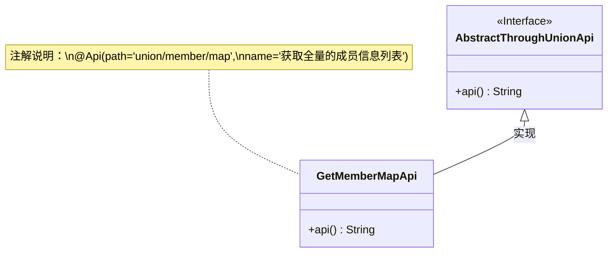
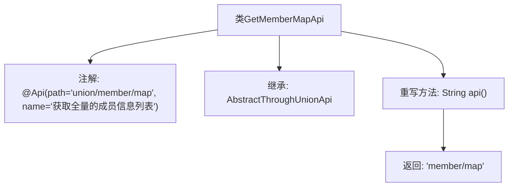

# 基础信息

|      |      |
|------|------|
| 名称 | GetMemberMapApi |
| 编码语言 | .java |
| 代码路径 | WeFe/board/board-service/src/main/java/com/welab/wefe/board/service/api/union/GetMemberMapApi.java |
| 包名 | com.welab.wefe.board.service.api.union |
| 依赖项 | ['com.welab.wefe.common.web.api.base.Api'] |
| 概述说明 | 获取全量成员信息列表的API类，继承自AbstractThroughUnionApi，路径为union/member/map。 |

# 说明

这是一个名为GetMemberMapApi的API类，用于获取全量成员信息列表。它继承自AbstractThroughUnionApi基类，通过@Api注解定义了路径为"union/member/map"和名称为"获取全量的成员信息列表"。该类重写了api()方法，返回具体的API端点路径"member/map"。整个类结构简洁，专注于提供成员信息列表的获取功能。

# 类列表 Class Summary

| 名称   | 类型  | 说明 |
|-------|------|-------------|
| GetMemberMapApi | class | 获取全量成员信息列表的API类，继承自AbstractThroughUnionApi，路径为union/member/map。 |

## 类 GetMemberMapApi

|      |      |
|------|------|
| 访问范围 | @Api(path = "union/member/map", name = "获取全量的成员信息列表");public |
| 类型 | class |
| 名称 | GetMemberMapApi |
| 说明 | 获取全量成员信息列表的API类，继承自AbstractThroughUnionApi，路径为union/member/map。 |

### UML类图

这段代码展示了一个继承关系，其中GetMemberMapApi类继承自AbstractThroughUnionApi抽象类（标记为接口），并实现了api()方法。类上使用了@Api注解，标注了API路径和功能描述。该设计模式是典型的模板方法模式实现，子类通过重写api()方法来提供具体实现，而父类可能包含其他通用逻辑。注解信息通过note附加在类上，清晰地表明了该API的用途和访问路径。

### 内部方法调用关系图

这段代码展示了一个继承自AbstractThroughUnionApi的GetMemberMapApi类，通过@Api注解定义了API路径和名称。类中重写了api()方法，返回特定的字符串路径'member/map'。流程图清晰地呈现了类的注解、继承关系和核心方法调用，层级结构简洁明了，便于理解该API类的核心功能实现方式。

### 字段列表 Field List

| 名称  | 类型  | 说明 |
|-------|-------|------|

### 方法列表

| 名称  | 类型  | 说明 |
|-------|-------|------|
| api | String | 重写api方法，返回字符串"member/map"。 |

