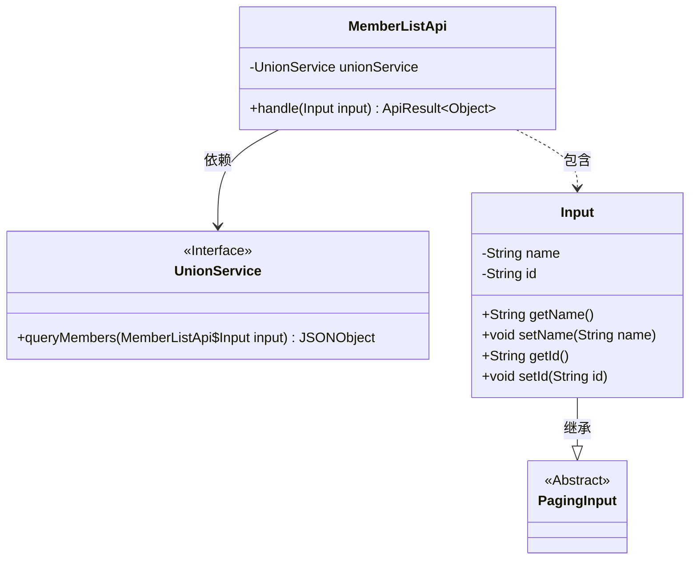

# 基础信息

|      |      |
|------|------|
| 名称 | MemberListApi |
| 编码语言 | .java |
| 代码路径 | WeFe/board/board-service/src/main/java/com/welab/wefe/board/service/api/union/MemberListApi.java |
| 包名 | com.welab.wefe.board.service.api.union |
| 依赖项 | ['com.alibaba.fastjson.JSONObject', 'com.welab.wefe.board.service.dto.base.PagingInput', 'com.welab.wefe.board.service.sdk.union.UnionService', 'com.welab.wefe.common.exception.StatusCodeWithException', 'com.welab.wefe.common.fieldvalidate.annotation.Check', 'com.welab.wefe.common.web.api.base.AbstractApi', 'com.welab.wefe.common.web.api.base.Api', 'com.welab.wefe.common.web.dto.ApiResult', 'org.springframework.beans.factory.annotation.Autowired'] |
| 概述说明 | MemberListApi类用于查询联盟成员，继承AbstractApi，接收名称和ID参数，调用UnionService返回结果。输入类Input包含分页参数和成员名称、ID字段。 |

# 说明

该代码定义了一个名为MemberListApi的API类，用于查询联盟成员。API路径为union/member/query，继承自AbstractApi基类，处理输入类型为Input，返回Object类型。通过注入的UnionService调用queryMembers方法获取结果，并将结果转换为ApiResult格式返回。Input类继承自PagingInput，包含两个可校验字段：name（成员名称）和id（成员ID），并提供了相应的getter和setter方法。

# 类列表 Class Summary

| 名称   | 类型  | 说明 |
|-------|------|-------------|
| MemberListApi | class | MemberListApi类通过UnionService查询成员，支持分页和按名称或ID筛选，返回JSON结果。输入参数包括name和id。 |

## 类 MemberListApi

|      |      |
|------|------|
| 访问范围 | @Api(path = "union/member/query", name = "Query members from union");public |
| 类型 | class |
| 名称 | MemberListApi |
| 说明 | MemberListApi类通过UnionService查询成员，支持分页和按名称或ID筛选，返回JSON结果。输入参数包括name和id。 |

### UML类图

类图描述：
该图展示了MemberListApi类结构及其关联关系。MemberListApi继承自AbstractApi，包含一个UnionService接口依赖用于查询成员数据，以及一个嵌套的Input静态类（继承自PagingInput）。Input类包含name/id字段及对应getter/setter，用于接收分页查询参数。MemberListApi通过handle方法处理输入并返回API结果，核心业务逻辑委托给UnionService实现。

### 内部方法调用关系图

```mermaid
graph TD
    A["类MemberListApi"]
    B["注解: @Api(path='union/member/query', name='Query members from union')"]
    C["继承: AbstractApi<Input, Object>"]
    D["依赖注入: @Autowired UnionService unionService"]
    E["重写方法: handle(Input input)"]
    F["内部类: Input"]
    G["父类: PagingInput"]
    H["属性: @Check String name"]
    I["属性: @Check String id"]
    J["getter/setter方法"]
    K["调用: unionService.queryMembers(input)"]
    L["转换结果: unionApiResultToBoardApiResult(result)"]

    A --> B
    A --> C
    A --> D
    A --> E
    A --> F
    F --> G
    F --> H
    F --> I
    F --> J
    E --> K
    E --> L
```

这段代码展示了一个基于Spring框架的API类MemberListApi，用于查询联盟成员列表。该类继承自AbstractApi并实现了handle方法，通过注入的UnionService执行实际查询操作。内部类Input继承PagingInput，包含两个带校验注解的查询参数name和id。流程图清晰呈现了类结构、依赖关系和方法调用链，特别是展示了从请求处理到服务调用的完整流程，以及参数校验和结果转换的关键步骤。

### 字段列表 Field List

| 名称  | 类型  | 说明 |
|-------|-------|------|
| unionService | UnionService | 使用@Autowired自动注入UnionService实例。 |

### 方法列表

| 名称  | 类型  | 说明 |
|-------|-------|------|
| handle | ApiResult<Object> | 该方法重写父类逻辑，调用unionService查询成员数据，并将结果转换为指定格式返回。处理过程可能抛出StatusCodeWithException异常。 |

