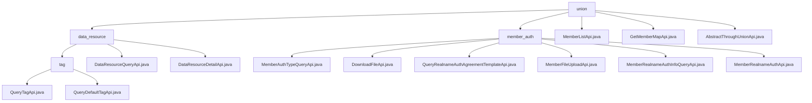

# 基础信息

|      |      |
|------|------|
| 名称 | union |
| 编码语言 | .java |
| 代码路径 | WeFe/board/board-service/src/main/java/com/welab/wefe/board/service/api/union |
| 包名 | docs.board.board-service.src.main.java.com.welab.wefe.board.service.api.union |
| 概述说明 | 数据资源管理模块提供标签查询、资源检索和详情服务，采用统一接口规范。成员认证模块处理认证流程，包括文件上传和实名认证。MemberListApi查询联盟成员，GetMemberMapApi获取成员列表。AbstractThroughUnionApi是基础抽象类，封装API调用逻辑。 |

# 说明

## 概述  
该模块核心职责是提供联盟数据资源管理和成员认证服务，采用分层API设计模式。数据资源管理包含标签查询、资源检索和详情获取三类服务，例如QueryTagApi返回动态/默认标签；成员认证涵盖类型查询、文件操作和实名认证，例如MemberRealnameAuthApi处理CSR生成。关键数据结构包括资源ID/类型、extra_data扩展字段及认证相关的Input类（如包含文件ID、主体名称）。外部依赖包括AbstractApi/AbstractThroughUnionApi基类、UnionService、CertOperationService和RestTemplate。实现案例可见DataResourceDetailApi返回JSONObject，MemberFileUploadApi实现安全文件上传。

## 主要业务场景  
模块支撑联盟数据治理和成员认证全流程。数据资源管理采用类似RESTful的交互模式，典型场景包括标签预加载（QueryTagApi）和资源详情展示（DataResourceDetailApi校验ID/类型）。成员认证流程类似工作流引擎：先查询类型（MemberAuthTypeQueryApi），再上传文件（例如RSA签名保障安全）并提交认证（MemberRealnameAuthApi）。API类型涵盖复合查询（如GetMemberMapApi）和文件操作（DownloadFileApi），集成案例见于联合学习数据管理模块，功能对标数据中台的元数据服务。

### 包内部结构视图

该流程图展示了WeFe项目中union模块的API层级结构，包含data_resource和member_auth两个主要子模块。data_resource下又分为tag子模块和两个独立API文件，而member_auth包含6个具体的API实现文件。顶层union模块还直接包含3个独立API文件，整体结构清晰展现了各API的从属关系。

# 文件列表

| 名称   | 类型  | 说明 |
|-------|------|-------------|
| [MemberListApi.java](MemberListApi.md) | file | MemberListApi类用于查询联盟成员，继承AbstractApi，接收名称和ID参数，调用UnionService返回结果。输入类Input包含分页参数和成员名称、ID字段。 |
| [GetMemberMapApi.java](GetMemberMapApi.md) | file | 获取全量成员信息列表的API类，继承自AbstractThroughUnionApi，路径为union/member/map。 |
| [AbstractThroughUnionApi.java](AbstractThroughUnionApi.md) | file | 抽象类AbstractThroughUnionApi继承AbstractApi，自动注入UnionService，定义抽象方法api()，处理请求并转换结果。 |
| [member_auth](member_auth/_module.md) | package | MemberAuthTypeQueryApi查询成员认证类型。DownloadFileApi处理文件下载。QueryRealnameAuthAgreementTemplateApi查询实名认证模板。MemberFileUploadApi处理文件上传。MemberRealnameAuthInfoQueryApi查询实名认证信息。MemberRealnameAuthApi处理实名认证请求。 |
| [data_resource](data_resource/_module.md) | package | 该模块提供数据资源标签查询功能，含自定义和默认标签接口，路径如`union/data_resource/tags/query`，依赖基类AbstractThroughUnionApi，支持数据分类检索和标签预加载场景。 |

