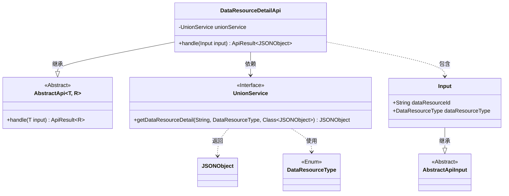

# 基础信息

|      |      |
|------|------|
| 名称 | DataResourceDetailApi |
| 编码语言 | .java |
| 代码路径 | WeFe/board/board-service/src/main/java/com/welab/wefe/board/service/api/union/data_resource/DataResourceDetailApi.java |
| 包名 | com.welab.wefe.board.service.api.union.data_resource |
| 依赖项 | ['com.alibaba.fastjson.JSONObject', 'com.welab.wefe.board.service.sdk.union.UnionService', 'com.welab.wefe.common.exception.StatusCodeWithException', 'com.welab.wefe.common.fieldvalidate.annotation.Check', 'com.welab.wefe.common.web.api.base.AbstractApi', 'com.welab.wefe.common.web.api.base.Api', 'com.welab.wefe.common.web.dto.AbstractApiInput', 'com.welab.wefe.common.web.dto.ApiResult', 'com.welab.wefe.common.wefe.enums.DataResourceType', 'org.springframework.beans.factory.annotation.Autowired', 'java.io.IOException'] |
| 概述说明 | 数据资源详情API，通过资源ID和类型查询详情，返回JSON格式结果。输入需包含资源ID和类型。 |

# 说明

该代码定义了一个名为DataResourceDetailApi的API类，继承自AbstractApi，用于处理数据资源详情请求。API路径为union/data_resource/detail，接受Input类作为输入参数，返回JSONObject类型结果。Input类包含两个必填字段：dataResourceId（资源ID）和dataResourceType（资源类型）。核心逻辑通过unionService的getDataResourceDetail方法获取资源详情，并返回成功结果。整个API实现了资源详情的查询功能。

# 类列表 Class Summary

| 名称   | 类型  | 说明 |
|-------|------|-------------|
| DataResourceDetailApi | class | DataResourceDetailApi接口通过UnionService获取数据资源详情，需传入资源ID和类型，返回JSONObject结果。 |

## 类 DataResourceDetailApi

|      |      |
|------|------|
| 访问范围 | @Api(path = "union/data_resource/detail", name = "");public |
| 类型 | class |
| 名称 | DataResourceDetailApi |
| 说明 | DataResourceDetailApi接口通过UnionService获取数据资源详情，需传入资源ID和类型，返回JSONObject结果。 |

### UML类图

这段代码展示了一个数据资源详情API的实现结构。DataResourceDetailApi继承自泛型抽象类AbstractApi，处理Input输入并返回JSONObject结果。它依赖UnionService接口获取数据详情，其中Input是嵌套静态类，继承自AbstractApiInput并包含两个带校验注解的字段。UnionService接口定义了获取数据资源详情的方法，涉及DataResourceType枚举和JSONObject类。整体设计体现了清晰的层次结构和依赖关系，符合API服务的典型模式。

### 内部方法调用关系图

```mermaid
graph TD
    A["类DataResourceDetailApi"]
    B["继承: AbstractApi<Input, JSONObject>"]
    C["注解: @Api(path='union/data_resource/detail', name='')"]
    D["依赖注入: @Autowired UnionService unionService"]
    E["重写方法: handle(Input input)"]
    F["内部类: Input extends AbstractApiInput"]
    G["属性: @Check String dataResourceId"]
    H["属性: @Check DataResourceType dataResourceType"]
    I["方法调用: unionService.getDataResourceDetail()"]
    J["返回结果: success(output)"]

    A --> B
    A --> C
    A --> D
    A --> E
    E --> I
    I --> J
    A --> F
    F --> G
    F --> H
```

这段代码定义了一个名为DataResourceDetailApi的API类，继承自AbstractApi并处理数据资源详情查询。类中包含一个通过@Autowired注入的UnionService，重写了handle方法调用服务层获取详情数据。内部类Input定义了必需的请求参数dataResourceId和dataResourceType，并带有参数校验注解。流程图展示了从API入口到服务调用的完整处理流程，包括类结构、依赖关系和主要方法调用路径。

### 字段列表 Field List

| 名称  | 类型  | 说明 |
|-------|-------|------|
| unionService | UnionService | 使用@Autowired自动注入UnionService实例。 |

### 方法列表

| 名称  | 类型  | 说明 |
|-------|-------|------|
| handle | ApiResult<JSONObject> | 该方法处理输入，调用服务获取数据资源详情，返回成功结果。 |

