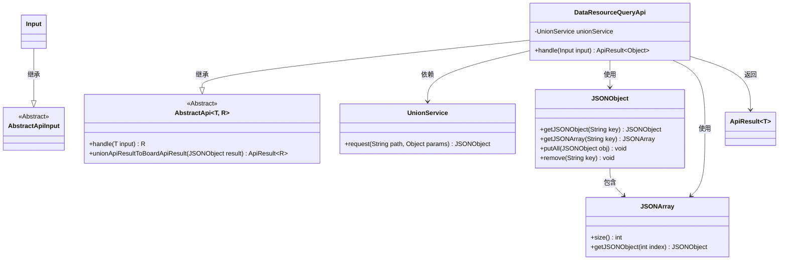

# 基础信息

|      |      |
|------|------|
| 名称 | DataResourceQueryApi |
| 编码语言 | .java |
| 代码路径 | WeFe/board/board-service/src/main/java/com/welab/wefe/board/service/api/union/data_resource/DataResourceQueryApi.java |
| 包名 | com.welab.wefe.board.service.api.union.data_resource |
| 依赖项 | ['com.alibaba.fastjson.JSONArray', 'com.alibaba.fastjson.JSONObject', 'com.welab.wefe.board.service.sdk.union.UnionService', 'com.welab.wefe.common.exception.StatusCodeWithException', 'com.welab.wefe.common.web.api.base.AbstractApi', 'com.welab.wefe.common.web.api.base.Api', 'com.welab.wefe.common.web.dto.AbstractApiInput', 'com.welab.wefe.common.web.dto.ApiResult', 'org.springframework.beans.factory.annotation.Autowired', 'java.io.IOException'] |
| 概述说明 | DataResourceQueryApi类通过unionService查询数据资源，处理返回结果中的extra_data字段，并将其合并到主数据中。 |

# 说明

该代码定义了一个名为DataResourceQueryApi的API类，用于从联合服务查询数据资源。它继承自AbstractApi，接受Input参数并返回Object类型结果。通过注入的UnionService发起请求，路径为data_resource/query。处理响应时，检查并合并extra_data字段到主数据项中，最后将结果转换为统一的API响应格式。Input类继承自AbstractApiInput，未定义额外字段。

# 类列表 Class Summary

| 名称   | 类型  | 说明 |
|-------|------|-------------|
| DataResourceQueryApi | class | DataResourceQueryApi类通过UnionService查询数据资源，处理返回结果中的extra_data字段，并将其合并到主数据中。 |

## 类 DataResourceQueryApi

|      |      |
|------|------|
| 访问范围 | @Api(path = "union/data_resource/query", name = "query data resource from union service");public |
| 类型 | class |
| 名称 | DataResourceQueryApi |
| 说明 | DataResourceQueryApi类通过UnionService查询数据资源，处理返回结果中的extra_data字段，并将其合并到主数据中。 |

### UML类图

类图描述：
该图展示了DataResourceQueryApi及其相关类的结构关系。DataResourceQueryApi继承自泛型类AbstractApi<Input, Object>，包含UnionService依赖用于数据请求，并处理返回的JSON数据结构。Input类继承自AbstractApiInput，作为API的输入参数。JSONObject和JSONArray类用于处理JSON数据，ApiResult封装返回结果。整体展示了从请求处理到结果返回的完整流程。

### 内部方法调用关系图

```mermaid
graph TD
    A["类DataResourceQueryApi"]
    B["注解: @Api"]
    C["继承: AbstractApi<Input, Object>"]
    D["依赖注入: UnionService unionService"]
    E["重写方法: handle(Input input)"]
    F["调用: unionService.request"]
    G["处理JSON结果: getJSONObject('data')"]
    H["遍历list数组"]
    I["合并extra_data字段"]
    J["返回: unionApiResultToBoardApiResult"]

    A --> B
    A --> C
    A --> D
    A --> E
    E --> F
    F --> G
    G --> H
    H --> I
    I --> J
```

这段代码是一个API处理类，用于查询联合服务的数据资源。主要流程包括：通过UnionService发起请求，处理返回的JSON数据（提取data对象，遍历list数组，合并extra_data字段），最后将结果转换为标准API格式返回。代码通过继承抽象类实现核心逻辑，并使用了Spring的依赖注入来获取服务实例。

### 字段列表 Field List

| 名称  | 类型  | 说明 |
|-------|-------|------|
| unionService | UnionService | 自动注入UnionService实例。 |

### 方法列表

| 名称  | 类型  | 说明 |
|-------|-------|------|
| handle | ApiResult<Object> | 该方法处理输入请求，调用unionService获取数据资源查询结果，检查并合并extra_data字段到主数据，最后转换并返回API结果。 |

