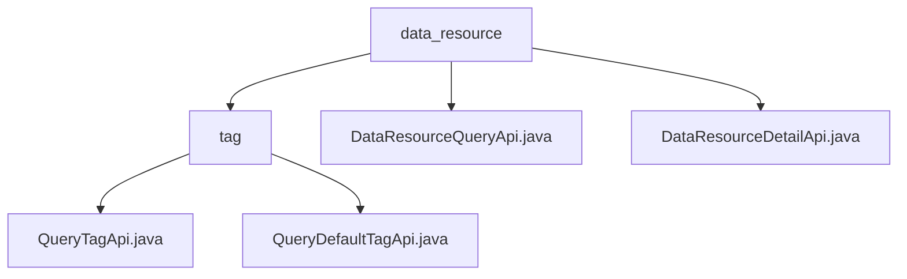

# 基础信息

|      |      |
|------|------|
| 名称 | data_resource |
| 编码语言 | .java |
| 代码路径 | WeFe/board/board-service/src/main/java/com/welab/wefe/board/service/api/union/data_resource |
| 包名 | docs.board.board-service.src.main.java.com.welab.wefe.board.service.api.union.data_resource |
| 概述说明 | 该模块提供数据资源标签查询功能，含自定义和默认标签接口，路径如`union/data_resource/tags/query`，依赖基类AbstractThroughUnionApi，支持数据分类检索和标签预加载场景。 |

# 说明

## 概述  
该模块核心职责是实现数据资源管理功能，包含标签查询、资源检索和详情获取三类服务。接口规范采用统一继承模式，如QueryTagApi继承AbstractThroughUnionApi，DataResourceQueryApi继承AbstractApi，均通过路径常量定义访问端点，例如`data_resource/query`和`union/data_resource/detail`。关键数据结构包括资源ID、类型及extra_data扩展字段。外部依赖涉及AbstractThroughUnionApi、AbstractApi基类和UnionService。实现案例包括标签查询返回动态/默认标签，资源详情API返回JSONObject格式数据。

## 主要业务场景  
模块支撑数据资源全生命周期管理，采用类似RESTful的查询交互模式。完整功能涵盖标签筛选（例如用户检索调用QueryTagApi）、资源检索（如DataResourceQueryApi合并extra_data字段）和详情查看（如DataResourceDetailApi校验资源ID/类型）。典型应用包括数据治理平台的资源分类、标签预加载和详情展示。API类型属于复合型查询接口，集成案例可见于联合学习数据管理模块，类似数据中台的元数据服务。

### 包内部结构视图

该流程图展示了数据资源API的层级结构，顶层为data_resource目录，包含tag子目录和两个API文件。tag目录下又包含两个标签查询API文件，清晰地呈现了模块间的从属关系。

# 文件列表

| 名称   | 类型  | 说明 |
|-------|------|-------------|
| [DataResourceQueryApi.java](DataResourceQueryApi.md) | file | DataResourceQueryApi类通过unionService查询数据资源，处理返回结果中的extra_data字段，并将其合并到主数据中。 |
| [DataResourceDetailApi.java](DataResourceDetailApi.md) | file | 数据资源详情API，通过资源ID和类型查询详情，返回JSON格式结果。输入需包含资源ID和类型。 |
| [tag](tag/_module.md) | package | QueryTagApi类继承AbstractThroughUnionApi，实现查询标签API，路径为union/data_resource/tags/query。QueryDefaultTagApi类类似，实现默认标签查询，路径为union/data_resource/default_tag/query。 |

