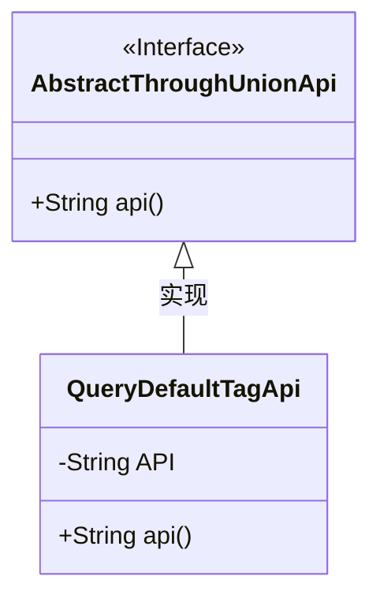
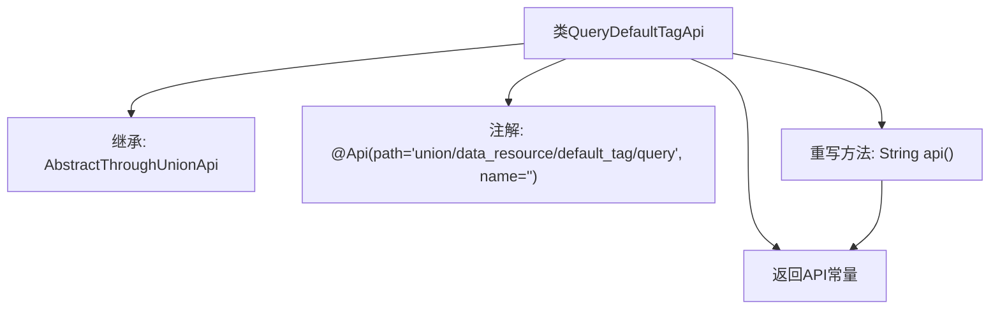

# 基础信息

|      |      |
|------|------|
| 名称 | QueryDefaultTagApi |
| 编码语言 | .java |
| 代码路径 | WeFe/board/board-service/src/main/java/com/welab/wefe/board/service/api/union/data_resource/tag/QueryDefaultTagApi.java |
| 包名 | com.welab.wefe.board.service.api.union.data_resource.tag |
| 依赖项 | ['com.welab.wefe.board.service.api.union.AbstractThroughUnionApi', 'com.welab.wefe.common.web.api.base.Api'] |
| 概述说明 | 查询默认标签API，继承自AbstractThroughUnionApi，路径为data_resource/default_tag/query。 |

# 说明

该代码定义了一个名为QueryDefaultTagApi的API类，继承自AbstractThroughUnionApi基类。类上标注了@Api注解，指定路径为union/data_resource/default_tag/query。类中包含一个私有常量API，值为data_resource/default_tag/query。重写了api()方法，返回该API常量值。整个类用于实现默认标签查询功能。

# 类列表 Class Summary

| 名称   | 类型  | 说明 |
|-------|------|-------------|
| QueryDefaultTagApi | class | 查询默认标签API，继承自AbstractThroughUnionApi，路径为data_resource/default_tag/query。 |

## 类 QueryDefaultTagApi

|      |      |
|------|------|
| 访问范围 | @Api(path = "union/data_resource/default_tag/query", name = "");public |
| 类型 | class |
| 名称 | QueryDefaultTagApi |
| 说明 | 查询默认标签API，继承自AbstractThroughUnionApi，路径为data_resource/default_tag/query。 |

### UML类图

这段类图展示了一个继承关系，其中QueryDefaultTagApi类继承自AbstractThroughUnionApi接口。AbstractThroughUnionApi被标记为接口，包含一个抽象方法api()。QueryDefaultTagApi实现了该接口，包含一个私有常量API和重写的api()方法。这个结构展示了典型的接口实现模式，子类提供具体实现细节，同时保持了与父接口的契约关系。

### 内部方法调用关系图

这段代码展示了一个继承自AbstractThroughUnionApi的QueryDefaultTagApi类，主要用于查询默认标签数据。类中包含一个API路径常量，并通过重写api()方法返回该常量值。类上标注了@Api注解，定义了接口路径和空名称。流程图清晰地呈现了类的继承关系、常量定义、注解使用及方法重写逻辑，体现了简洁的API封装设计模式。

### 字段列表 Field List

| 名称  | 类型  | 说明 |
|-------|-------|------|
| API = "data_resource/default_tag/query" | String | 私有静态常量API存储数据资源默认标签查询接口路径。 |

### 方法列表

| 名称  | 类型  | 说明 |
|-------|-------|------|
| api | String | 重写api方法，返回API常量值。 |

