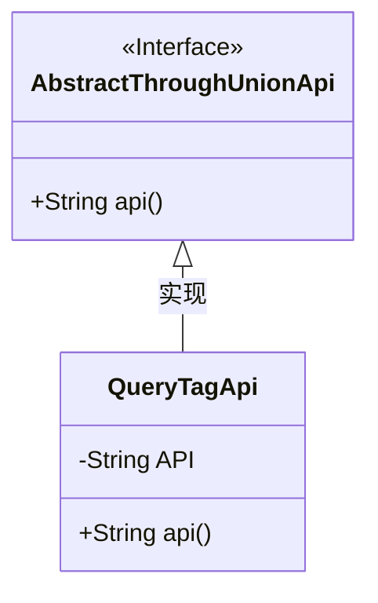
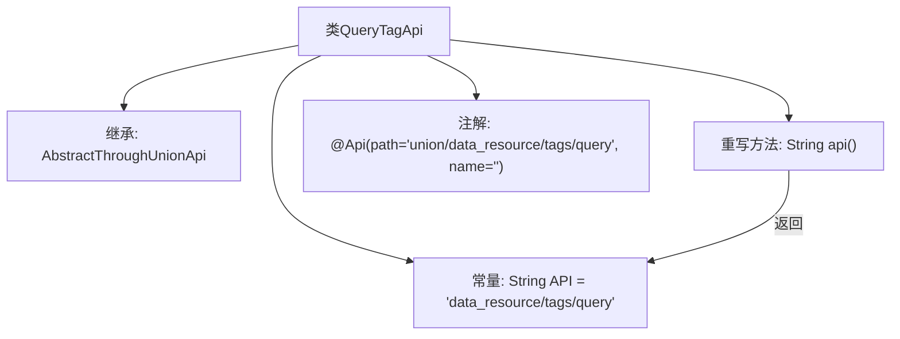

# 基础信息

|      |      |
|------|------|
| 名称 | QueryTagApi |
| 编码语言 | .java |
| 代码路径 | WeFe/board/board-service/src/main/java/com/welab/wefe/board/service/api/union/data_resource/tag/QueryTagApi.java |
| 包名 | com.welab.wefe.board.service.api.union.data_resource.tag |
| 依赖项 | ['com.welab.wefe.board.service.api.union.AbstractThroughUnionApi', 'com.welab.wefe.common.web.api.base.Api'] |
| 概述说明 | 这是一个名为QueryTagApi的API类，继承自AbstractThroughUnionApi，用于查询数据资源标签，路径为"data_resource/tags/query"。 |

# 说明

该代码定义了一个名为QueryTagApi的API类，继承自AbstractThroughUnionApi基类。类上标注了Api注解，指定路径为union/data_resource/tags/query。类中包含一个私有常量API，值为data_resource/tags/query。重写了api()方法，返回该API常量值。整体实现了一个查询标签的API接口。

# 类列表 Class Summary

| 名称   | 类型  | 说明 |
|-------|------|-------------|
| QueryTagApi | class | 这是一个名为QueryTagApi的API类，路径为union/data_resource/tags/query，继承自AbstractThroughUnionApi，返回固定API字符串。 |

## 类 QueryTagApi

|      |      |
|------|------|
| 访问范围 | @Api(path = "union/data_resource/tags/query", name = "");public |
| 类型 | class |
| 名称 | QueryTagApi |
| 说明 | 这是一个名为QueryTagApi的API类，路径为union/data_resource/tags/query，继承自AbstractThroughUnionApi，返回固定API字符串。 |

### UML类图

这段类图展示了一个简单的API实现结构。QueryTagApi类继承自AbstractThroughUnionApi接口，实现了其api()方法。类中包含一个私有常量API字符串，并通过重写api()方法返回该常量。注解@Api表明这是一个API端点类，路径为"union/data_resource/tags/query"。整体结构体现了通过继承实现接口方法的典型设计模式，用于统一管理API路径。

### 内部方法调用关系图

流程图描述了QueryTagApi类的结构，该类继承自AbstractThroughUnionApi，包含一个常量API和重写的api()方法。通过@Api注解定义了API路径，api()方法返回预设的API常量值。整体展示了类继承关系、常量定义和方法实现的逻辑流向。

### 字段列表 Field List

| 名称  | 类型  | 说明 |
|-------|-------|------|
| API = "data_resource/tags/query" | String | 私有静态常量API存储数据资源标签查询路径。 |

### 方法列表

| 名称  | 类型  | 说明 |
|-------|-------|------|
| api | String | 这是一个Java方法重写，返回API常量字符串。 |

