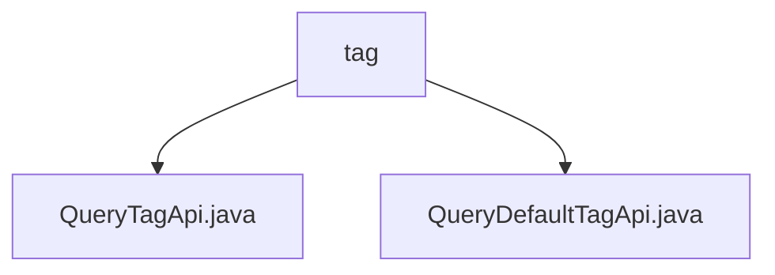

# 基础信息

|      |      |
|------|------|
| 名称 | tag |
| 编码语言 | .java |
| 代码路径 | WeFe/board/board-service/src/main/java/com/welab/wefe/board/service/api/union/data_resource/tag |
| 包名 | docs.board.board-service.src.main.java.com.welab.wefe.board.service.api.union.data_resource.tag |
| 概述说明 | QueryTagApi类继承AbstractThroughUnionApi，实现查询标签API，路径为union/data_resource/tags/query。QueryDefaultTagApi类类似，实现默认标签查询，路径为union/data_resource/default_tag/query。 |

# 说明

## 概述  
该模块核心职责是实现数据资源标签查询功能，包括自定义标签和默认标签两类查询接口。接口规范遵循统一设计模式，均继承AbstractThroughUnionApi基类并通过@Api注解定义路径，例如QueryTagApi路径为`union/data_resource/tags/query`，QueryDefaultTagApi路径为`union/data_resource/default_tag/query`。关键数据结构包含API路径常量，如`data_resource/tags/query`。外部依赖仅为基类AbstractThroughUnionApi。实现案例包括QueryTagApi返回标签数据，QueryDefaultTagApi返回系统预置标签。

## 主要业务场景  
模块服务于数据资源标签管理场景，采用类似RESTful风格的查询模式。完整功能包含动态标签查询和默认标签获取，例如用户筛选数据时调用QueryTagApi，系统初始化时加载QueryDefaultTagApi。交互模式均为HTTP GET请求，典型应用包括数据分类检索和标签预加载。API类型属于数据查询类接口，集成案例可见于数据治理平台标签管理模块。

### 包内部结构视图

该流程图展示了在tag目录下的两个Java文件：QueryTagApi.java和QueryDefaultTagApi.java。这两个文件都直接隶属于tag目录，没有更深层的嵌套结构。图中清晰地呈现了tag目录与其包含的两个API文件之间的直接层级关系。

# 文件列表

| 名称   | 类型  | 说明 |
|-------|------|-------------|
| [QueryTagApi.java](QueryTagApi.md) | file | 这是一个名为QueryTagApi的API类，继承自AbstractThroughUnionApi，用于查询数据资源标签，路径为"data_resource/tags/query"。 |
| [QueryDefaultTagApi.java](QueryDefaultTagApi.md) | file | 查询默认标签API，继承自AbstractThroughUnionApi，路径为data_resource/default_tag/query。 |

