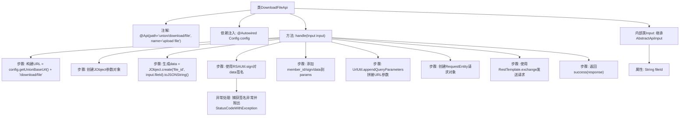

# 基础信息

|      |      |
|------|------|
| 名称 | DownloadFileApi |
| 编码语言 | .java |
| 代码路径 | WeFe/board/board-service/src/main/java/com/welab/wefe/board/service/api/union/member_auth/DownloadFileApi.java |
| 包名 | com.welab.wefe.board.service.api.union.member_auth |
| 依赖项 | ['com.welab.wefe.board.service.constant.Config', 'com.welab.wefe.board.service.service.CacheObjects', 'com.welab.wefe.common.StatusCode', 'com.welab.wefe.common.exception.StatusCodeWithException', 'com.welab.wefe.common.util.JObject', 'com.welab.wefe.common.util.RSAUtil', 'com.welab.wefe.common.util.UrlUtil', 'com.welab.wefe.common.web.api.base.AbstractApi', 'com.welab.wefe.common.web.api.base.Api', 'com.welab.wefe.common.web.dto.AbstractApiInput', 'com.welab.wefe.common.web.dto.ApiResult', 'org.springframework.beans.factory.annotation.Autowired', 'org.springframework.http.HttpMethod', 'org.springframework.http.RequestEntity', 'org.springframework.http.ResponseEntity', 'org.springframework.web.client.RestTemplate', 'java.io.IOException'] |
| 概述说明 | DownloadFileApi类处理文件下载请求，通过RSA签名验证，拼接URL参数后调用远程服务获取文件字节流返回。输入参数为fileId。 |

# 说明

该代码定义了一个名为DownloadFileApi的API类，用于处理文件下载请求。它继承自AbstractApi，接受Input参数并返回ResponseEntity<byte[]>。主要流程包括：构建下载URL，使用RSA签名生成安全参数，通过RestTemplate发送GET请求获取文件数据。Input类包含fileId字段作为请求参数。异常处理包括签名失败时抛出StatusCodeWithException。

# 类列表 Class Summary

| 名称   | 类型  | 说明 |
|-------|------|-------------|
| DownloadFileApi | class | DownloadFileApi类处理文件下载请求，通过RSA签名验证，拼接URL参数后调用远程服务获取文件字节流。输入参数为fileId。 |


## 类 DownloadFileApi

|      |      |
|------|------|
| 访问范围 | @Api(path = "union/download/file", name = "upload file");public |
| 类型 | class |
| 名称 | DownloadFileApi |
| 说明 | DownloadFileApi类处理文件下载请求，通过RSA签名验证，拼接URL参数后调用远程服务获取文件字节流。输入参数为fileId。 |


### UML类图

```mermaid
classDiagram
    class DownloadFileApi {
        -Config config
        +handle(DownloadFileApi~Input~ input) ApiResult~ResponseEntity~byte[]~~
    }
    <<Interface>> DownloadFileApi {
        <<AbstractApi>>
    }
    class Config {
        +getUnionBaseUrl() String
    }
    class RSAUtil {
        +sign(String data, PrivateKey privateKey, String charset) String
    }
    class CacheObjects {
        +getRsaPrivateKey() PrivateKey
        +getMemberId() String
    }
    class UrlUtil {
        +appendQueryParameters(String url, JObject params) String
        +createUri(String url) URI
    }
    class RestTemplate {
        +exchange(RequestEntity requestEntity, Class~T~ responseType) ResponseEntity~T~
    }
    class Input {
        +String fileId
    }
    <<Interface>> Input {
        <<AbstractApiInput>>
    }

    DownloadFileApi --> Config : 依赖
    DownloadFileApi --> RSAUtil : 调用签名方法
    DownloadFileApi --> CacheObjects : 获取密钥和会员ID
    DownloadFileApi --> UrlUtil : URL处理
    DownloadFileApi --> RestTemplate : HTTP请求
    DownloadFileApi --> Input : 使用输入参数
```

类图描述：该图展示了DownloadFileApi类及其关联关系，继承自AbstractApi泛型类，处理文件下载请求。核心依赖包括Config配置类、RSAUtil签名工具、CacheObjects缓存管理、UrlUtil网址工具和RestTemplate网络请求组件。Input内部类继承AbstractApiInput，包含文件ID字段。各类通过清晰箭头标注协作关系，体现完整的文件下载流程。


### 内部方法调用关系图



这段代码流程图展示了DownloadFileApi类的完整处理流程。该API通过RESTful接口实现文件下载功能，主要流程包括：初始化配置参数、构建加密签名、组装请求参数、发送HTTP请求并返回二进制响应数据。异常处理模块会捕获签名过程中的错误并转换为系统异常。内部类Input定义了必需的fileId输入参数，整个流程严格遵循请求构建→安全校验→远程调用→结果封装的逻辑链条，体现了典型的安全API设计模式。

### 字段列表 Field List

| 名称  | 类型  | 说明 |
|-------|-------|------|
| config | Config | 自动注入Config配置实例。 |

### 方法列表

| 名称  | 类型  | 说明 |
|-------|-------|------|
| handle | ApiResult<ResponseEntity<byte[]>> | 方法处理文件下载请求，拼接URL并生成RSA签名，通过GET请求获取文件字节流返回结果。 |


