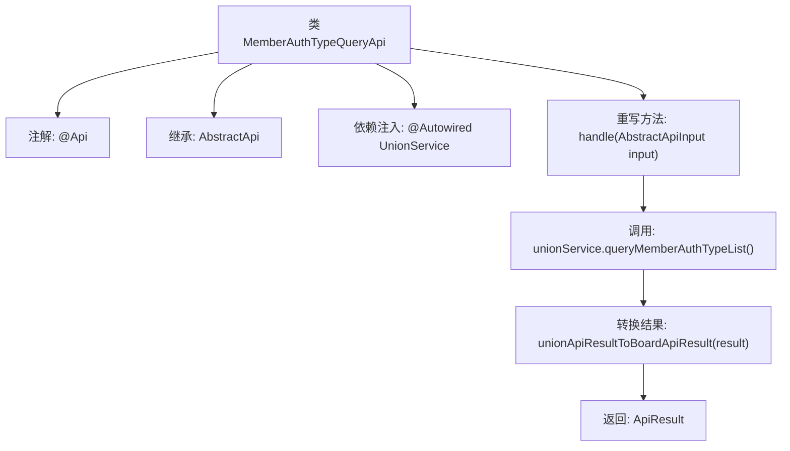

# 基础信息

|      |      |
|------|------|
| 名称 | MemberAuthTypeQueryApi |
| 编码语言 | .java |
| 代码路径 | WeFe/board/board-service/src/main/java/com/welab/wefe/board/service/api/union/member_auth/MemberAuthTypeQueryApi.java |
| 包名 | com.welab.wefe.board.service.api.union.member_auth |
| 依赖项 | ['com.alibaba.fastjson.JSONObject', 'com.welab.wefe.board.service.sdk.union.UnionService', 'com.welab.wefe.common.exception.StatusCodeWithException', 'com.welab.wefe.common.web.api.base.AbstractApi', 'com.welab.wefe.common.web.api.base.Api', 'com.welab.wefe.common.web.dto.AbstractApiInput', 'com.welab.wefe.common.web.dto.ApiResult', 'org.springframework.beans.factory.annotation.Autowired'] |
| 概述说明 | 这是一个查询会员认证类型的API，路径为union/member/authtype/query，通过UnionService获取数据并返回结果。 |

# 说明

这是一个名为MemberAuthTypeQueryApi的Java类，用于查询联盟成员认证类型。它继承自AbstractApi类，泛型参数为AbstractApiInput和Object。类上标注了Api注解，指定路径为union/member/authtype/query，名称为Query member authtype from union。类中通过Autowired注入了UnionService实例。重写了handle方法，调用unionService的queryMemberAuthTypeList方法获取结果，并通过unionApiResultToBoardApiResult方法转换返回类型为ApiResult<Object>。该方法可能抛出StatusCodeWithException异常。

# 类列表 Class Summary

| 名称   | 类型  | 说明 |
|-------|------|-------------|
| MemberAuthTypeQueryApi | class | 这是一个查询成员认证类型的API类，路径为union/member/authtype/query，通过调用unionService的queryMemberAuthTypeList方法获取结果并返回。 |


## 类 MemberAuthTypeQueryApi

|      |      |
|------|------|
| 访问范围 | @Api(path = "union/member/authtype/query", name = "Query member authtype from union");public |
| 类型 | class |
| 名称 | MemberAuthTypeQueryApi |
| 说明 | 这是一个查询成员认证类型的API类，路径为union/member/authtype/query，通过调用unionService的queryMemberAuthTypeList方法获取结果并返回。 |


### UML类图

```mermaid
classDiagram
    class AbstractApi~T, R~ {
        <<abstract>>
        +handle(T input) R
    }
    // AbstractApi是通用API基类，使用泛型定义输入输出类型

    class MemberAuthTypeQueryApi {
        -UnionService unionService
        +handle(AbstractApiInput input) ApiResult~Object~
    }
    // 成员认证类型查询API，继承自AbstractApi并指定泛型参数

    class UnionService {
        <<Interface>>
        +queryMemberAuthTypeList() JSONObject
    }
    // 联合服务接口，提供成员认证类型查询能力

    MemberAuthTypeQueryApi --> AbstractApi : 继承
    MemberAuthTypeQueryApi --> UnionService : 依赖
```

该代码展示了一个成员认证类型查询API的实现结构。MemberAuthTypeQueryApi继承自泛型基类AbstractApi，通过注入的UnionService接口获取认证类型数据。类图清晰地反映了三层关系：具体API实现类与抽象基类的继承关系、对服务接口的依赖关系，以及各组件间的类型约束。UnionService作为独立接口，其实现类可通过依赖注入提供具体功能。


### 内部方法调用关系图



这段代码展示了一个基于Spring框架的API类，用于查询成员认证类型。流程图清晰呈现了类结构继承关系、依赖注入服务和核心处理逻辑：通过UnionService获取数据后转换结果格式并返回。注解@Api定义了接口路径和名称，handle方法实现了父类抽象方法并处理业务逻辑。

### 字段列表 Field List

| 名称  | 类型  | 说明 |
|-------|-------|------|
| unionService | UnionService | 自动注入UnionService服务实例。 |

### 方法列表

| 名称  | 类型  | 说明 |
|-------|-------|------|
| handle | ApiResult<Object> | 该方法处理API请求，调用unionService查询成员认证类型列表，并将结果转换为统一API格式返回。 |


