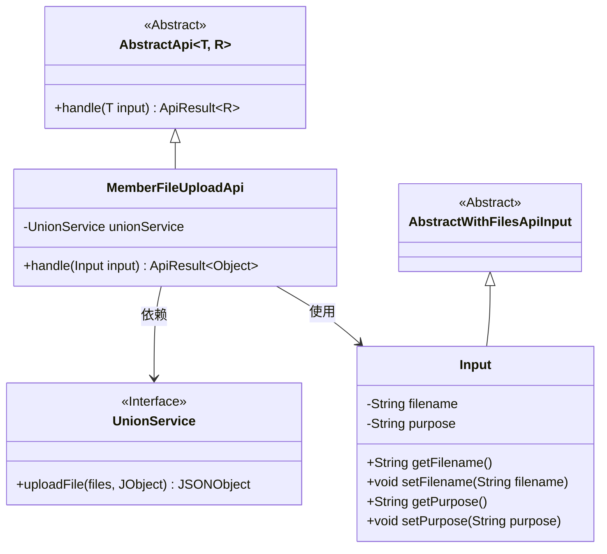
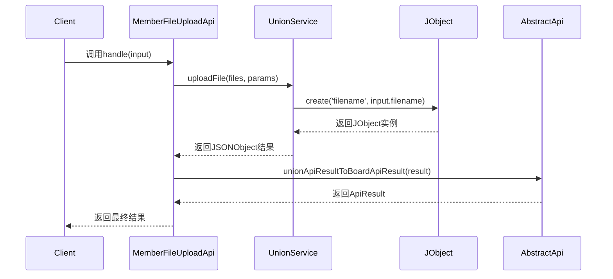

# 基础信息

|      |      |
|------|------|
| 名称 | MemberFileUploadApi |
| 编码语言 | .java |
| 代码路径 | WeFe/board/board-service/src/main/java/com/welab/wefe/board/service/api/union/member_auth/MemberFileUploadApi.java |
| 包名 | com.welab.wefe.board.service.api.union.member_auth |
| 依赖项 | ['com.alibaba.fastjson.JSONObject', 'com.welab.wefe.board.service.sdk.union.UnionService', 'com.welab.wefe.common.exception.StatusCodeWithException', 'com.welab.wefe.common.util.JObject', 'com.welab.wefe.common.web.api.base.AbstractApi', 'com.welab.wefe.common.web.api.base.Api', 'com.welab.wefe.common.web.dto.AbstractWithFilesApiInput', 'com.welab.wefe.common.web.dto.ApiResult', 'org.springframework.beans.factory.annotation.Autowired'] |
| 概述说明 | MemberFileUploadApi类处理文件上传请求，调用UnionService上传文件并返回结果。输入参数包括文件名和用途。 |

# 说明

这是一个名为MemberFileUploadApi的API类，用于处理文件上传请求。它继承自AbstractApi类，接受Input类型的输入参数并返回Object类型结果。API路径为union/member/file/upload，名称为upload file。该类通过注入的UnionService调用uploadFile方法处理上传的文件，并将结果转换为ApiResult返回。Input内部类继承自AbstractWithFilesApiInput，包含filename和purpose两个字符串属性及其getter/setter方法。

# 类列表 Class Summary

| 名称   | 类型  | 说明 |
|-------|------|-------------|
| MemberFileUploadApi | class | 这是一个文件上传API类，路径为union/member/file/upload，使用UnionService处理上传请求，接收文件名和用途参数，返回处理结果。 |

## 类 MemberFileUploadApi

|      |      |
|------|------|
| 访问范围 | @Api(path = "union/member/file/upload", name = "upload file");public |
| 类型 | class |
| 名称 | MemberFileUploadApi |
| 说明 | 这是一个文件上传API类，路径为union/member/file/upload，使用UnionService处理上传请求，接收文件名和用途参数，返回处理结果。 |

### UML类图

这段代码描述了一个文件上传API的实现类MemberFileUploadApi，它继承自泛型抽象类AbstractApi，处理Input类型的输入并返回Object类型结果。类中包含对UnionService的依赖，用于实际文件上传操作。Input类继承自AbstractWithFilesApiInput，包含文件名和用途两个属性。整个结构展示了典型的API层实现模式，通过服务层完成核心业务逻辑，同时封装了文件上传所需的输入参数。

### 内部方法调用关系图

```mermaid
graph TD
    A["类MemberFileUploadApi"]
    B["注解: @Api(path='union/member/file/upload', name='upload file')"]
    C["继承: AbstractApi<Input, Object>"]
    D["依赖注入: @Autowired UnionService unionService"]
    E["重写方法: handle(Input input)"]
    F["调用: unionService.uploadFile()"]
    G["创建: JObject.create()"]
    H["转换结果: unionApiResultToBoardApiResult()"]
    I["嵌套类Input"]
    J["属性: String filename"]
    K["属性: String purpose"]
    L["Getter/Setter方法"]

    A --> B
    A --> C
    A --> D
    A --> E
    E --> F
    F --> G
    F --> H
    A --> I
    I --> J
    I --> K
    I --> L
```

这段代码实现了一个文件上传API接口，继承自AbstractApi基类，通过UnionService处理文件上传业务逻辑。流程图展示了类结构关系，包括注解、依赖注入和方法调用链；时序图则详细描述了从客户端请求到最终返回结果的完整调用过程，重点突出了文件上传参数封装和服务调用的交互流程。嵌套类Input用于封装上传文件的元数据信息。

### 字段列表 Field List

| 名称  | 类型  | 说明 |
|-------|-------|------|
| unionService | UnionService | 自动注入UnionService实例。 |

### 方法列表

| 名称  | 类型  | 说明 |
|-------|-------|------|
| handle | ApiResult<Object> | 重写上传文件处理方法，调用unionService上传文件并返回转换后的结果。 |

