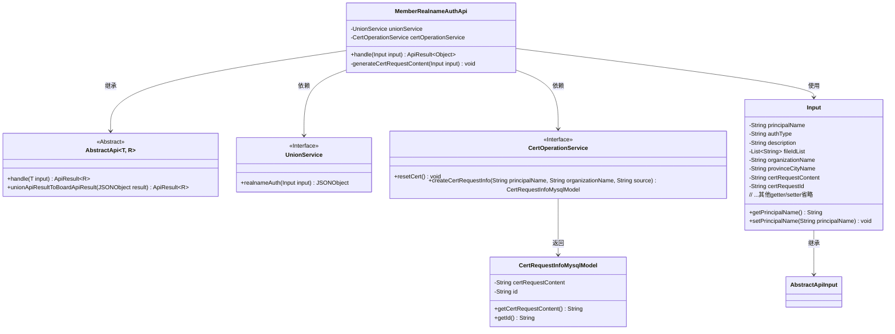
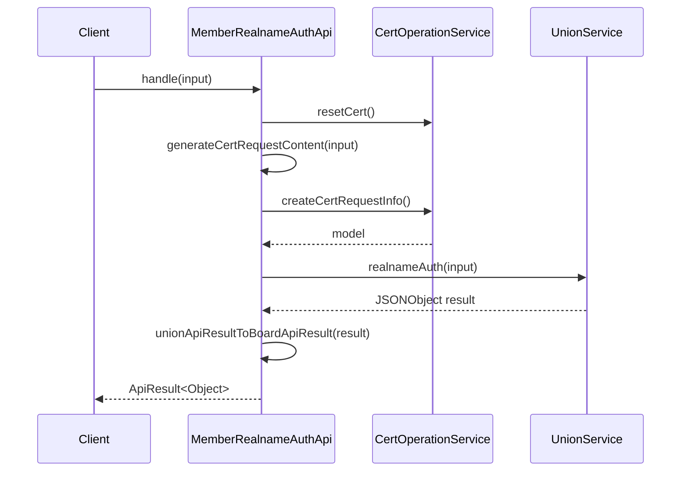

# 基础信息

|      |      |
|------|------|
| 名称 | MemberRealnameAuthApi |
| 编码语言 | .java |
| 代码路径 | WeFe/board/board-service/src/main/java/com/welab/wefe/board/service/api/union/member_auth/MemberRealnameAuthApi.java |
| 包名 | com.welab.wefe.board.service.api.union.member_auth |
| 依赖项 | ['com.alibaba.fastjson.JSONObject', 'com.welab.wefe.board.service.database.entity.cert.CertRequestInfoMysqlModel', 'com.welab.wefe.board.service.sdk.union.UnionService', 'com.welab.wefe.board.service.service.CertOperationService', 'com.welab.wefe.common.StatusCode', 'com.welab.wefe.common.exception.StatusCodeWithException', 'com.welab.wefe.common.web.api.base.AbstractApi', 'com.welab.wefe.common.web.api.base.Api', 'com.welab.wefe.common.web.dto.AbstractApiInput', 'com.welab.wefe.common.web.dto.ApiResult', 'org.springframework.beans.factory.annotation.Autowired', 'java.io.IOException', 'java.util.List'] |
| 概述说明 | 实名认证API类，处理用户实名认证请求，生成证书请求并调用联盟服务完成认证。包含输入参数类，记录用户信息和证书请求内容。 |

# 说明

该代码定义了一个名为MemberRealnameAuthApi的API类，用于处理实名认证请求。API路径为union/member/realname/auth。类继承自AbstractApi，输入类型为内部类Input，返回类型为Object。主要功能包括重置本地证书、生成证书请求内容（CSR）并调用实名认证服务。内部类Input包含多个字段，如主体名称、认证类型、描述、文件ID列表、组织名称、省市名称、证书请求内容和ID等，均提供getter和setter方法。处理过程中可能抛出StatusCodeWithException和IOException异常。

# 类列表 Class Summary

| 名称   | 类型  | 说明 |
|-------|------|-------------|
| MemberRealnameAuthApi | class | 成员实名认证API，处理输入参数生成证书请求，调用实名认证服务并返回结果。 |

## 类 MemberRealnameAuthApi

|      |      |
|------|------|
| 访问范围 | @Api(path = "union/member/realname/auth", name = "apply realname auth");public |
| 类型 | class |
| 名称 | MemberRealnameAuthApi |
| 说明 | 成员实名认证API，处理输入参数生成证书请求，调用实名认证服务并返回结果。 |

### UML类图

类图描述：该图展示了实名认证API的核心结构，MemberRealnameAuthApi继承自泛型抽象类AbstractApi，依赖UnionService和CertOperationService两个服务接口。Input作为内部数据传输对象继承AbstractApiInput，包含认证所需字段。CertOperationService操作会返回CertRequestInfoMysqlModel模型类。整体实现了证书重置、CSR生成和联盟链实名认证的业务流程。

### 内部方法调用关系图

```mermaid
graph TD
    A["类MemberRealnameAuthApi"]
    B["继承: AbstractApi<Input, Object>"]
    C["依赖: UnionService unionService"]
    D["依赖: CertOperationService certOperationService"]
    E["主方法: handle(Input input)"]
    F["辅助方法: generateCertRequestContent(Input input)"]
    G["内部类: Input"]
    H["方法: resetCert()"]
    I["方法: createCertRequestInfo()"]
    J["方法: realnameAuth()"]
    K["方法: unionApiResultToBoardApiResult()"]

    A --> B
    A --> C
    A --> D
    A --> E
    A --> F
    A --> G
    E --> H
    E --> F
    F --> I
    E --> J
    E --> K
    C --> J
    D --> H
    D --> I
```

这段代码实现了一个实名认证API，主要流程包括：重置证书、生成证书请求内容、调用联盟服务进行实名认证，最后转换结果格式。流程图展示了类结构和依赖关系，时序图详细描述了认证请求的处理过程，涉及证书操作和联盟服务两个关键组件的交互。代码通过异常处理和日志记录确保系统稳定性，Input内部类封装了所有认证所需的参数。

### 字段列表 Field List

| 名称  | 类型  | 说明 |
|-------|-------|------|
| certOperationService | CertOperationService | 使用@Autowired自动注入CertOperationService实例。 |
| unionService | UnionService | 自动注入UnionService实例。 |

### 方法列表

| 名称  | 类型  | 说明 |
|-------|-------|------|
| handle | ApiResult<Object> | 处理成员实名认证：重置本地证书，生成CSR请求，调用实名认证服务并转换结果。 |
| generateCertRequestContent | void | 生成证书请求内容，设置请求ID和内容，异常时记录日志并抛出系统错误。 |

