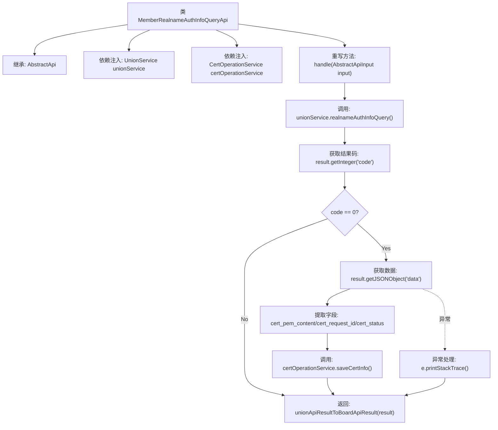

# 基础信息

|      |      |
|------|------|
| 名称 | MemberRealnameAuthInfoQueryApi |
| 编码语言 | .java |
| 代码路径 | WeFe/board/board-service/src/main/java/com/welab/wefe/board/service/api/union/member_auth/MemberRealnameAuthInfoQueryApi.java |
| 包名 | com.welab.wefe.board.service.api.union.member_auth |
| 依赖项 | ['java.io.IOException', 'org.springframework.beans.factory.annotation.Autowired', 'com.alibaba.fastjson.JSONObject', 'com.welab.wefe.board.service.sdk.union.UnionService', 'com.welab.wefe.board.service.service.CertOperationService', 'com.welab.wefe.common.exception.StatusCodeWithException', 'com.welab.wefe.common.web.api.base.AbstractApi', 'com.welab.wefe.common.web.api.base.Api', 'com.welab.wefe.common.web.dto.AbstractApiInput', 'com.welab.wefe.common.web.dto.ApiResult'] |
| 概述说明 | 查询实名认证信息的API类，调用UnionService获取认证数据，若成功则通过CertOperationService保存证书信息、请求ID和状态，最后返回处理结果。 |

# 说明

这是一个名为MemberRealnameAuthInfoQueryApi的API类，用于查询实名认证协议模板信息。它继承自AbstractApi基类，接受AbstractApiInput作为输入并返回Object类型结果。该API通过注入的UnionService和CertOperationService进行业务处理。主要逻辑是调用unionService的realnameAuthInfoQuery方法获取结果，当返回码为0时，从结果中提取证书内容、请求ID和状态信息，并通过certOperationService保存这些信息。最后将结果转换为统一API格式返回。处理过程中会捕获并打印异常，但不中断流程。

# 类列表 Class Summary

| 名称   | 类型  | 说明 |
|-------|------|-------------|
| MemberRealnameAuthInfoQueryApi | class | 查询实名认证信息的API，调用UnionService获取结果，成功时保存证书信息到CertOperationService，最后返回处理结果。 |


## 类 MemberRealnameAuthInfoQueryApi

|      |      |
|------|------|
| 访问范围 | @Api(path = "union/member/realname/authInfo/query", name = "realname auth agreement template query");public |
| 类型 | class |
| 名称 | MemberRealnameAuthInfoQueryApi |
| 说明 | 查询实名认证信息的API，调用UnionService获取结果，成功时保存证书信息到CertOperationService，最后返回处理结果。 |


### UML类图

```mermaid
classDiagram
    class AbstractApi~T, R~ {
        <<Abstract>>
        +handle(T input) R
    }
    // AbstractApi是基类，定义通用API处理逻辑

    class MemberRealnameAuthInfoQueryApi {
        -UnionService unionService
        -CertOperationService certOperationService
        +handle(AbstractApiInput input) ApiResult~Object~
    }
    // 实现实名认证信息查询的具体API

    class UnionService {
        <<Interface>>
        +realnameAuthInfoQuery() JSONObject
    }
    // 提供实名认证查询服务接口

    class CertOperationService {
        <<Interface>>
        +saveCertInfo(String, String, String) void
    }
    // 提供证书信息存储服务接口

    AbstractApi <|-- MemberRealnameAuthInfoQueryApi
    MemberRealnameAuthInfoQueryApi --> UnionService : 调用查询服务
    MemberRealnameAuthInfoQueryApi --> CertOperationService : 调用存储服务
```

类图描述：该结构展示了一个实名认证信息查询API的实现层次，MemberRealnameAuthInfoQueryApi继承自泛型抽象类AbstractApi，通过依赖UnionService获取认证信息，并调用CertOperationService存储证书数据。两个服务均以接口形式定义，体现了依赖倒置原则。当查询返回成功状态码时，会解析并保存证书内容、请求ID和状态信息，最后转换API返回格式。异常处理采用静默捕获方式，确保主流程不受影响。


### 内部方法调用关系图



该流程图展示了实名认证信息查询API的核心处理逻辑。首先通过UnionService查询认证信息，根据返回码判断是否处理数据：若成功则提取证书内容、请求ID和状态，通过CertOperationService保存信息；无论成功与否最终都会转换结果格式返回。流程包含异常处理分支，完整覆盖了正常流程和错误场景的处理路径。

### 字段列表 Field List

| 名称  | 类型  | 说明 |
|-------|-------|------|
| unionService | UnionService | 自动注入UnionService实例。 |
| certOperationService | CertOperationService | 自动注入CertOperationService实例。 |

### 方法列表

| 名称  | 类型  | 说明 |
|-------|-------|------|
| handle | ApiResult<Object> | 该方法处理实名认证查询，调用服务获取结果后检查状态码。若成功则提取证书内容、请求ID和状态，保存至服务。最后转换并返回API结果。 |


