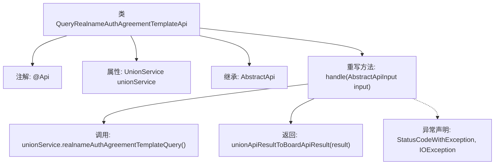

# 基础信息

|      |      |
|------|------|
| 名称 | QueryRealnameAuthAgreementTemplateApi |
| 编码语言 | .java |
| 代码路径 | WeFe/board/board-service/src/main/java/com/welab/wefe/board/service/api/union/member_auth/QueryRealnameAuthAgreementTemplateApi.java |
| 包名 | com.welab.wefe.board.service.api.union.member_auth |
| 依赖项 | ['com.alibaba.fastjson.JSONObject', 'com.welab.wefe.board.service.sdk.union.UnionService', 'com.welab.wefe.common.exception.StatusCodeWithException', 'com.welab.wefe.common.web.api.base.AbstractApi', 'com.welab.wefe.common.web.api.base.Api', 'com.welab.wefe.common.web.dto.AbstractApiInput', 'com.welab.wefe.common.web.dto.ApiResult', 'org.springframework.beans.factory.annotation.Autowired', 'java.io.IOException'] |
| 概述说明 | 这是一个查询实名认证协议模板的API类，通过调用UnionService获取结果并转换为API响应格式。 |

# 说明

这是一个名为QueryRealnameAuthAgreementTemplateApi的API类，用于查询实名认证协议模板。它继承自AbstractApi基类，使用AbstractApiInput作为输入参数，返回Object类型结果。类注解@Api定义了API路径为union/realname/auth/agreement/template/query，名称为realname auth agreement template query。该类通过@Autowired注入UnionService服务，在handle方法中调用unionService的realnameAuthAgreementTemplateQuery方法获取JSONObject结果，并将其转换为ApiResult格式返回。方法可能抛出StatusCodeWithException和IOException异常。

# 类列表 Class Summary

| 名称   | 类型  | 说明 |
|-------|------|-------------|
| QueryRealnameAuthAgreementTemplateApi | class | 这是一个查询实名认证协议模板的API类，通过UnionService调用realnameAuthAgreementTemplateQuery方法获取结果，并将结果转换为ApiResult格式返回。 |


## 类 QueryRealnameAuthAgreementTemplateApi

|      |      |
|------|------|
| 访问范围 | @Api(path = "union/realname/auth/agreement/template/query", name = "realname auth agreement template query");public |
| 类型 | class |
| 名称 | QueryRealnameAuthAgreementTemplateApi |
| 说明 | 这是一个查询实名认证协议模板的API类，通过UnionService调用realnameAuthAgreementTemplateQuery方法获取结果，并将结果转换为ApiResult格式返回。 |


### UML类图

```mermaid
classDiagram
    class AbstractApi~T~ {
        <<Abstract>>
        +handle(T input) ApiResult~Object~
    }

    class AbstractApiInput {
        <<Abstract>>
    }

    class QueryRealnameAuthAgreementTemplateApi {
        -UnionService unionService
        +handle(AbstractApiInput input) ApiResult~Object~
    }

    class UnionService {
        <<Interface>>
        +realnameAuthAgreementTemplateQuery() JSONObject
    }

    class ApiResult~T~ {
        +T data
    }

    class JSONObject

    AbstractApi <|-- QueryRealnameAuthAgreementTemplateApi
    AbstractApiInput <|-- : 泛型参数
    QueryRealnameAuthAgreementTemplateApi --> UnionService : 依赖
    QueryRealnameAuthAgreementTemplateApi --> JSONObject : 返回
    QueryRealnameAuthAgreementTemplateApi --> ApiResult : 返回
```

该代码展示了一个实名认证协议模板查询API的实现类结构。QueryRealnameAuthAgreementTemplateApi继承自泛型抽象类AbstractApi，通过注入UnionService接口实现业务逻辑。核心方法handle接收AbstractApiInput参数，调用UnionService获取JSON格式结果后转换为ApiResult返回。类图中清晰体现了抽象基类、接口依赖、泛型使用和返回类型关系，展示了典型的Spring Boot服务层API实现模式。


### 内部方法调用关系图



该流程图展示了QueryRealnameAuthAgreementTemplateApi类的核心结构，该类继承自AbstractApi并重写了handle方法。流程从类定义开始，展示其注解、依赖注入的UnionService属性，以及处理请求时调用unionService的方法并转换返回结果的过程，同时标注了可能抛出的异常类型。整个流程清晰呈现了API请求处理的数据流转和异常处理路径。

### 字段列表 Field List

| 名称  | 类型  | 说明 |
|-------|-------|------|
| unionService | UnionService | 自动注入UnionService实例。 |

### 方法列表

| 名称  | 类型  | 说明 |
|-------|-------|------|
| handle | ApiResult<Object> | 方法重写处理实名认证协议模板查询，调用unionService获取结果并转换为ApiResult格式返回。 |


