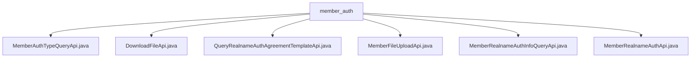

# 基础信息

|      |      |
|------|------|
| 名称 | member_auth |
| 编码语言 | .java |
| 代码路径 | WeFe/board/board-service/src/main/java/com/welab/wefe/board/service/api/union/member_auth |
| 包名 | docs.board.board-service.src.main.java.com.welab.wefe.board.service.api.union.member_auth |
| 概述说明 | MemberAuthTypeQueryApi查询成员认证类型。DownloadFileApi处理文件下载。QueryRealnameAuthAgreementTemplateApi查询实名认证模板。MemberFileUploadApi处理文件上传。MemberRealnameAuthInfoQueryApi查询实名认证信息。MemberRealnameAuthApi处理实名认证请求。 |

# 说明

## 概述  
该模块核心职责是提供联盟成员认证相关的API服务，包括认证类型查询、文件上传下载、实名认证协议及信息管理等。接口规范遵循统一设计模式，均继承AbstractApi基类，使用注解定义路径和名称，返回ApiResult格式数据。关键数据结构包括AbstractApiInput及其子类，例如包含文件ID、主体名称等字段的Input类。外部依赖包括UnionService、CertOperationService和RestTemplate。例如MemberRealnameAuthApi处理CSR生成和认证请求，DownloadFileApi实现安全文件下载。

## 主要业务场景  
模块支持完整的成员认证流程：先查询认证类型（MemberAuthTypeQueryApi），上传必要文件（MemberFileUploadApi），再发起实名认证（MemberRealnameAuthApi）。交互模式类似工作流引擎，各API通过UnionService协同。典型场景包括下载协议模板（QueryRealnameAuthAgreementTemplateApi）、查询认证状态（MemberRealnameAuthInfoQueryApi）。例如文件处理采用RSA签名保障安全，认证信息通过CertOperationService持久化。异常处理统一捕获StatusCodeWithException，保持业务连续性。

### 包内部结构视图

该流程图展示了member_auth目录下的6个API接口文件结构。所有Java文件都直接隶属于member_auth目录，没有更深层级的嵌套关系。这些API接口涉及成员认证相关功能，包括文件下载、实名认证信息查询、文件上传等操作，构成了一个完整的成员认证服务模块。每个节点仅显示文件名，符合路径最后一级元素的命名规则。

# 文件列表

| 名称   | 类型  | 说明 |
|-------|------|-------------|
| [MemberAuthTypeQueryApi.java](MemberAuthTypeQueryApi.md) | file | 这是一个查询会员认证类型的API，路径为union/member/authtype/query，通过UnionService获取数据并返回结果。 |
| [DownloadFileApi.java](DownloadFileApi.md) | file | DownloadFileApi类处理文件下载请求，通过RSA签名验证，拼接URL参数后调用远程服务获取文件字节流返回。输入参数为fileId。 |
| [QueryRealnameAuthAgreementTemplateApi.java](QueryRealnameAuthAgreementTemplateApi.md) | file | 这是一个查询实名认证协议模板的API类，通过调用UnionService获取结果并转换为API响应格式。 |
| [MemberFileUploadApi.java](MemberFileUploadApi.md) | file | MemberFileUploadApi类处理文件上传请求，调用UnionService上传文件并返回结果。输入参数包括文件名和用途。 |
| [MemberRealnameAuthInfoQueryApi.java](MemberRealnameAuthInfoQueryApi.md) | file | 查询实名认证信息的API类，调用UnionService获取认证数据，若成功则通过CertOperationService保存证书信息、请求ID和状态，最后返回处理结果。 |
| [MemberRealnameAuthApi.java](MemberRealnameAuthApi.md) | file | 实名认证API类，处理用户实名认证请求，生成证书请求并调用联盟服务完成认证。包含输入参数类，记录用户信息和证书请求内容。 |

