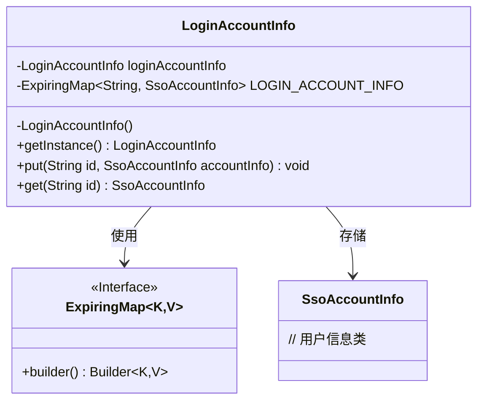
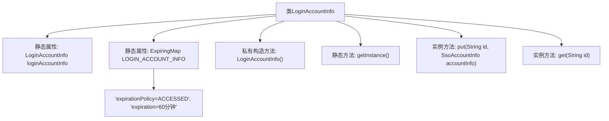

# 基础信息

|      |      |
|------|------|
| 名称 | LoginAccountInfo |
| 编码语言 | .java |
| 代码路径 | WeFe/board/board-service/src/main/java/com/welab/wefe/board/service/base/LoginAccountInfo.java |
| 包名 | com.welab.wefe.board.service.base |
| 依赖项 | ['com.welab.wefe.common.web.service.account.SsoAccountInfo', 'net.jodah.expiringmap.ExpirationPolicy', 'net.jodah.expiringmap.ExpiringMap', 'java.util.concurrent.TimeUnit'] |
| 概述说明 | 单例类LoginAccountInfo管理登录用户信息，使用ExpiringMap存储TOKEN对应用户数据，60分钟无访问自动过期。提供put和get方法操作数据。 |

# 说明

这是一个单例模式的登录账户信息管理类，用于存储和获取当前登录用户信息。类中包含一个静态的ExpiringMap集合，键为登录TOKEN，值为用户信息对象。该集合设置了60分钟的过期策略，基于最后一次访问时间自动清理过期数据。类提供了获取单例实例的方法，以及添加和获取用户信息的公共方法。主要用于Board的WebSocket功能中管理登录状态。

# 类列表 Class Summary

| 名称   | 类型  | 说明 |
|-------|------|-------------|
| LoginAccountInfo | class | LoginAccountInfo类使用单例模式管理登录用户信息，采用ExpiringMap存储TOKEN和用户信息，60分钟无访问自动过期。 |

## 类 LoginAccountInfo

|      |      |
|------|------|
| 访问范围 | public |
| 类型 | class |
| 名称 | LoginAccountInfo |
| 说明 | LoginAccountInfo类使用单例模式管理登录用户信息，采用ExpiringMap存储TOKEN和用户信息，60分钟无访问自动过期。 |

### UML类图

类图描述：LoginAccountInfo是一个单例类，用于管理登录用户信息缓存。它使用ExpiringMap作为存储容器，键为TOKEN字符串，值为SsoAccountInfo用户信息对象。ExpiringMap通过建造者模式配置过期策略（访问后60分钟过期）。该类提供put/get方法操作缓存，并通过私有构造器确保单例模式。

### 内部方法调用关系图

该流程图展示了LoginAccountInfo单例类的结构设计。核心是通过静态ExpiringMap实现带过期时间的登录信息缓存，采用ACCESSED访问后刷新过期时间的策略。类通过私有构造方法强制单例模式，提供put/get方法管理键值对，其中Map配置了60分钟自动过期机制。整个设计适用于需要临时存储且自动清理的场景，如WebSocket会话管理。

### 字段列表 Field List

| 名称  | 类型  | 说明 |
|-------|-------|------|
| LOGIN_ACCOUNT_INFO = ExpiringMap.builder()            .expirationPolicy(ExpirationPolicy.ACCESSED)            .expiration(60, TimeUnit.MINUTES).build() | ExpiringMap<String, SsoAccountInfo> | 定义了一个名为LOGIN_ACCOUNT_INFO的静态ExpiringMap，存储SSO账户信息，访问后60分钟自动过期。 |
| loginAccountInfo = new LoginAccountInfo() | LoginAccountInfo | 初始化静态登录账户信息对象。 |

### 方法列表

| 名称  | 类型  | 说明 |
|-------|-------|------|
| get | SsoAccountInfo | 通过ID从LOGIN_ACCOUNT_INFO中获取对应的SsoAccountInfo对象。 |
| put | void | 该方法将用户ID和对应的SSO账户信息存入LOGIN_ACCOUNT_INFO映射中。 |
| getInstance | LoginAccountInfo | 获取登录账户信息的单例实例。 |

