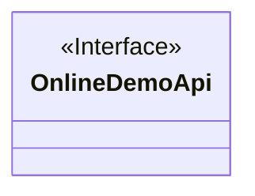
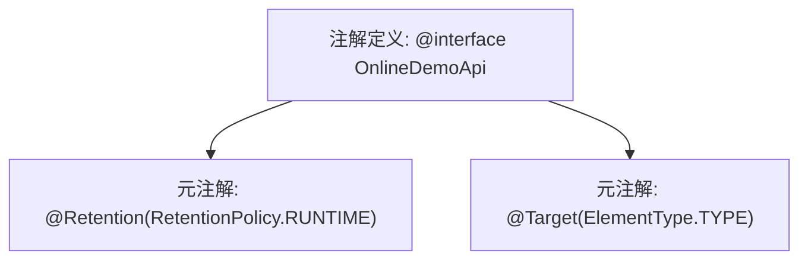

# 基础信息

|      |      |
|------|------|
| 名称 | OnlineDemoApi |
| 编码语言 | .java |
| 代码路径 | WeFe/board/board-service/src/main/java/com/welab/wefe/board/service/base/OnlineDemoApi.java |
| 包名 | com.welab.wefe.board.service.base |
| 依赖项 | ['java.lang.annotation.ElementType', 'java.lang.annotation.Retention', 'java.lang.annotation.RetentionPolicy', 'java.lang.annotation.Target'] |
| 概述说明 | Java注解@OnlineDemoApi，运行时保留，仅用于类声明。 |

# 说明

这是一个名为OnlineDemoApi的Java注解定义，使用@Retention(RetentionPolicy.RUNTIME)指定注解在运行时保留，@Target(ElementType.TYPE)表示该注解只能用于类、接口或枚举类型上。该注解没有定义任何成员变量，是一个标记注解。

# 类列表 Class Summary

| 名称   | 类型  | 说明 |
|-------|------|-------------|
| OnlineDemoApi | annotation | Java注解@OnlineDemoApi，运行时保留，作用于类级别。 |

## 类 OnlineDemoApi

|      |      |
|------|------|
| 访问范围 | @Retention(RetentionPolicy.RUNTIME);@Target(ElementType.TYPE);public |
| 类型 | annotation |
| 名称 | OnlineDemoApi |
| 说明 | Java注解@OnlineDemoApi，运行时保留，作用于类级别。 |

### UML类图

这段类图描述了一个名为OnlineDemoApi的注解接口，使用<<Interface>>和<<annotation>>标记表示其特性。该注解被@Retention(RetentionPolicy.RUNTIME)修饰，表示它会在运行时保留，可通过反射机制读取；同时被@Target(ElementType.TYPE)修饰，表示该注解只能用于类、接口或枚举声明。作为元数据标记，该注解不包含任何显式定义的成员变量或方法，主要用于标识类级别的特定功能或行为。

### 内部方法调用关系图

这段流程图描述了Java注解`OnlineDemoApi`的定义结构。该注解通过`@Retention`指定在运行时保留，通过`@Target`限定只能用于类/接口/枚举等类型声明。两个元注解作为核心属性直接关联到主注解定义，形成了典型的Java元数据标记模式，常用于框架级的类型标记或运行时反射处理场景。

### 字段列表 Field List

| 名称  | 类型  | 说明 |
|-------|-------|------|

### 方法列表

| 名称  | 类型  | 说明 |
|-------|-------|------|

