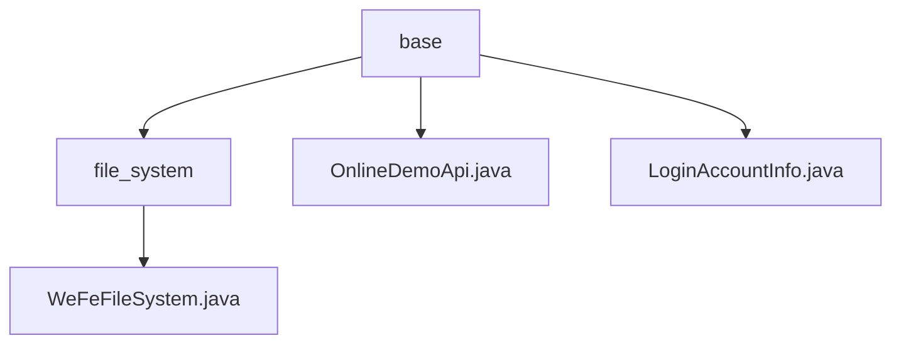

# 基础信息

|      |      |
|------|------|
| 名称 | base |
| 编码语言 | .java |
| 代码路径 | WeFe/board/board-service/src/main/java/com/welab/wefe/board/service/base |
| 包名 | docs.board.board-service.src.main.java.com.welab.wefe.board.service.base |
| 概述说明 | WeFeFileSystem类管理文件上传存储和目录，含UseType枚举定义文件用途，子类处理模型下载和调用。OnlineDemoApi是运行时类注解。LoginAccountInfo单例类管理登录用户信息，使用过期Map存储。 |

# 说明

## 概述  
该模块核心职责是提供文件系统管理和用户会话状态维护功能，类似资源管理器与会话中心的组合。WeFeFileSystem类处理文件存储、目录分类及深度学习模型相关操作，支持多种文件用途类型（如临时文件、模型调用）。LoginAccountInfo类实现基于Token的会话管理，采用ExpiringMap自动清理过期数据。关键数据结构包括UseType枚举、ExpiringMap集合及用户信息对象。外部依赖仅涉及Java标准库。例如，DownloadDeepLearningModel处理模型下载，CallDeepLearningModel管理样本压缩和解压。

## 主要业务场景  
模块支持文件全生命周期管理，从上传分类（如临时存储或模型调用）到清理维护，同时确保WebSocket会话有效性。典型流程包括：用户登录后Token被缓存60分钟，期间可调用文件服务处理模型文件（例如解压样本ZIP或清理临时图片）。交互模式采用单例访问（如LoginAccountInfo.getInstance()）和类型驱动路径生成（如getSubDirectory(UseType)）。集成案例涵盖从文件上传到模型调用的完整AI流程，以及会话过期的自动回收机制。

### 包内部结构视图

该流程图展示了WeFe项目中board-service模块的基础服务结构。根节点为base目录，包含三个子节点：file_system文件夹和两个Java文件。file_system文件夹下又包含WeFeFileSystem.java实现文件，清晰地呈现了文件系统的层级关系与核心服务组件分布。

# 文件列表

| 名称   | 类型  | 说明 |
|-------|------|-------------|
| [OnlineDemoApi.java](OnlineDemoApi.md) | file | Java注解@OnlineDemoApi，运行时保留，仅用于类声明。 |
| [LoginAccountInfo.java](LoginAccountInfo.md) | file | 单例类LoginAccountInfo管理登录用户信息，使用ExpiringMap存储TOKEN对应用户数据，60分钟无访问自动过期。提供put和get方法操作数据。 |
| [file_system](file_system/_module.md) | package | WeFeFileSystem类管理文件系统操作，包括文件路径获取、资源类型处理、深度学习模型下载和调用，支持临时文件、数据资源上传及图片处理等功能。 |

