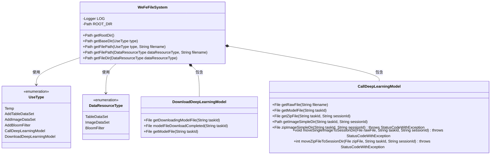

# 基础信息

|      |      |
|------|------|
| 名称 | WeFeFileSystem |
| 编码语言 | .java |
| 代码路径 | WeFe/board/board-service/src/main/java/com/welab/wefe/board/service/base/file_system/WeFeFileSystem.java |
| 包名 | com.welab.wefe.board.service.base.file_system |
| 依赖项 | ['com.welab.wefe.board.service.constant.Config', 'com.welab.wefe.common.StatusCode', 'com.welab.wefe.common.exception.StatusCodeWithException', 'com.welab.wefe.common.file.compression.impl.Zip', 'com.welab.wefe.common.file.decompression.SuperDecompressor', 'com.welab.wefe.common.file.decompression.dto.DecompressionResult', 'com.welab.wefe.common.util.FileUtil', 'com.welab.wefe.common.util.StringUtil', 'com.welab.wefe.common.web.Launcher', 'com.welab.wefe.common.wefe.enums.DataResourceType', 'org.slf4j.Logger', 'org.slf4j.LoggerFactory', 'java.io.File', 'java.io.IOException', 'java.nio.file.Path', 'java.nio.file.Paths'] |
| 概述说明 | WeFeFileSystem类管理文件系统操作，包括文件路径获取、资源类型处理、深度学习模型下载和调用，支持临时文件、数据资源上传及图片处理等功能。 |

# 说明

WeFeFileSystem类是一个文件系统管理工具，主要用于处理文件上传、存储和目录管理。它包含一个枚举UseType，定义了多种文件用途，如临时文件、数据资源添加、深度学习模型调用和下载等。类提供了获取根目录和根据不同类型获取子目录的方法。DownloadDeepLearningModel子类处理模型文件的下载和重命名操作。CallDeepLearningModel子类管理深度学习模型相关的文件操作，包括图片样本目录的压缩、单张图片移动、ZIP文件解压及非图片文件清理等功能。所有操作均包含错误处理和日志记录。

# 类列表 Class Summary

| 名称   | 类型  | 说明 |
|-------|------|-------------|
| WeFeFileSystem | class | WeFeFileSystem类管理文件系统操作，包括文件上传路径、资源类型处理及深度学习模型相关功能。 |

## 类 WeFeFileSystem

|      |      |
|------|------|
| 访问范围 | public |
| 类型 | class |
| 名称 | WeFeFileSystem |
| 说明 | WeFeFileSystem类管理文件系统操作，包括文件上传路径、资源类型处理及深度学习模型相关功能。 |

### UML类图

这段代码定义了一个文件系统管理类WeFeFileSystem，主要用于管理不同用途的文件存储路径和操作。核心功能包括获取根目录、根据文件用途类型获取基础路径、处理数据资源文件路径等。系统包含两个嵌套类：DownloadDeepLearningModel处理模型下载相关文件操作，CallDeepLearningModel处理模型调用时的文件压缩、解压和移动等操作。通过枚举类型UseType和DataResourceType来分类管理不同用途的文件路径，实现了模块化的文件系统管理功能。

### 内部方法调用关系图

```mermaid
graph TD
    A["类WeFeFileSystem"]
    B["静态初始化块: 检查/创建ROOT_DIR"]
    C["方法: getRootDir()"]
    D["枚举UseType: 定义文件用途"]
    E["方法: getBaseDir(UseType)"]
    F["方法: getFilePath(UseType, String)"]
    G["方法: getFilePath(DataResourceType, String)"]
    H["方法: getFileDir(DataResourceType)"]
    I["嵌套类DownloadDeepLearningModel"]
    J["嵌套类CallDeepLearningModel"]

    A --> B
    A --> C
    A --> D
    A --> E
    A --> F
    A --> G
    A --> H
    A --> I
    A --> J

    I --> I1["方法: getDownloadingModelFile(String)"]
    I --> I2["方法: modelFileDownloadCompleted(String)"]
    I --> I3["方法: getModelFile(String)"]

    J --> J1["方法: getRawFile(String)"]
    J --> J2["方法: getModelFile(String)"]
    J --> J3["方法: getZipFile(String, String)"]
    J --> J4["方法: getImageSimpleDir(String, String)"]
    J --> J5["方法: zipImageSimpleDir(String, String)"]
    J --> J6["方法: moveSingleImageToSessionDir(File, String, String)"]
    J --> J7["方法: moveZipFileToSessionDir(File, String, String)"]
```

该流程图展示了WeFeFileSystem类的核心结构和功能。类包含静态初始化块用于确保根目录存在，提供获取不同用途文件路径的方法，并通过嵌套类DownloadDeepLearningModel和CallDeepLearningModel实现深度学习模型相关文件的下载和调用管理。主要功能包括文件路径解析、资源类型映射、文件操作（移动/压缩/解压）等，通过枚举UseType和DataResourceType实现多场景文件分类管理。

### 字段列表 Field List

| 名称  | 类型  | 说明 |
|-------|-------|------|
| LOG = LoggerFactory.getLogger(WeFeFileSystem.class) | Logger | 定义静态常量LOG，用于WeFeFileSystem类的日志记录。 |
| ROOT_DIR = Paths.get(Launcher.getBean(Config.class).getFileUploadDir()) | Path | 定义文件上传根目录路径，通过配置类获取路径并转换为Path对象。 |

### 方法列表

| 名称  | 类型  | 说明 |
|-------|-------|------|
| getFilePath | Path | 静态方法getFilePath根据UseType和文件名生成文件路径，返回类型为Path。方法通过getBaseDir获取基础路径后与文件名拼接。 |
| getRootDir | Path | 获取根目录路径的静态方法，返回常量ROOT_DIR。 |
| getBaseDir | Path | 静态方法getBaseDir根据UseType类型生成子目录路径，转换为下划线小写格式后与根目录拼接返回。 |
| getFilePath | Path | 静态方法getFilePath根据资源类型和文件名生成完整路径，调用getFileDir获取目录后拼接文件名返回Path对象。 |
| getFileDir | Path | 静态方法getFileDir根据数据类型返回对应目录路径：TableDataSet和ImageDataSet返回AddTableDataSet和AddImageDataSet的基础目录，BloomFilter返回AddBloomFilter目录，其他情况返回根目录。 |

