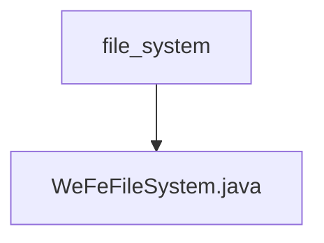

# 基础信息

|      |      |
|------|------|
| 名称 | file_system |
| 编码语言 | .java |
| 代码路径 | WeFe/board/board-service/src/main/java/com/welab/wefe/board/service/base/file_system |
| 包名 | docs.board.board-service.src.main.java.com.welab.wefe.board.service.base.file_system |
| 概述说明 | WeFeFileSystem类管理文件系统操作，包括文件路径获取、资源类型处理、深度学习模型下载和调用，支持临时文件、数据资源上传及图片处理等功能。 |

# 说明

WeFeFileSystem类是一个文件系统管理工具，主要用于处理文件上传、存储和目录管理。它包含一个枚举UseType，定义了多种文件用途，如临时文件、数据资源添加、深度学习模型调用和下载等。类提供了获取根目录和根据不同类型获取子目录的方法。DownloadDeepLearningModel子类处理模型文件的下载和重命名操作。CallDeepLearningModel子类管理深度学习模型相关的文件操作，包括图片样本目录的压缩、单张图片移动、ZIP文件解压及非图片文件清理等功能。所有操作均包含错误处理和日志记录。

### 包内部结构视图

该流程图展示了文件系统模块的简单层级结构，顶层目录是file_system，其下包含一个核心文件WeFeFileSystem.java。这种结构常见于项目中的基础服务模块，用于封装文件系统相关操作。整个结构简洁明了，体现了单一职责原则。

# 文件列表

| 名称   | 类型  | 说明 |
|-------|------|-------------|
| [WeFeFileSystem.java](WeFeFileSystem.md) | file | WeFeFileSystem类管理文件系统操作，包括文件路径获取、资源类型处理、深度学习模型下载和调用，支持临时文件、数据资源上传及图片处理等功能。 |

