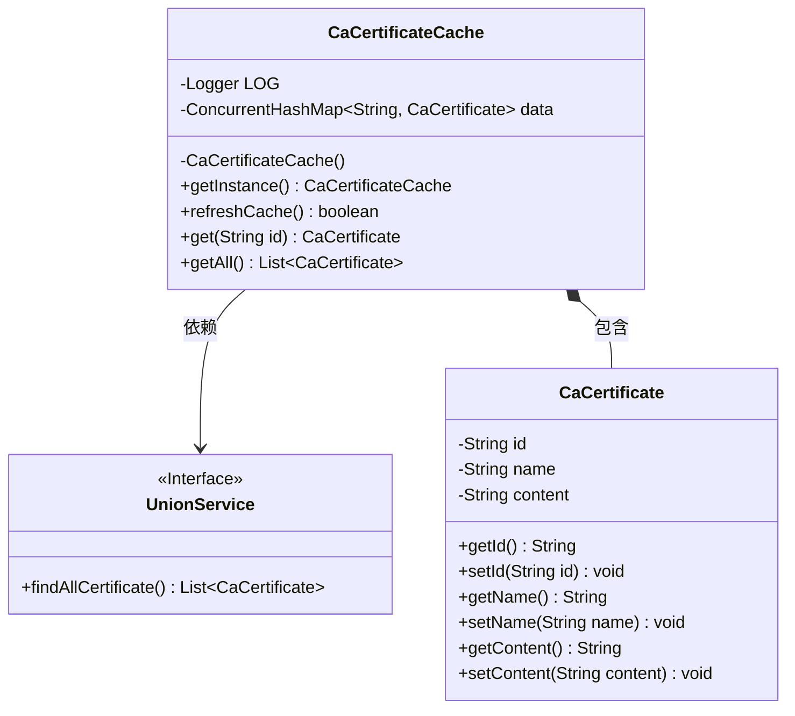
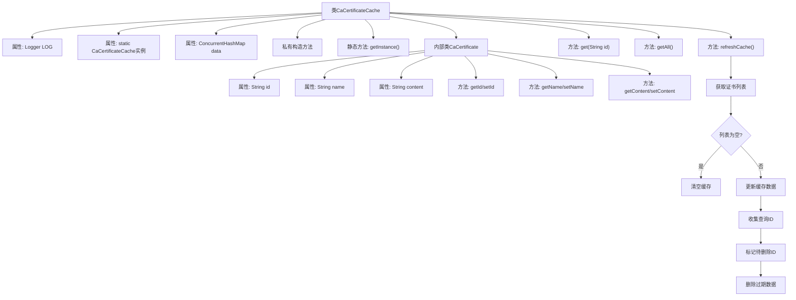
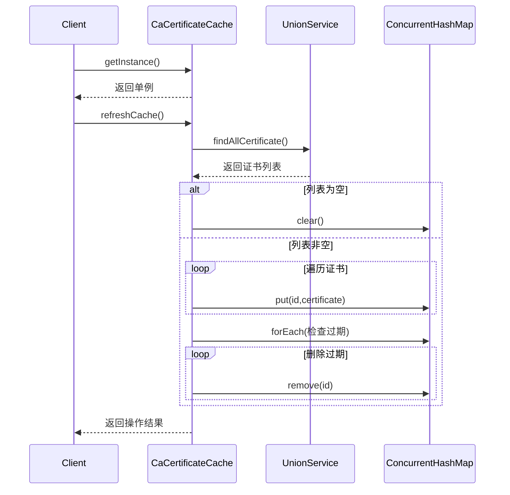

# 基础信息

|      |      |
|------|------|
| 名称 | CaCertificateCache |
| 编码语言 | .java |
| 代码路径 | WeFe/board/board-service/src/main/java/com/welab/wefe/board/service/cache/CaCertificateCache.java |
| 包名 | com.welab.wefe.board.service.cache |
| 依赖项 | ['com.welab.wefe.board.service.sdk.union.UnionService', 'com.welab.wefe.common.web.Launcher', 'org.apache.commons.collections4.CollectionUtils', 'org.slf4j.Logger', 'org.slf4j.LoggerFactory', 'java.util.ArrayList', 'java.util.List', 'java.util.concurrent.ConcurrentHashMap'] |
| 概述说明 | CaCertificateCache类是一个单例模式的CA证书缓存，使用ConcurrentHashMap存储证书数据，提供刷新缓存、获取单个或全部证书的功能。内部类CaCertificate包含id、name和content属性。 |

# 说明

CaCertificateCache是一个单例类，用于管理CA证书缓存。它使用ConcurrentHashMap存储CaCertificate对象，提供刷新缓存、获取单个或全部证书的功能。刷新缓存时从UnionService获取最新证书列表，更新并清理无效数据。CaCertificate是内部类，包含id、name和content属性及对应的getter和setter方法。

# 类列表 Class Summary

| 名称   | 类型  | 说明 |
|-------|------|-------------|
| CaCertificateCache | class | CaCertificateCache类是一个单例缓存，用于存储CaCertificate对象。它提供刷新缓存、获取单个或全部证书的方法。内部使用ConcurrentHashMap存储数据，CaCertificate包含id、name和content属性。 |

## 类 CaCertificateCache

|      |      |
|------|------|
| 访问范围 | public |
| 类型 | class |
| 名称 | CaCertificateCache |
| 说明 | CaCertificateCache类是一个单例缓存，用于存储CaCertificate对象。它提供刷新缓存、获取单个或全部证书的方法。内部使用ConcurrentHashMap存储数据，CaCertificate包含id、name和content属性。 |

### UML类图

这段代码展示了一个单例模式的CA证书缓存系统，包含CaCertificateCache主类和嵌套的CaCertificate数据类。CaCertificateCache使用ConcurrentHashMap存储证书数据，通过refreshCache方法从UnionService接口获取最新证书列表并同步更新缓存，同时提供get和getAll查询方法。CaCertificate类封装了证书ID、名称和内容等基础属性，采用标准JavaBean设计。整体设计实现了线程安全的证书缓存管理，支持动态更新和查询功能。

### 内部方法调用关系图

该流程图展示了CaCertificateCache类的结构和核心方法refreshCache的执行逻辑。这是一个单例模式的证书缓存类，通过ConcurrentHashMap存储证书数据，提供缓存刷新、查询等功能。refreshCache方法通过对比数据库查询结果与现有缓存，实现了增量更新和过期数据清理的机制，确保缓存数据一致性。时序图则详细描述了客户端调用缓存刷新时，与UnionService和内部存储结构的交互过程。

### 字段列表 Field List

| 名称  | 类型  | 说明 |
|-------|-------|------|
| data = new ConcurrentHashMap<>() | ConcurrentHashMap<String, CaCertificate> | 线程安全的哈希表，存储字符串到CaCertificate对象的映射。 |
| LOG = LoggerFactory.getLogger(CaCertificateCache.class) | Logger | 类CaCertificateCache中定义了一个私有不可变的日志记录器LOG。 |
| caCertificateCache = new CaCertificateCache() | CaCertificateCache | 声明一个静态不可变的CA证书缓存实例。 |

### 方法列表

| 名称  | 类型  | 说明 |
|-------|-------|------|
| getInstance | CaCertificateCache | 这是一个静态方法，返回CaCertificateCache类的单例实例caCertificateCache。 |
| refreshCache | boolean | 方法refreshCache用于更新证书缓存：获取所有证书列表，若为空则清空缓存；否则更新缓存数据，移除不存在的证书ID。成功返回true，失败记录错误并返回false。 |
| get | CaCertificate | 方法get通过id从data中获取对应的CaCertificate对象。 |
| getAll | List<CaCertificate> | 该方法返回存储的所有CA证书列表，以ArrayList形式提供数据副本。 |

