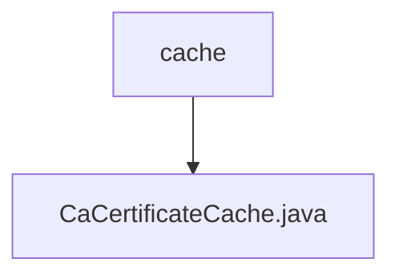

# 基础信息

|      |      |
|------|------|
| 名称 | cache |
| 编码语言 | .java |
| 代码路径 | WeFe/board/board-service/src/main/java/com/welab/wefe/board/service/cache |
| 包名 | docs.board.board-service.src.main.java.com.welab.wefe.board.service.cache |
| 概述说明 | CaCertificateCache类是一个单例模式的CA证书缓存，使用ConcurrentHashMap存储证书数据，提供刷新缓存、获取单个或全部证书的功能。内部类CaCertificate包含id、name和content属性。 |

# 说明

CaCertificateCache是一个单例类，用于管理CA证书缓存。它使用ConcurrentHashMap存储CaCertificate对象，提供刷新缓存、获取单个或全部证书的功能。刷新缓存时从UnionService获取最新证书列表，更新并清理无效数据。CaCertificate是内部类，包含id、name和content属性及对应的getter和setter方法。

### 包内部结构视图

该流程图展示了WeFe项目中board-service模块下的缓存目录结构。根节点为cache目录，其下包含一个Java缓存实现文件CaCertificateCache.java。这种结构是典型的服务层缓存实现方式，将证书缓存功能单独封装在一个文件中，便于维护和管理。

# 文件列表

| 名称   | 类型  | 说明 |
|-------|------|-------------|
| [CaCertificateCache.java](CaCertificateCache.md) | file | CaCertificateCache类是一个单例模式的CA证书缓存，使用ConcurrentHashMap存储证书数据，提供刷新缓存、获取单个或全部证书的功能。内部类CaCertificate包含id、name和content属性。 |

