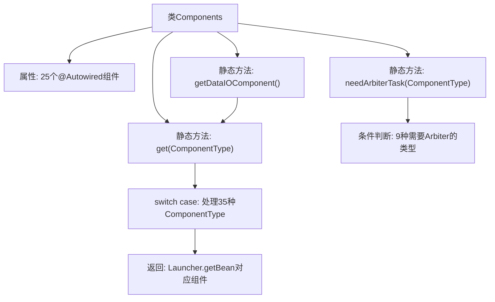

# 基础信息

|      |      |
|------|------|
| 名称 | Components |
| 编码语言 | .java |
| 代码路径 | WeFe/board/board-service/src/main/java/com/welab/wefe/board/service/component/Components.java |
| 包名 | com.welab.wefe.board.service.component |
| 依赖项 | ['com.welab.wefe.board.service.component.base.AbstractComponent', 'com.welab.wefe.board.service.component.deep_learning.ImageDataIOComponent', 'com.welab.wefe.board.service.component.deep_learning.PaddleClassifyComponent', 'com.welab.wefe.board.service.component.deep_learning.PaddleDetectionComponent', 'com.welab.wefe.board.service.component.feature', 'com.welab.wefe.board.service.component.modeling', 'com.welab.wefe.common.web.Launcher', 'com.welab.wefe.common.wefe.enums.ComponentType', 'org.springframework.beans.factory.annotation.Autowired', 'org.springframework.stereotype.Service'] |
| 概述说明 | Components类是一个Spring服务，包含多个自动注入的组件，提供根据ComponentType获取对应组件的方法，并判断是否需要仲裁任务。 |

# 说明

该代码定义了一个名为Components的Spring服务类，包含多个自动装配的组件实例，涵盖数据处理、机器学习、特征工程等功能模块。类中提供了静态方法get，通过ComponentType枚举参数返回对应的组件实例，并定义了needArbiterTask方法判断特定组件类型是否需要仲裁者任务。组件类型包括横向/纵向逻辑回归、安全提升树、特征分箱、PCA、神经网络等，支持图像处理、评分卡等扩展功能。

# 类列表 Class Summary

| 名称   | 类型  | 说明 |
|-------|------|-------------|
| Components | class | Components类是一个Spring服务，包含多个自动注入的组件，提供根据ComponentType获取对应组件的方法，并判断是否需要仲裁任务。 |


## 类 Components

|      |      |
|------|------|
| 访问范围 | @Service;public |
| 类型 | class |
| 名称 | Components |
| 说明 | Components类是一个Spring服务，包含多个自动注入的组件，提供根据ComponentType获取对应组件的方法，并判断是否需要仲裁任务。 |


### UML类图

```mermaid
classDiagram
    class Components {
        -DataIOComponent dataIOComponent
        -IntersectionComponent intersectionComponent
        -EvaluationComponent evaluationComponent
        -HorzLRComponent horzLRComponent
        -VertLRComponent vertLRComponent
        -BinningComponent binningComponent
        -HorzSecureBoostComponent horzSecureBoostComponent
        -VertSecureBoostComponent vertSecureBoostComponent
        -FeatureSelectionComponent featureSelectionComponent
        -SegmentComponent segmentComponent
        -FeatureStatisticsComponent featureStatisticsComponent
        -FeatureCalculationComponent featureCalculationComponent
        -FillMissingValueComponent fillMissingValueComponent
        -FeatureStandardizedComponent featureStandardizedComponent
        -VertPearsonComponent vertPearsonComponent
        -MixLrComponent mixLrComponent
        -MixSecureBoostComponent mixSecureBoostComponent
        -MixStatisticComponent mixStatisticComponent
        -OotComponent ootComponent
        -FeatureTransformComponent featureTransformComponent
        -HorzOneHotComponent horzOneHotComponent
        -VertFilterComponent vertFilterComponent
        -VertOneHotComponent vertOneHotComponent
        -VertPCAComponent vertPCAComponent
        -HorzFeatureBinningComponent horzFeatureBinningComponent
        -HorzStatisticComponent horzStatisticComponent
        -VertNNComponent vertNNComponent
        -HorzNNComponent horzNNComponent
        -MixBinningComponent mixBinningComponent
        -ImageDataIOComponent imageDataIOComponent
        -PaddleClassifyComponent paddleClassifyComponent
        -PaddleDetectionComponent paddleDetectionComponent
        -ScoreCardComponent scoreCardComponent
        -FeaturePsiComponent featurePsiComponent
        +static AbstractComponent~?~ getDataIOComponent()
        +static AbstractComponent~?~ get(ComponentType componentType)
        +static boolean needArbiterTask(ComponentType type)
    }

    class AbstractComponent~T~ {
        <<Abstract>>
    }

    class ComponentType {
        <<Enumeration>>
    }

    Components --> AbstractComponent~?~ : "通过get()返回"
    Components --> ComponentType : "依赖枚举类型"
    DataIOComponent --|> AbstractComponent~?~
    IntersectionComponent --|> AbstractComponent~?~
    EvaluationComponent --|> AbstractComponent~?~
    // 其他具体组件类同理继承AbstractComponent
```

这段代码展示了一个名为`Components`的服务类，它通过`@Autowired`注入了30多个不同类型的组件实例，并提供了静态方法`get()`来根据`ComponentType`枚举获取对应的组件实例。类图清晰地展示了`Components`与抽象组件类`AbstractComponent`的关联关系，以及所有具体组件类对`AbstractComponent`的实现关系。该类作为组件管理中心，通过类型安全的枚举映射机制实现了组件的统一获取和仲裁任务判断功能，体现了典型的工厂模式设计思想。


### 内部方法调用关系图



这段代码定义了一个Spring服务类Components，它通过@Autowired注入了25个不同类型的组件，并提供了三个静态方法。主要功能是通过ComponentType枚举获取对应的组件实例，其中get方法包含一个大型switch-case结构处理35种组件类型。needArbiterTask方法判断特定组件类型是否需要仲裁任务。整个类作为组件管理中心，实现了不同类型组件的统一获取和仲裁需求判断功能。

### 字段列表 Field List

| 名称  | 类型  | 说明 |
|-------|-------|------|
| vertPCAComponent | VertPCAComponent | 自动注入VertPCAComponent组件实例。 |
| mixSecureBoostComponent | MixSecureBoostComponent | 自动注入MixSecureBoostComponent组件实例。 |
| featurePsiComponent | FeaturePsiComponent | 使用@Autowired自动注入FeaturePsiComponent组件实例。 |
| vertPearsonComponent | VertPearsonComponent | 使用@Autowired自动注入VertPearsonComponent组件实例。 |
| horzFeatureBinningComponent | HorzFeatureBinningComponent | 代码片段使用@Autowired自动注入HorzFeatureBinningComponent组件实例。 |
| horzNNComponent | HorzNNComponent | 代码片段使用@Autowired自动注入HorzNNComponent组件实例。 |
| vertFilterComponent | VertFilterComponent | 使用@Autowired自动注入VertFilterComponent组件实例。 |
| mixLrComponent | MixLrComponent | 使用@Autowired自动注入MixLrComponent组件实例。 |
| scoreCardComponent | ScoreCardComponent | 使用@Autowired自动注入ScoreCardComponent组件实例。 |
| mixBinningComponent | MixBinningComponent | 自动注入MixBinningComponent组件实例。 |
| fillMissingValueComponent | FillMissingValueComponent | 自动注入缺失值填充组件实例。 |
| mixStatisticComponent | MixStatisticComponent | 使用@Autowired自动注入MixStatisticComponent组件实例。 |
| featureStatisticsComponent | FeatureStatisticsComponent | 使用@Autowired自动注入FeatureStatisticsComponent组件实例。 |
| evaluationComponent | EvaluationComponent | 自动注入EvaluationComponent组件实例。 |
| paddleDetectionComponent | PaddleDetectionComponent | 自动注入PaddleDetectionComponent组件实例。 |
| paddleClassifyComponent | PaddleClassifyComponent | 使用@Autowired自动注入PaddleClassifyComponent组件实例。 |
| featureCalculationComponent | FeatureCalculationComponent | 自动注入特征计算组件实例。 |
| ootComponent | OotComponent | 使用@Autowired自动注入OotComponent组件实例。 |
| horzSecureBoostComponent | HorzSecureBoostComponent | 代码片段中通过@Autowired注解自动注入了一个名为horzSecureBoostComponent的私有组件。 |
| binningComponent | BinningComponent | 自动注入BinningComponent组件实例。 |
| segmentComponent | SegmentComponent | 使用@Autowired自动注入SegmentComponent组件实例。 |
| featureSelectionComponent | FeatureSelectionComponent | 自动注入特征选择组件实例。 |
| imageDataIOComponent | ImageDataIOComponent | 使用@Autowired自动注入ImageDataIOComponent组件。 |
| horzStatisticComponent | HorzStatisticComponent | 使用@Autowired自动注入HorzStatisticComponent组件实例。 |
| featureStandardizedComponent | FeatureStandardizedComponent | 自动注入特征标准化组件实例。 |
| horzLRComponent | HorzLRComponent | 使用@Autowired自动注入HorzLRComponent组件实例。 |
| vertLRComponent | VertLRComponent | 自动注入VertLRComponent组件实例。 |
| horzOneHotComponent | HorzOneHotComponent | 代码片段中使用了Spring的@Autowired注解，自动注入HorzOneHotComponent组件实例。 |
| vertSecureBoostComponent | VertSecureBoostComponent | 自动注入VertSecureBoostComponent组件实例。 |
| dataIOComponent | DataIOComponent | 使用@Autowired自动注入DataIOComponent组件实例。 |
| vertNNComponent | VertNNComponent | 代码片段使用@Autowired自动注入VertNNComponent组件实例。 |
| featureTransformComponent | FeatureTransformComponent | 自动注入特征转换组件实例。 |
| vertOneHotComponent | VertOneHotComponent | 自动注入VertOneHotComponent组件实例。 |
| intersectionComponent | IntersectionComponent | 自动注入IntersectionComponent组件实例。 |

### 方法列表

| 名称  | 类型  | 说明 |
|-------|-------|------|
| get | AbstractComponent<?> | 静态方法根据组件类型返回对应实例，涉及数据加载、处理、分析及机器学习等组件，未匹配则返回空。 |
| needArbiterTask | boolean | 判断组件类型是否需要仲裁任务，适用于多种横向和混合类型组件。 |
| getDataIOComponent | AbstractComponent<?> | 获取DataIO类型组件的静态方法。 |


