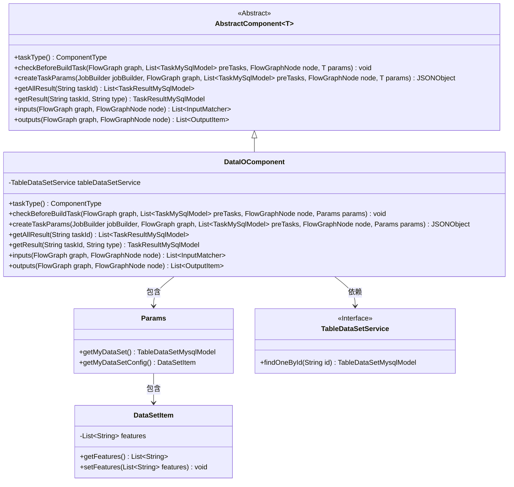
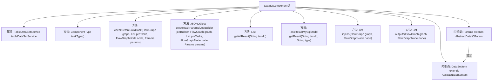
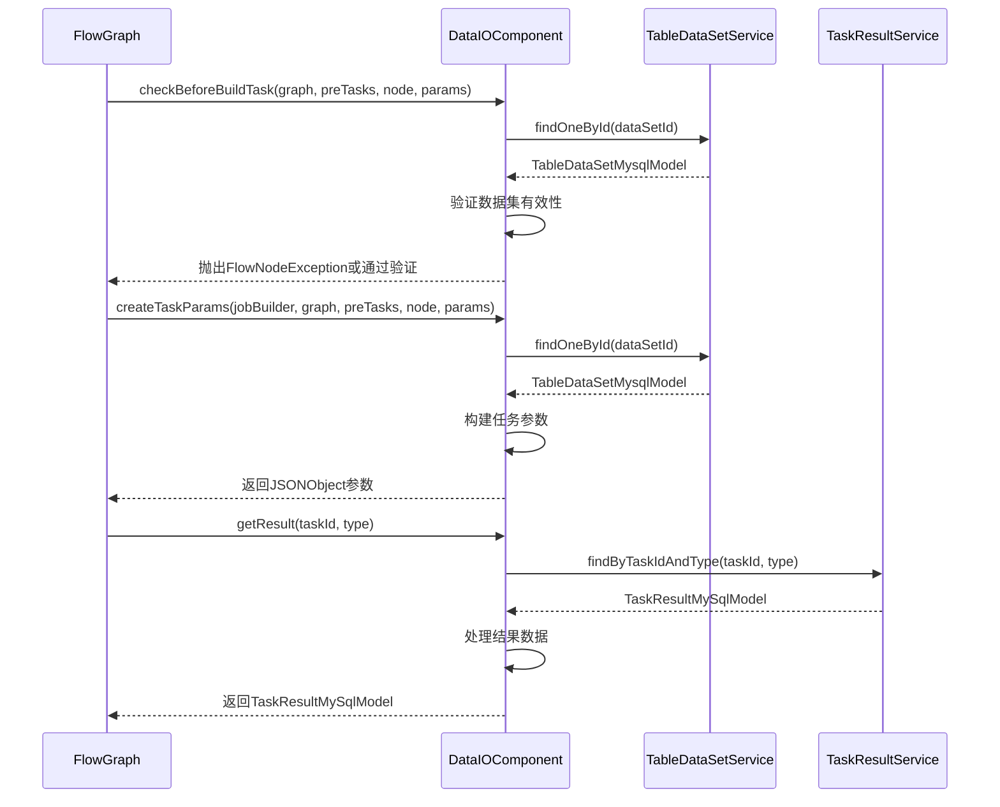

# 基础信息

|      |      |
|------|------|
| 名称 | DataIOComponent |
| 编码语言 | .java |
| 代码路径 | WeFe/board/board-service/src/main/java/com/welab/wefe/board/service/component/DataIOComponent.java |
| 包名 | com.welab.wefe.board.service.component |
| 依赖项 | ['com.alibaba.fastjson.JSONArray', 'com.alibaba.fastjson.JSONObject', 'com.welab.wefe.board.service.component.base.AbstractComponent', 'com.welab.wefe.board.service.component.base.dto.AbstractDataIOParam', 'com.welab.wefe.board.service.component.base.dto.AbstractDataSetItem', 'com.welab.wefe.board.service.component.base.io.IODataType', 'com.welab.wefe.board.service.component.base.io.InputMatcher', 'com.welab.wefe.board.service.component.base.io.Names', 'com.welab.wefe.board.service.component.base.io.OutputItem', 'com.welab.wefe.board.service.database.entity.data_resource.TableDataSetMysqlModel', 'com.welab.wefe.board.service.database.entity.job.JobMemberMySqlModel', 'com.welab.wefe.board.service.database.entity.job.TaskMySqlModel', 'com.welab.wefe.board.service.database.entity.job.TaskResultMySqlModel', 'com.welab.wefe.board.service.dto.vo.data_set.table_data_set.LabelDistribution', 'com.welab.wefe.board.service.exception.FlowNodeException', 'com.welab.wefe.board.service.model.FlowGraph', 'com.welab.wefe.board.service.model.FlowGraphNode', 'com.welab.wefe.board.service.model.JobBuilder', 'com.welab.wefe.board.service.service.CacheObjects', 'com.welab.wefe.board.service.service.data_resource.table_data_set.TableDataSetService', 'com.welab.wefe.common.fieldvalidate.annotation.Check', 'com.welab.wefe.common.util.JObject', 'com.welab.wefe.common.web.Launcher', 'com.welab.wefe.common.wefe.enums.ComponentType', 'com.welab.wefe.common.wefe.enums.FederatedLearningType', 'com.welab.wefe.common.wefe.enums.JobMemberRole', 'com.welab.wefe.common.wefe.enums.TaskResultType', 'org.apache.commons.collections4.CollectionUtils', 'org.springframework.beans.factory.annotation.Autowired', 'org.springframework.stereotype.Service', 'java.util.ArrayList', 'java.util.Arrays', 'java.util.List', 'java.util.stream.Collectors'] |
| 概述说明 | DataIOComponent是处理联邦学习数据输入输出的服务组件，包含数据校验、任务参数生成和结果处理功能。校验逻辑确保数据集符合联邦学习要求（如特征一致性、标签种类等），支持横向和混合建模模式。组件通过TableDataSetService操作数据集，生成任务参数并管理任务结果。 |

# 说明

DataIOComponent是一个继承自AbstractComponent的服务类，主要用于处理联邦学习中的数据输入输出任务。它包含以下核心功能：1. 任务类型定义为DataIO；2. 在构建任务前进行多项验证，包括检查成员数量、数据集数量、发起方数据集存在性、特征列选择等；3. 支持横向和混合联邦学习的特定验证规则；4. 创建任务参数时处理数据集信息；5. 提供获取任务结果的实现；6. 定义输出项为标准化数据集。内部类Params用于管理数据集参数，DataSetItem则扩展了抽象数据集项，增加了特征列属性。组件通过自动注入的TableDataSetService进行数据集操作，并包含严格的业务逻辑验证。

# 类列表 Class Summary

| 名称   | 类型  | 说明 |
|-------|------|-------------|
| DataIOComponent | class | DataIOComponent是处理联邦学习数据输入输出的组件，包含数据校验、任务参数生成和结果处理功能。校验包括成员角色、数据集特征、标签分布等。支持横向和混合建模，确保数据一致性。生成任务参数时处理数据集信息，输出标准化数据集实例。 |

## 类 DataIOComponent

|      |      |
|------|------|
| 访问范围 | @Service;public |
| 类型 | class |
| 名称 | DataIOComponent |
| 说明 | DataIOComponent是处理联邦学习数据输入输出的组件，包含数据校验、任务参数生成和结果处理功能。校验包括成员角色、数据集特征、标签分布等。支持横向和混合建模，确保数据一致性。生成任务参数时处理数据集信息，输出标准化数据集实例。 |

### UML类图

这段类图展示了DataIOComponent及其相关类的结构。DataIOComponent继承自AbstractComponent，实现了数据处理相关的核心功能，包括参数校验、任务创建和结果获取。它依赖TableDataSetService接口进行数据访问，并包含Params和DataSetItem两个内部类来处理参数配置。Params类负责获取数据集配置信息，DataSetItem则封装了特征列数据。整个设计体现了联邦学习场景下对多方数据的安全处理和严格校验机制。

### 内部方法调用关系图

流程图描述：该流程图展示了DataIOComponent类的核心结构和主要方法调用关系。作为联邦学习中的数据IO组件，它通过TableDataSetService进行数据集操作，包含参数验证、任务创建和结果处理三大功能模块。内部类Params和DataSetItem分别处理参数配置和数据集项定义，整体结构体现了严格的数据校验和任务参数构建流程。

时序图描述：时序图展示了DataIOComponent与外部服务的交互过程，包括数据集验证、任务参数创建和结果查询三个阶段。首先通过TableDataSetService验证数据集有效性，然后构建任务参数JSON对象，最后通过TaskResultService获取任务执行结果。整个过程体现了严格的错误检查机制和数据转换逻辑。

### 字段列表 Field List

| 名称  | 类型  | 说明 |
|-------|-------|------|
| tableDataSetService | TableDataSetService | 自动注入TableDataSetService实例。 |

### 方法列表

| 名称  | 类型  | 说明 |
|-------|-------|------|
| createTaskParams | JSONObject | 方法根据角色和数据集配置生成任务参数。若角色为仲裁者返回null；否则验证数据集存在后，返回包含数据集ID、标签、命名空间等信息的JSON对象。若数据集无效抛出异常。 |
| taskType | ComponentType | 该方法返回组件类型为DataIO。 |
| checkBeforeBuildTask | void | 方法检查联邦学习任务构建前的条件：成员需至少2个且指定数据集；数据集需多个且含特征；发起方需数据集且含Y值；横向建模需特征一致；混合建模需发起方数据集2个以上且特征一致。 |
| inputs | List<InputMatcher> | 重写方法inputs，返回空列表，参数为graph和node。 |
| outputs | List<OutputItem> | 方法检查节点参数中的数据集列表，若为空则返回空列表；若指定数据集不存在则抛出异常；否则返回包含数据集实例的输出项列表。 |
| getAllResult | List<TaskResultMySqlModel> | 该方法重写父类方法，通过调用taskResultService的listAllResult方法获取指定taskId的所有任务结果，返回TaskResultMySqlModel列表。 |
| getResult | TaskResultMySqlModel | 方法根据任务ID和类型查询结果，合并数据正常和模型结果，更新结果对象并返回。 |

