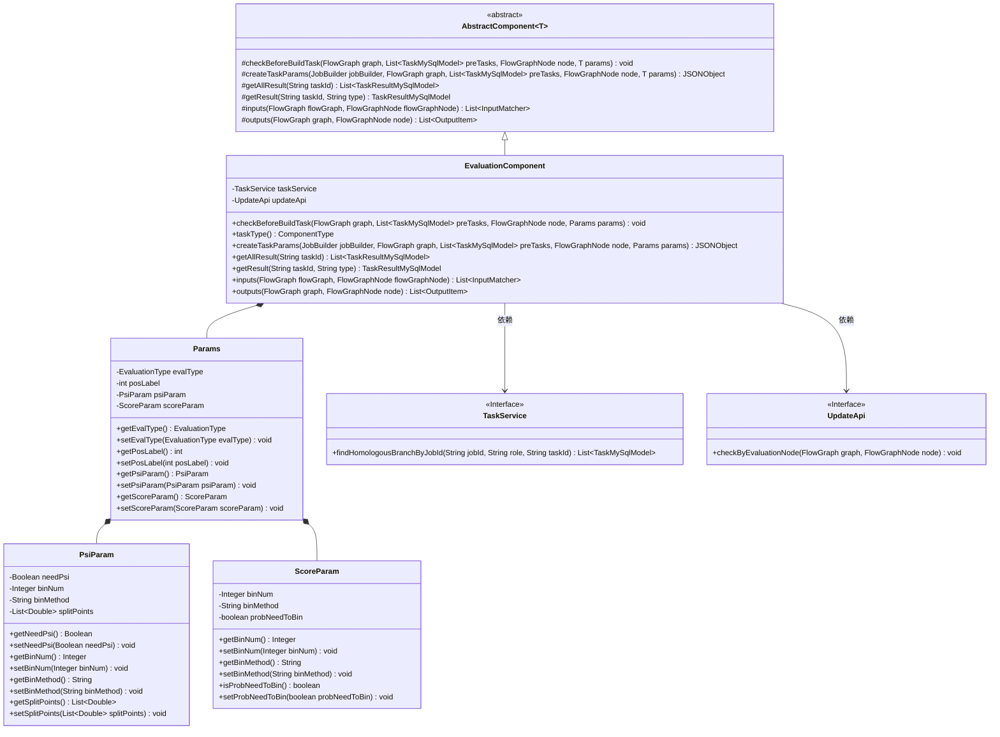
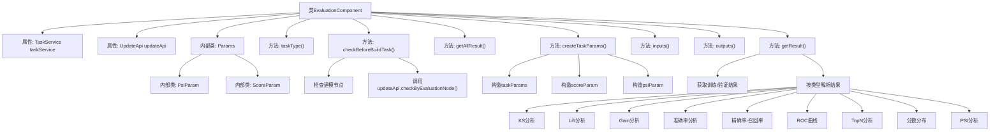

# 基础信息

|      |      |
|------|------|
| 名称 | EvaluationComponent |
| 编码语言 | .java |
| 代码路径 | WeFe/board/board-service/src/main/java/com/welab/wefe/board/service/component/EvaluationComponent.java |
| 包名 | com.welab.wefe.board.service.component |
| 依赖项 | ['com.alibaba.fastjson.JSONObject', 'com.welab.wefe.board.service.api.project.node.UpdateApi', 'com.welab.wefe.board.service.component.base.AbstractComponent', 'com.welab.wefe.board.service.component.base.io', 'com.welab.wefe.board.service.component.enums.EvaluationType', 'com.welab.wefe.board.service.database.entity.job.TaskMySqlModel', 'com.welab.wefe.board.service.database.entity.job.TaskResultMySqlModel', 'com.welab.wefe.board.service.exception.FlowNodeException', 'com.welab.wefe.board.service.model.FlowGraph', 'com.welab.wefe.board.service.model.FlowGraphNode', 'com.welab.wefe.board.service.model.JobBuilder', 'com.welab.wefe.board.service.service.TaskService', 'com.welab.wefe.common.exception.StatusCodeWithException', 'com.welab.wefe.common.fieldvalidate.AbstractCheckModel', 'com.welab.wefe.common.fieldvalidate.annotation.Check', 'com.welab.wefe.common.util.JObject', 'com.welab.wefe.common.web.util.ModelMapper', 'com.welab.wefe.common.wefe.enums.ComponentType', 'com.welab.wefe.common.wefe.enums.JobMemberRole', 'com.welab.wefe.common.wefe.enums.TaskResultType', 'org.apache.commons.collections4.CollectionUtils', 'org.apache.commons.compress.utils.Lists', 'org.springframework.beans.factory.annotation.Autowired', 'org.springframework.stereotype.Service', 'java.math.BigDecimal', 'java.util.ArrayList', 'java.util.Arrays', 'java.util.List', 'java.util.stream.Collectors'] |
| 概述说明 | EvaluationComponent是评估组件，继承AbstractComponent，检查建模节点存在性，创建任务参数，处理评估结果，支持多种评估类型如KS、Lift等，包含PSI和分数分布参数。 |

# 说明

EvaluationComponent是一个继承自AbstractComponent的Spring服务类，主要用于评估任务处理。它通过TaskService和UpdateApi进行任务管理和更新操作。核心功能包括：前置检查确保评估前存在建模节点，创建包含评分参数和PSI参数的JSON任务参数，以及获取和解析多种评估结果类型（如KS、Lift、Gain等）。该类还定义了Params、PsiParam和ScoreParam三个内部类，用于封装评估参数。输出结果为JSON格式，支持训练集和验证集的数据合并与解析。

# 类列表 Class Summary

| 名称   | 类型  | 说明 |
|-------|------|-------------|
| EvaluationComponent | class | EvaluationComponent是一个评估组件，继承自AbstractComponent，用于处理评估任务。它包含检查建模节点、创建任务参数、获取评估结果等功能，支持多种评估类型如KS、Lift、Gain等，并处理PSI和评分参数。 |

## 类 EvaluationComponent

|      |      |
|------|------|
| 访问范围 | @Service;public |
| 类型 | class |
| 名称 | EvaluationComponent |
| 说明 | EvaluationComponent是一个评估组件，继承自AbstractComponent，用于处理评估任务。它包含检查建模节点、创建任务参数、获取评估结果等功能，支持多种评估类型如KS、Lift、Gain等，并处理PSI和评分参数。 |

### UML类图

该代码实现了一个评估组件(EvaluationComponent)，继承自抽象组件类(AbstractComponent)，主要用于处理机器学习模型评估任务。核心功能包括：前置检查(checkBeforeBuildTask)、创建任务参数(createTaskParams)、获取评估结果(getResult)等。组件通过TaskService和UpdateApi接口与其他服务交互，使用Params类封装评估参数，包含PSI参数(PsiParam)和评分参数(ScoreParam)等嵌套配置类。评估组件支持多种评估类型如KS、Lift、Gain等，并能处理训练集和验证集的结果合并。

### 内部方法调用关系图

这段代码是评估组件的实现，主要负责机器学习模型评估任务的处理。流程图展示了类结构和核心方法调用关系，包括参数检查、任务创建、结果获取和多种评估指标分析功能。组件通过TaskService和UpdateApi进行任务管理，支持KS、Lift、Gain等9种评估指标的计算，并能处理训练集和验证集的对比分析，最终输出JSON格式的评估结果。内部类Params及其嵌套类定义了评估所需的参数结构。

### 字段列表 Field List

| 名称  | 类型  | 说明 |
|-------|-------|------|
| updateApi | UpdateApi | 自动注入UpdateApi实例。 |
| taskService | TaskService | 使用@Autowired自动注入TaskService实例。 |

### 方法列表

| 名称  | 类型  | 说明 |
|-------|-------|------|
| extractXAxis | String | 方法`extractXAxis`根据输入的数据键列表和索引生成X轴范围字符串，格式为"前键~当前键"。若索引为0则前键为"0"，否则取列表中前一个键值。结果经`precisionProcessByString`处理。 |
| extractFlowNodeId | String | 提取任务结果中的流程节点ID，通过任务结果查找对应任务并返回其流程节点ID。 |
| extractNormalName | String | 提取任务结果模型名称，组合组件类型、流程节点ID和后缀。 |
| getDistributionObjByTaskId | JObject | 该方法通过任务ID获取分布对象，查询数据库后返回JSON格式结果，若无结果则返回空JSON。 |
| getResultByType | JObject | 根据任务ID和类型获取结果数据，支持KS、Lift、Gain、Accuracy、Precision_Recall、ROC、TopN、Scores_Distribution和PSI等多种类型，返回对应JSON对象。 |
| findEvaluationTaskResultByTaskId | TaskResultMySqlModel | 根据任务ID查找评估任务结果，优先返回训练结果，若无则返回验证结果，两者类型不同但最终合并返回。 |
| extractPreValidateName | String | 该方法根据任务结果模型生成预验证名称，格式为"validate_组件类型_流程节点ID_后缀"。 |
| extractYAxis2 | double | 该方法从JSON对象中提取指定键的Y轴数据，获取"count_rate"值并进行精度处理后返回。 |
| getAllResult | List<TaskResultMySqlModel> | 这是一个Java方法，重写了父类的getAllResult方法，通过taskResultService的listAllResult方法获取指定taskId的所有任务结果列表。 |
| createTaskParams | JSONObject | 方法根据角色决定是否返回参数，非仲裁者时构建包含评估类型、分数分箱及PSI分箱参数的JSON对象。 |
| getValidateJObject | JObject | 私有方法通过任务ID获取验证对象，并从中提取指定名称的JObject。可能抛出状态码异常。 |
| extractModelComponentType | String | 该方法从任务结果模型中提取关联任务的任务类型字符串。先通过任务结果查找对应任务模型，再返回其任务类型字符串。若查找失败会抛出异常。 |
| getResult | TaskResultMySqlModel | 该方法根据任务ID和类型获取任务结果，先查询数据库，若不存在返回null。然后构建包含验证和训练数据的JSON对象，再按类型解析结果数据，更新结果字段后返回模型对象。 |
| parserValidateCurveData | JObject | 解析验证曲线数据方法，调用parserCurveData处理，前缀为validate_。 |
| findEvaluationDistributionTaskResultByTaskId | TaskResultMySqlModel | 方法通过任务ID查询评估分布任务结果，调用服务层按任务ID和类型（metric_train_validate）查找并返回结果。 |
| getPsiObjByTaskId | JObject | 该方法通过任务ID获取PSI任务结果，若存在则返回JSON对象，否则返回空JSON。 |
| findPsiTaskResultByTaskId | TaskResultMySqlModel | 查找指定任务ID的PSI任务结果，调用taskResultService的findByTaskIdAndType方法，类型为metric_train_validate。 |
| getValidateObjByTaskId | JObject | 该方法通过任务ID获取验证结果对象。若存在验证任务结果，则返回其JSON对象；否则返回空JSON对象。 |
| taskType | ComponentType | 方法返回任务类型为评估。 |
| checkBeforeBuildTask | void | 方法检查构建任务前的条件：查找父节点的建模节点，若无则抛出异常；通过评估节点检查API验证。 |
| getTrainJObject | JObject | 方法getTrainJObject通过taskId获取训练对象，并从中提取预处理名称对应的JObject。参数为taskId和taskResultMySqlModel，可能抛出StatusCodeWithException异常。 |
| precisionProcessByString | double | 该方法将字符串转换为BigDecimal，保留3位小数并四舍五入，最后返回double值。 |
| parserScoresDistributionCurveData | JObject | 解析分数分布曲线数据，提取并排序键值，生成包含X轴和双Y轴数据的列表，最终返回分数分布结果。 |
| findEvaluationTrainTaskResultByTaskId | TaskResultMySqlModel | 查找指定任务ID的训练评估结果。 |
| extractScoreDistributionData | JObject | 该方法从JSON对象中提取分数分布数据，依次获取指定键名的嵌套对象，最终返回bin_result结果。 |
| scoreDistributionKey | String | 方法scoreDistributionKey生成训练验证评分键，格式为"train_validate_[taskResultName]_scored"。 |
| parserCurveData | JObject | 解析曲线数据方法：根据类型、名称和数据类型生成键，从输入对象获取对应曲线数据，若不存在返回空对象；否则标准化数据并返回包含解析结果的JObject。 |
| normalizerData | JObject | 该方法接收JObject对象，提取其"data"字段并按key排序。遍历排序后的key，将每个key作为X轴，对应value作为Y轴，构建坐标列表。最后将坐标列表存入原对象并返回。 |
| inputs | List<InputMatcher> | 方法重写，通过flowGraph获取建模节点，返回包含数据集名称和类型的InputMatcher列表。 |
| outputs | List<OutputItem> | Java方法重写，返回包含JSON结果的OutputItem列表。 |
| extractPreTrainName | String | 方法提取预训练名称，组合模型类型、流程节点ID和后缀，格式为"train_类型_节点ID后缀"。 |
| extractSuffix | String | 提取任务ID后缀：若不以流程节点ID结尾，则返回下划线加最后一段；否则返回空字符串。 |
| findEvaluationTaskByTaskResult | TaskMySqlModel | 该方法通过任务结果查找评估任务，返回同源分支任务列表中首个符合任务类型条件的任务，若无则返回null。 |
| getTrainObjByTaskId | JObject | 根据任务ID获取训练结果对象，若存在则返回结果对象，否则返回空对象。 |
| precisionProcessByDouble | double | 该方法将双精度浮点数四舍五入保留两位小数，使用BigDecimal确保精度，ROUND_HALF_UP表示四舍五入规则。 |
| extractYAxis | int | 提取Y轴数据：从JSON对象中获取指定键的值并返回其count字段的整数值。 |
| parserTopN | JObject | 解析训练对象中的topN数据，提取指定类型的topn列表并返回新对象。 |
| findEvaluationValidateTaskResultByTaskId | TaskResultMySqlModel | 查找指定任务ID的评估验证任务结果，返回MySQL模型对象。 |
| parserTrainCurveData | JObject | 解析训练曲线数据，调用parserCurveData方法处理，前缀为"train_"。 |

