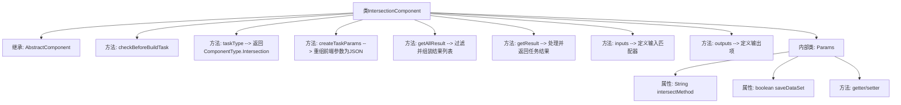

# 基础信息

|      |      |
|------|------|
| 名称 | IntersectionComponent |
| 编码语言 | .java |
| 代码路径 | WeFe/board/board-service/src/main/java/com/welab/wefe/board/service/component/IntersectionComponent.java |
| 包名 | com.welab.wefe.board.service.component |
| 依赖项 | ['com.alibaba.fastjson.JSONObject', 'com.welab.wefe.board.service.component.base.AbstractComponent', 'com.welab.wefe.board.service.component.base.io.IODataType', 'com.welab.wefe.board.service.component.base.io.InputMatcher', 'com.welab.wefe.board.service.component.base.io.Names', 'com.welab.wefe.board.service.component.base.io.OutputItem', 'com.welab.wefe.board.service.database.entity.job.TaskMySqlModel', 'com.welab.wefe.board.service.database.entity.job.TaskResultMySqlModel', 'com.welab.wefe.board.service.exception.FlowNodeException', 'com.welab.wefe.board.service.model.FlowGraph', 'com.welab.wefe.board.service.model.FlowGraphNode', 'com.welab.wefe.board.service.model.JobBuilder', 'com.welab.wefe.common.fieldvalidate.AbstractCheckModel', 'com.welab.wefe.common.fieldvalidate.annotation.Check', 'com.welab.wefe.common.util.JObject', 'com.welab.wefe.common.wefe.enums.ComponentType', 'com.welab.wefe.common.wefe.enums.TaskResultType', 'org.springframework.beans.BeanUtils', 'org.springframework.stereotype.Service', 'java.util.Arrays', 'java.util.List', 'java.util.stream.Collectors'] |
| 概述说明 | IntersectionComponent是处理数据集交集的服务组件，包含参数校验、任务创建、结果获取及输入输出定义，支持交集方法和数据保存配置。 |

# 说明

IntersectionComponent是一个继承自AbstractComponent的服务类，用于处理数据交集任务。它定义了任务类型为Intersection，并实现了多个关键方法：checkBeforeBuildTask用于构建前检查，createTaskParams重组前端参数（包括交集方法和保存数据集标志），getAllResult获取任务结果并过滤训练指标，getResult提取并重组训练交集数据（包括计数、交集数和交集率）。输入输出分别匹配数据集实例。Params内部类封装了必填的交集方法和可选的保存数据集参数。

# 类列表 Class Summary

| 名称   | 类型  | 说明 |
|-------|------|-------------|
| IntersectionComponent | class | IntersectionComponent是处理数据交集的服务组件，包含参数校验、任务创建、结果获取功能，支持数据集对齐操作和结果统计。 |


## 类 IntersectionComponent

|      |      |
|------|------|
| 访问范围 | @Service |
| 类型 | class |
| 名称 | IntersectionComponent |
| 说明 | IntersectionComponent是处理数据交集的服务组件，包含参数校验、任务创建、结果获取功能，支持数据集对齐操作和结果统计。 |


### UML类图

```mermaid
classDiagram
    class AbstractComponent~T~ {
        <<Abstract>>
        #checkBeforeBuildTask(FlowGraph graph, List~TaskMySqlModel~ preTasks, FlowGraphNode node, T params) void
        #createTaskParams(JobBuilder jobBuilder, FlowGraph graph, List~TaskMySqlModel~ preTasks, FlowGraphNode node, T params) JSONObject
        #getAllResult(String taskId) List~TaskResultMySqlModel~
        #getResult(String taskId, String type) TaskResultMySqlModel
        #inputs(FlowGraph graph, FlowGraphNode node) List~InputMatcher~
        +outputs(FlowGraph graph, FlowGraphNode node) List~OutputItem~
        +taskType() ComponentType
    }

    class IntersectionComponent {
        +IntersectionComponent$Params
        #checkBeforeBuildTask(FlowGraph graph, List~TaskMySqlModel~ preTasks, FlowGraphNode node, Params params) void
        #createTaskParams(JobBuilder jobBuilder, FlowGraph graph, List~TaskMySqlModel~ preTasks, FlowGraphNode node, Params params) JSONObject
        #getAllResult(String taskId) List~TaskResultMySqlModel~
        #getResult(String taskId, String type) TaskResultMySqlModel
        #inputs(FlowGraph graph, FlowGraphNode node) List~InputMatcher~
        +outputs(FlowGraph graph, FlowGraphNode node) List~OutputItem~
        +taskType() ComponentType
    }

    class IntersectionComponent$Params {
        -String intersectMethod
        -boolean saveDataSet
        +getIntersectMethod() String
        +setIntersectMethod(String intersectMethod) void
        +isSaveDataSet() boolean
        +setSaveDataSet(boolean saveDataSet) void
    }

    class AbstractCheckModel {
        <<Abstract>>
    }

    class TaskResultMySqlModel {
        +String result
        +String type
        +getResult() String
        +setResult(String result) void
    }

    class InputMatcher {
        <<Interface>>
    }

    class OutputItem {
        <<Interface>>
    }

    AbstractComponent~T~ <|-- IntersectionComponent
    AbstractCheckModel <|-- IntersectionComponent$Params
    IntersectionComponent --> IntersectionComponent$Params : 使用
    IntersectionComponent --> TaskResultMySqlModel : 生成
    IntersectionComponent ..|> InputMatcher : 实现
    IntersectionComponent ..|> OutputItem : 实现
```

这段代码展示了一个名为`IntersectionComponent`的服务类，继承自泛型抽象类`AbstractComponent`，专门处理数据交集任务。该类包含参数处理、任务构建、结果获取等核心方法，通过`Params`内部类封装交集算法参数，使用`TaskResultMySqlModel`存储计算结果。类图清晰地呈现了继承关系、泛型参数传递和接口实现，体现了组件化设计中参数校验、任务构建与结果处理的完整流程。


### 内部方法调用关系图



该流程图展示了IntersectionComponent类的完整结构，重点突出其继承关系和核心方法调用链。作为数据处理组件，它通过createTaskParams方法重组参数，通过getResult方法处理训练指标结果，并定义了数据输入输出规范。内部类Params封装了交集算法所需的配置参数，包含对齐方式和数据集保存标志两个核心属性。所有方法均围绕数据转换和流程控制展开，形成清晰的任务处理闭环。

### 字段列表 Field List

| 名称  | 类型  | 说明 |
|-------|-------|------|

### 方法列表

| 名称  | 类型  | 说明 |
|-------|-------|------|
| getAllResult | List<TaskResultMySqlModel> | 该方法获取指定任务ID的所有训练指标结果，先筛选出类型为metric_train的数据，再补充重组后的同类数据，最终返回合并列表。 |
| createTaskParams | JSONObject | 该方法用于重组前端参数，生成包含交集方法和是否保存数据集的JSON对象。 |
| checkBeforeBuildTask | void | 方法检查构建任务前条件，参数包括流程图、前置任务列表、节点和参数，可能抛出流程节点异常。 |
| getResult | TaskResultMySqlModel | 方法根据任务ID和类型查询结果，提取训练交集数据（数量、交集数、交集率），处理后返回新结果对象。 |
| taskType | ComponentType | 该方法返回组件类型为Intersection。 |
| inputs | List<InputMatcher> | Java方法重写，返回包含数据集实例的输入匹配器列表。 |
| outputs | List<OutputItem> | 该方法返回一个包含单个OutputItem的列表，OutputItem由NORMAL_DATA_SET和DataSetInstance类型组成。 |


