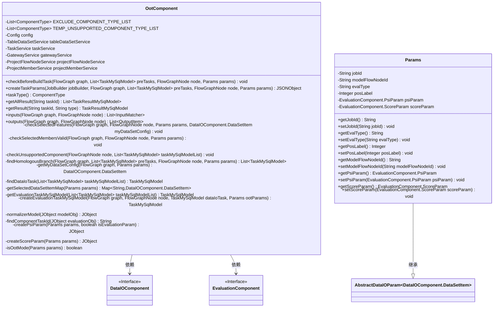

# 基础信息

|      |      |
|------|------|
| 名称 | OotComponent |
| 编码语言 | .java |
| 代码路径 | WeFe/board/board-service/src/main/java/com/welab/wefe/board/service/component/OotComponent.java |
| 包名 | com.welab.wefe.board.service.component |
| 依赖项 | ['com.alibaba.fastjson.JSON', 'com.alibaba.fastjson.JSONObject', 'com.welab.wefe.board.service.api.project.flow.QueryDataIoTaskConfigApi', 'com.welab.wefe.board.service.api.project.member.ListInProjectApi', 'com.welab.wefe.board.service.component.base.AbstractComponent', 'com.welab.wefe.board.service.component.base.dto.AbstractDataIOParam', 'com.welab.wefe.board.service.component.base.io.IODataType', 'com.welab.wefe.board.service.component.base.io.InputMatcher', 'com.welab.wefe.board.service.component.base.io.Names', 'com.welab.wefe.board.service.component.base.io.OutputItem', 'com.welab.wefe.board.service.constant.Config', 'com.welab.wefe.board.service.database.entity.data_resource.TableDataSetMysqlModel', 'com.welab.wefe.board.service.database.entity.job', 'com.welab.wefe.board.service.dto.kernel.machine_learning.TaskConfig', 'com.welab.wefe.board.service.exception.FlowNodeException', 'com.welab.wefe.board.service.model.FlowGraph', 'com.welab.wefe.board.service.model.FlowGraphNode', 'com.welab.wefe.board.service.model.JobBuilder', 'com.welab.wefe.board.service.service', 'com.welab.wefe.board.service.service.data_resource.table_data_set.TableDataSetService', 'com.welab.wefe.common.exception.StatusCodeWithException', 'com.welab.wefe.common.util.JObject', 'com.welab.wefe.common.util.StringUtil', 'com.welab.wefe.common.wefe.enums.ComponentType', 'com.welab.wefe.common.wefe.enums.FederatedLearningType', 'com.welab.wefe.common.wefe.enums.JobMemberRole', 'com.welab.wefe.common.wefe.enums.TaskResultType', 'org.apache.commons.collections4.CollectionUtils', 'org.springframework.beans.factory.annotation.Autowired', 'org.springframework.stereotype.Service', 'java.util', 'java.util.stream.Collectors'] |
| 概述说明 | OotComponent是用于打分验证的组件，支持OOT模式验证模型效果。主要功能包括检查数据集特征完整性、验证成员选择有效性、处理评估任务配置及生成标准化输出结果。关键点：排除特定组件类型、临时不支持组件列表、混合联邦学习限制、特征列校验、评估参数生成。 |

# 说明

OotComponent是一个用于打分验证的组件，继承自AbstractComponent，主要用于处理联邦学习中的OOT（Out of Time）模式验证。该组件包含以下关键功能：1. 定义了排除执行的组件列表和暂不支持的组件列表；2. 通过多个服务注入实现数据操作、任务处理等功能；3. 在构建任务前进行多项检查，包括角色验证、联邦学习类型检查、数据集特征完整性验证等；4. 支持OOT模式和非OOT模式两种场景；5. 创建任务参数时处理数据集替换、模型组件调整等逻辑；6. 提供多种评估结果查询功能，如KS、Lift、ROC等指标；7. 包含参数类Params，用于配置jobId、评估类型等关键信息。组件严格验证输入数据集特征必须包含原流程入模特征列，确保验证过程的有效性。

# 类列表 Class Summary

| 名称   | 类型  | 说明 |
|-------|------|-------------|
| OotComponent | class | OotComponent是用于打分验证的组件，支持OOT模式验证数据集特征完整性，检查建模节点和评估节点，生成评估任务配置，并处理PSI和评分参数。 |

## 类 OotComponent

|      |      |
|------|------|
| 访问范围 | @Service;public |
| 类型 | class |
| 名称 | OotComponent |
| 说明 | OotComponent是用于打分验证的组件，支持OOT模式验证数据集特征完整性，检查建模节点和评估节点，生成评估任务配置，并处理PSI和评分参数。 |

### UML类图

这段代码展示了一个OotComponent类，它是AbstractComponent的泛型子类，主要用于处理联邦学习中的打分验证逻辑。该类包含多个服务依赖和常量定义，提供了构建任务参数、检查前置条件、创建评估任务等方法。Params作为内部类封装了OOT模式所需的配置参数，包括任务ID、评估类型等。类图中清晰地展示了OotComponent与DataIOComponent、EvaluationComponent的依赖关系，以及Params类的继承结构。

### 内部方法调用关系图

```mermaid
graph TD
    A["类OotComponent"]
    B["静态常量: EXCLUDE_COMPONENT_TYPE_LIST"]
    C["静态常量: TEMP_UNSUPPORTED_COMPONENT_TYPE_LIST"]
    D["依赖注入: Config config"]
    E["依赖注入: TableDataSetService"]
    F["依赖注入: TaskService"]
    G["依赖注入: GatewayService"]
    H["依赖注入: ProjectFlowNodeService"]
    I["依赖注入: ProjectMemberService"]
    J["方法: checkBeforeBuildTask"]
    K["方法: createTaskParams"]
    L["方法: taskType"]
    M["方法: getAllResult"]
    N["方法: getResult"]
    O["方法: inputs"]
    P["方法: outputs"]
    Q["私有方法: checkSelectedFeatures"]
    R["私有方法: checkSelectedMembersValid"]
    S["私有方法: checkUnsupportedComponent"]
    T["私有方法: findHomologousBranch"]
    U["私有方法: getMyDataSetConfig"]
    V["私有方法: findDataIoTask"]
    W["私有方法: getSelectedDataSetItemMap"]
    X["私有方法: getEvaluationTaskMySqlModel"]
    Y["私有方法: createEvaluationTaskMySqlModel"]
    Z["私有方法: normalizerModel"]
    AA["私有方法: findComponentTaskId"]
    AB["私有方法: createPsiParam"]
    AC["私有方法: createScoreParam"]
    AD["私有方法: isOotMode"]
    AE["内部类: Params"]

    A --> B
    A --> C
    A --> D
    A --> E
    A --> F
    A --> G
    A --> H
    A --> I
    A --> J
    A --> K
    A --> L
    A --> M
    A --> N
    A --> O
    A --> P
    A --> Q
    A --> R
    A --> S
    A --> T
    A --> U
    A --> V
    A --> W
    A --> X
    A --> Y
    A --> Z
    A --> AA
    A --> AB
    A --> AC
    A --> AD
    A --> AE

    J -->|调用| U
    J -->|调用| V
    J -->|调用| S
    J -->|调用| Q
    J -->|调用| R
    K -->|调用| U
    K -->|调用| V
    K -->|调用| X
    K -->|调用| Y
    K -->|调用| AB
    K -->|调用| AC
    N -->|调用| AA
    N -->|调用| Z
    Q -->|调用| W
    Q -->|调用| AD
    R -->|调用| AD
    Y -->|调用| AB
    Y -->|调用| AC
```

该流程图展示了OotComponent类的完整结构，包含静态常量、依赖注入服务和主要方法调用关系。核心方法checkBeforeBuildTask和createTaskParams负责验证和任务创建，调用多个私有方法完成特征检查、成员验证和评估任务生成。私有方法如checkSelectedFeatures实现特征列校验，createEvaluationTaskMySqlModel处理评估组件创建，形成完整的OOT验证流程。内部类Params封装了作业ID、评估类型等关键参数。

### 字段列表 Field List

| 名称  | 类型  | 说明 |
|-------|-------|------|
| tableDataSetService | TableDataSetService | 自动注入TableDataSetService实例。 |
| TEMP_UNSUPPORTED_COMPONENT_TYPE_LIST = Arrays.asList(ComponentType.MixLR,            ComponentType.MixSecureBoost, ComponentType.HorzNN, ComponentType.VertNN) | List<ComponentType> | 临时不支持组件类型列表：MixLR、MixSecureBoost、HorzNN、VertNN。 |
| taskService | TaskService | 自动注入TaskService实例。 |
| EXCLUDE_COMPONENT_TYPE_LIST = Arrays.asList(ComponentType.FeatureStatistic,            ComponentType.FeatureCalculation, ComponentType.MixStatistic,            ComponentType.Segment, ComponentType.VertPearson, ComponentType.Oot, ComponentType.VertFeaturePSI, ComponentType.VertFilter, ComponentType.ScoreCard) | List<ComponentType> | 排除的组件类型列表：FeatureStatistic、FeatureCalculation、MixStatistic、Segment、VertPearson、Oot、VertFeaturePSI、VertFilter、ScoreCard。 |
| gatewayService | GatewayService | 使用@Autowired自动注入GatewayService实例。 |
| projectFlowNodeService | ProjectFlowNodeService | 自动注入项目流程节点服务实例。 |
| config | Config | 使用@Autowired自动注入Config配置类实例。 |
| projectMemberService | ProjectMemberService | 使用@Autowired自动注入ProjectMemberService实例。 |

### 方法列表

| 名称  | 类型  | 说明 |
|-------|-------|------|
| findComponentTaskId | String | 该方法从JSON对象中查找符合特定后缀的键，并返回去除后缀的键名。若无匹配则返回空字符串。 |
| inputs | List<InputMatcher> | 重写方法inputs，返回空列表，参数为graph和node，可能抛出FlowNodeException异常。 |
| checkUnsupportedComponent | void | 检查节点任务信息是否为空，并遍历任务列表验证组件类型是否在临时不支持列表中，若发现不支持类型则抛出异常。 |
| findHomologousBranch | List<TaskMySqlModel> | 方法findHomologousBranch根据参数模式查找同源分支任务：OOT模式时验证建模节点任务，否则获取父任务ID，最终调用taskService查询同源分支。 |
| outputs | List<OutputItem> | 方法outputs返回包含JSON结果的OutputItem列表，参数为FlowGraph和FlowGraphNode，可能抛出FlowNodeException。 |
| getSelectedDataSetItemMap | Map<String, DataIOComponent.DataSetItem> | 该方法根据参数获取数据集列表，将每个数据项的成员ID作为键、数据项作为值存入Map并返回。 |
| normalizerModel | JObject | 该方法规范化模型对象，提取模块名、联邦学习类型、模型参数和预测指标数据，返回包含这些信息的JSON对象。若输入为空则返回空对象。 |
| createTaskParams | JSONObject | 方法为OOT模式创建任务参数，检查数据集，处理原始任务列表，过滤组件，添加评估任务，配置子任务参数，生成输入参数。 |
| createPsiParam | JObject | 创建PSI参数的JSON对象，包含need_psi、bin_num、bin_method和split_points字段，根据输入参数动态设置值。 |
| checkSelectedMembersValid | void | 检查选定成员有效性，验证数据集成员是否匹配项目成员，垂直联邦学习模式下需确保成员一致，异常时抛出错误。 |
| checkSelectedFeatures | void | 检查选定特征：验证数据集特征是否包含原入模特征列，确保OOT模式下特征完整性，否则抛出异常提示重新选择数据集。 |
| findDataIoTask | TaskMySqlModel | 查找列表中首个符合DATA_IO_COMPONENT_TYPE_LIST类型的任务，若无则返回null。 |
| getResult | TaskResultMySqlModel | 该方法根据任务ID和类型获取任务结果，处理不同评估指标（如KS、Lift、Gain等），并返回标准化输出。若无结果则返回null。 |
| checkBeforeBuildTask | void | 方法检查构建任务前的条件：仲裁者角色跳过；混合联邦不支持打分验证；验证数据集存在且特征列包含原流程入模特征；发起方需额外检查组件、特征和成员有效性。 |
| getEvaluationTaskMySqlModel | TaskMySqlModel | 从任务模型列表中获取类型为Evaluation的任务，若列表为空或无匹配项则返回null。 |
| taskType | ComponentType | 方法重写，返回组件类型为Oot。 |
| createEvaluationTaskMySqlModel | TaskMySqlModel | 该方法创建评估任务的MySQL模型，检查参数有效性后，基于数据IO任务配置生成评估任务配置，设置任务ID、类型、作业ID等属性，并重组评估参数，最后返回模型对象。 |
| getMyDataSetConfig | DataIOComponent.DataSetItem | 从参数数据集列表中筛选出当前成员ID和角色匹配的首个数据项，若无则返回null。 |
| getAllResult | List<TaskResultMySqlModel> | 重写方法getAllResult，接收taskId参数，返回空列表。 |
| createScoreParam | JObject | 创建JObject参数，仅包含prob_need_to_bin字段设为false，其他字段被注释。 |
| isOotMode | boolean | 检查params的jobId是否非空，返回布尔值。 |

