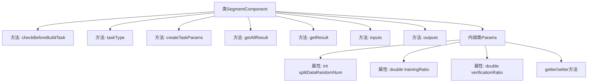
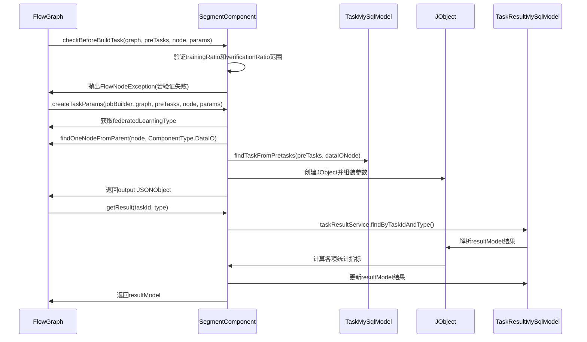

# 基础信息

|      |      |
|------|------|
| 名称 | SegmentComponent |
| 编码语言 | .java |
| 代码路径 | WeFe/board/board-service/src/main/java/com/welab/wefe/board/service/component/SegmentComponent.java |
| 包名 | com.welab.wefe.board.service.component |
| 依赖项 | ['com.alibaba.fastjson.JSONObject', 'com.welab.wefe.board.service.component.base.AbstractComponent', 'com.welab.wefe.board.service.component.base.io.IODataType', 'com.welab.wefe.board.service.component.base.io.InputMatcher', 'com.welab.wefe.board.service.component.base.io.Names', 'com.welab.wefe.board.service.component.base.io.OutputItem', 'com.welab.wefe.board.service.database.entity.job.TaskMySqlModel', 'com.welab.wefe.board.service.database.entity.job.TaskResultMySqlModel', 'com.welab.wefe.board.service.exception.FlowNodeException', 'com.welab.wefe.board.service.model.FlowGraph', 'com.welab.wefe.board.service.model.FlowGraphNode', 'com.welab.wefe.board.service.model.JobBuilder', 'com.welab.wefe.common.fieldvalidate.AbstractCheckModel', 'com.welab.wefe.common.fieldvalidate.annotation.Check', 'com.welab.wefe.common.util.JObject', 'com.welab.wefe.common.wefe.enums.ComponentType', 'com.welab.wefe.common.wefe.enums.FederatedLearningType', 'com.welab.wefe.common.wefe.enums.TaskResultType', 'org.springframework.stereotype.Service', 'java.util.Arrays', 'java.util.List'] |
| 概述说明 | SegmentComponent是处理数据分割的组件，验证训练和验证比例，生成任务参数，并输出训练和评估数据集。 |

# 说明

SegmentComponent是一个服务类，继承自AbstractComponent，用于处理数据分割任务。它首先检查训练和验证数据的比例是否在0到100之间，否则抛出异常。根据联邦学习类型设置模式为垂直或水平。从DataIO组件获取标签信息，并生成包含随机数、训练比例、标签信息等参数的任务配置。它还提供了获取任务结果的方法，包括训练和验证数据的数量、正负例比例等统计信息。输入输出分别匹配普通数据集和训练、评估数据集。Params类定义了切分随机数、训练集和验证集比例等必填参数。

# 类列表 Class Summary

| 名称   | 类型  | 说明 |
|-------|------|-------------|
| SegmentComponent | class | SegmentComponent是处理数据分割的组件，验证训练和验证集比例，生成任务参数，并输出训练和评估数据集。支持横向和纵向联邦学习，包含标签处理和结果统计功能。 |


## 类 SegmentComponent

|      |      |
|------|------|
| 访问范围 | @Service |
| 类型 | class |
| 名称 | SegmentComponent |
| 说明 | SegmentComponent是处理数据分割的组件，验证训练和验证集比例，生成任务参数，并输出训练和评估数据集。支持横向和纵向联邦学习，包含标签处理和结果统计功能。 |


### UML类图

```mermaid
classDiagram
    class AbstractComponent~T~ {
        <<Abstract>>
        +checkBeforeBuildTask(FlowGraph graph, List~TaskMySqlModel~ preTasks, FlowGraphNode node, T params) void
        +taskType() ComponentType
        +createTaskParams(JobBuilder jobBuilder, FlowGraph graph, List~TaskMySqlModel~ preTasks, FlowGraphNode node, T params) JSONObject
        +getAllResult(String taskId) List~TaskResultMySqlModel~
        +getResult(String taskId, String type) TaskResultMySqlModel
        +inputs(FlowGraph graph, FlowGraphNode node) List~InputMatcher~
        +outputs(FlowGraph graph, FlowGraphNode node) List~OutputItem~
    }

    class SegmentComponent {
        +checkBeforeBuildTask(FlowGraph graph, List~TaskMySqlModel~ preTasks, FlowGraphNode node, Params params) void
        +taskType() ComponentType
        +createTaskParams(JobBuilder jobBuilder, FlowGraph graph, List~TaskMySqlModel~ preTasks, FlowGraphNode node, Params params) JSONObject
        +getAllResult(String taskId) List~TaskResultMySqlModel~
        +getResult(String taskId, String type) TaskResultMySqlModel
        +inputs(FlowGraph graph, FlowGraphNode node) List~InputMatcher~
        +outputs(FlowGraph graph, FlowGraphNode node) List~OutputItem~
    }

    class SegmentComponent$Params {
        -int splitDataRandomNum
        -double trainingRatio
        -double verificationRatio
        +getSplitDataRandomNum() int
        +setSplitDataRandomNum(int splitDataRandomNum) void
        +getTrainingRatio() double
        +setTrainingRatio(double trainingRatio) void
        +getVerificationRatio() double
        +setVerificationRatio(double verificationRatio) void
    }

    class AbstractCheckModel {
        <<Abstract>>
    }

    AbstractComponent <|-- SegmentComponent
    AbstractCheckModel <|-- SegmentComponent$Params
    SegmentComponent --> SegmentComponent$Params : 使用
```

该代码实现了一个数据分段组件(SegmentComponent)，用于在联邦学习流程中处理数据分割任务。类图展示了SegmentComponent继承自AbstractComponent泛型类，并使用内部类Params作为类型参数。Params继承自AbstractCheckModel，包含分割随机数、训练集和验证集比例等配置参数。组件主要功能包括参数校验(checkBeforeBuildTask)、任务参数创建(createTaskParams)、结果处理(getResult)以及定义输入输出数据规范(inputs/outputs)。整个设计体现了对联邦学习场景中数据分割流程的封装，支持水平和垂直两种联邦学习模式。


### 内部方法调用关系图





该流程图展示了SegmentComponent类的结构及其与内部类Params的关系，包含7个主要方法和3个属性。时序图则详细描述了三个关键方法的调用流程：参数检查(checkBeforeBuildTask)、任务参数创建(createTaskParams)和结果获取(getResult)。代码主要用于数据分段处理，验证训练/验证集比例，根据联邦学习类型组装参数，并计算数据分段后的统计指标。内部类Params封装了分段所需的配置参数，包含随机数、训练集和验证集比例等属性。

### 字段列表 Field List

| 名称  | 类型  | 说明 |
|-------|-------|------|

### 方法列表

| 名称  | 类型  | 说明 |
|-------|-------|------|
| taskType | ComponentType | 方法重写，返回组件类型为Segment。 |
| getAllResult | List<TaskResultMySqlModel> | 这是一个Java方法，重写父类方法，通过调用taskResultService的listAllResult方法获取指定taskId的所有任务结果列表。 |
| checkBeforeBuildTask | void | 检查构建任务前验证训练和验证数据比例是否在0到100之间，否则抛出异常。 |
| createTaskParams | JSONObject | 该方法根据任务参数创建JSON对象，设置联邦学习模式（垂直或水平），检查DataIO组件是否存在，并配置数据分割比例、标签等参数。若缺少DataIO组件则抛出异常。 |
| getResult | TaskResultMySqlModel | 该方法根据任务ID获取训练评估结果，计算正负样本数量和比例，并更新结果模型返回。 |
| inputs | List<InputMatcher> | 方法重写，返回包含数据集实例的输入匹配器列表。 |
| outputs | List<OutputItem> | 该方法返回一个包含两个OutputItem的列表，分别对应训练数据集和评估数据集，数据类型均为DataSetInstance。 |


