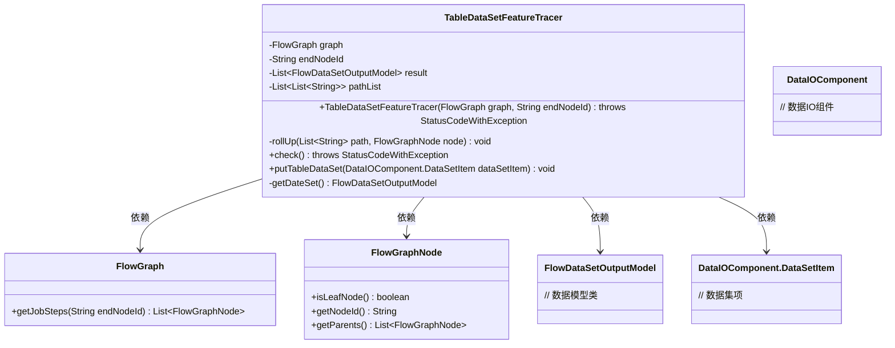
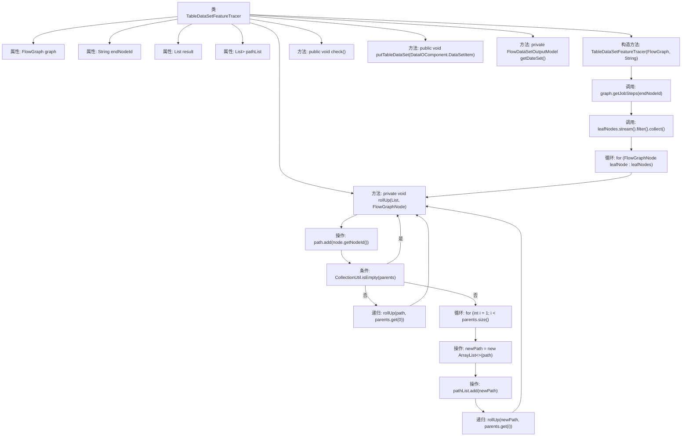

# 基础信息

|      |      |
|------|------|
| 名称 | TableDataSetFeatureTracer |
| 编码语言 | .java |
| 代码路径 | WeFe/board/board-service/src/main/java/com/welab/wefe/board/service/component/TableDataSetFeatureTracer.java |
| 包名 | com.welab.wefe.board.service.component |
| 依赖项 | ['cn.hutool.core.collection.CollectionUtil', 'com.welab.wefe.board.service.dto.vo.FlowDataSetOutputModel', 'com.welab.wefe.board.service.model.FlowGraph', 'com.welab.wefe.board.service.model.FlowGraphNode', 'com.welab.wefe.common.exception.StatusCodeWithException', 'java.util.ArrayList', 'java.util.List', 'java.util.stream.Collectors'] |
| 概述说明 | TableDataSetFeatureTracer类用于跟踪流程图节点路径，支持从指定结束节点回溯所有执行路径，处理分叉时生成新路径。包含路径检查和数据输出功能。 |

# 说明

TableDataSetFeatureTracer类用于跟踪流程图中的执行路径。它接收FlowGraph和可选的结束节点ID作为参数，通过从叶子节点向上回溯遍历所有路径。当遇到分叉时，会创建新路径。类包含pathList存储所有路径，result存储跟踪结果。提供check方法检查路径，putTableDataSet方法添加数据集，getDateSet方法获取数据集。核心逻辑是通过rollUp方法递归构建路径列表。

# 类列表 Class Summary

| 名称   | 类型  | 说明 |
|-------|------|-------------|
| TableDataSetFeatureTracer | class | TableDataSetFeatureTracer类用于跟踪流程图节点路径，支持从叶子节点向上搜索所有执行路径，处理分叉时生成新路径。包含路径列表和结果存储功能。 |

## 类 TableDataSetFeatureTracer

|      |      |
|------|------|
| 访问范围 | public |
| 类型 | class |
| 名称 | TableDataSetFeatureTracer |
| 说明 | TableDataSetFeatureTracer类用于跟踪流程图节点路径，支持从叶子节点向上搜索所有执行路径，处理分叉时生成新路径。包含路径列表和结果存储功能。 |

### UML类图

这段代码实现了一个表数据集特征追踪器，主要用于分析流程图中的执行路径。核心功能是通过`rollUp`方法从叶子节点向上回溯，记录所有可能的执行路径到`pathList`中。类结构包含对流程图节点(FlowGraphNode)的操作、数据模型(FlowDataSetOutputModel)的处理以及数据IO组件(DataIOComponent)的交互。该设计支持从指定结束节点开始逆向追踪，并能处理流程图中的分支情况。

### 内部方法调用关系图

该流程图展示了TableDataSetFeatureTracer类的核心结构和执行逻辑。主要流程从构造函数开始，通过graph.getJobSteps获取步骤列表，过滤出叶子节点后，对每个叶子节点执行rollUp方法向上回溯构建路径。rollUp方法递归处理父节点，遇到分叉时创建新路径。整个过程形成树状回溯结构，最终生成所有可能的执行路径列表pathList。其他方法如check()和putTableDataSet()作为接口预留，尚未实现具体逻辑。

### 字段列表 Field List

| 名称  | 类型  | 说明 |
|-------|-------|------|
| result = new ArrayList<>() | List<FlowDataSetOutputModel> | 声明一个私有列表变量result，用于存储FlowDataSetOutputModel类型的数据集合。 |
| graph | FlowGraph | 私有变量graph，类型为FlowGraph。 |
| endNodeId | String | 私有字符串类型变量，存储结束节点ID。 |
| pathList = new ArrayList<>() | List<List<String>> | 定义了一个私有变量pathList，类型为包含字符串列表的列表，初始化为空ArrayList。 |

### 方法列表

| 名称  | 类型  | 说明 |
|-------|-------|------|
| rollUp | void | 递归向上遍历节点路径，单父节点继续当前路径，多父节点时分叉新路径。 |
| check | void | 方法检查路径列表，未实现步骤检查逻辑，可能抛出异常。 |
| getDateSet | FlowDataSetOutputModel | 方法getDateSet返回空FlowDataSetOutputModel对象。 |
| putTableDataSet | void | 方法定义：空实现，接收DataSetItem参数，无返回值。 |

