# 基础信息

|      |      |
|------|------|
| 名称 | component |
| 编码语言 | .java |
| 代码路径 | WeFe/board/board-service/src/main/java/com/welab/wefe/board/service/component |
| 包名 | docs.board.board-service.src.main.java.com.welab.wefe.board.service.component |
| 概述说明 | 联邦学习平台组件集合，包含数据交互、特征工程、机器学习建模（逻辑回归/XGBoost/神经网络）、深度学习（PaddlePaddle图像处理）、评估验证等模块。采用策略模式设计，支持横向/纵向/混合场景，统一接口规范（参数校验-JSON配置-结果输出），依赖Java标准库和内部服务。 |

# 说明

## 概述  
该模块是联邦学习平台的核心组件集合，主要职责是实现分布式机器学习全流程，包括数据预处理、特征工程、模型训练和评估验证。采用策略模式（如AbstractComponent基类）和工厂模式（如Components服务类）设计，类似数据处理流水线。关键数据结构涵盖FlowGraphNode（流程节点）、Params（任务参数）、DataSetItem（数据集元信息）及各类算法配置（如神经网络层/XGBoost树深度）。外部依赖包括Java标准库、Spring框架、PaddlePaddle/XGBoost等机器学习框架，以及内部服务（如JobService/TableDataSetService）。例如HorzLRComponent实现横向逻辑回归，PaddleClassify处理图像分类。

## 主要业务场景  
模块支持横向/纵向/混合联邦学习场景，典型业务流程为：1）数据准备（DataIOComponent校验数据集→IntersectionComponent样本对齐）；2）特征处理（FeatureBinning分箱→PCA降维）；3）模型训练（HorzLRComponent逻辑回归→VertSecureBoostComponent安全提升树）；4）评估验证（EvaluationComponent计算KS/ROC指标→OotComponent时间外验证）。交互模式统一采用"校验-参数化-执行"链，例如PaddleDetection先校验图像标签一致性再配置检测参数。API集成涵盖静态方法（如intersected）和动态服务（如Components.get），支持从数据输入到模型输出的全链路可追溯。

### 包内部结构视图

```mermaid
graph TD
    component --> base
    component --> modeling
    component --> deep_learning
    component --> enums
    component --> temp
    component --> feature
    component --> EvaluationComponent.java
    component --> DataIOComponent.java
    component --> SegmentComponent.java
    component --> OotComponent.java
    component --> TableDataSetFeatureTracer.java
    component --> Components.java
    component --> IntersectionComponent.java
    base --> filter
    base --> io
    base --> dto
    base --> AbstractComponent.java
    filter --> OutputItemFilterFunction.java
    filter --> BinnedOutputFilter.java
    filter --> OutputDataTypesOutputFilter.java
    filter --> IntersectedOutputFilter.java
    filter --> OutputDataTypeAndNameOutputFilter.java
    io --> NodeOutputItem.java
    io --> Names.java
    io --> DataTypeGroup.java
    io --> InputSupplier.java
    io --> InputGroup.java
    io --> InputMatcher.java
    io --> OutputItem.java
    io --> IODataType.java
    dto --> AbstractDataSetItem.java
    dto --> AbstractDataIOParam.java
    modeling --> HorzLRComponent.java
    modeling --> HorzNNComponent.java
    modeling --> AbstractModelingComponent.java
    modeling --> VertSecureBoostComponent.java
    modeling --> HorzSecureBoostComponent.java
    modeling --> ScoreCardComponent.java
    modeling --> VertLRComponent.java
    modeling --> MixLrComponent.java
    modeling --> VertNNComponent.java
    modeling --> MixSecureBoostComponent.java
    deep_learning --> PaddleClassifyComponent.java
    deep_learning --> PaddleDetectionComponent.java
    deep_learning --> ImageDataIOComponent.java
    deep_learning --> AbstractDeepLearningComponent.java
    enums --> EvaluationType.java
    temp --> AbstractValidationDataSetLoaderComponent.java
    feature --> HorzFeatureBinningComponent.java
    feature --> FeatureTransformComponent.java
    feature --> VertFilterComponent.java
    feature --> MixBinningComponent.java
    feature --> FeatureStandardizedComponent.java
    feature --> MixStatisticComponent.java
    feature --> BinningComponent.java
    feature --> HorzOneHotComponent.java
    feature --> FillMissingValueComponent.java
    feature --> FeatureStatisticsComponent.java
    feature --> HorzStatisticComponent.java
    feature --> VertOneHotComponent.java
    feature --> VertPCAComponent.java
    feature --> VertPearsonComponent.java
    feature --> FeatureCalculationComponent.java
    feature --> FeaturePsiComponent.java
    feature --> FeatureSelectionComponent.java
```

该流程图展示了WeFe项目中board-service模块的组件结构，包含base、modeling、deep_learning等主要子模块及其内部文件关系。base模块下包含filter、io、dto等基础功能，modeling和deep_learning模块包含多种机器学习算法实现，feature模块提供特征工程相关功能，整体呈现清晰的树状层级结构。

# 文件列表

| 名称   | 类型  | 说明 |
|-------|------|-------------|
| [temp](temp/_module.md) | package | 抽象类AbstractValidationDataSetLoaderComponent继承AbstractComponent，实现任务参数创建、结果获取、输入输出匹配等方法，包含静态Params类。 |
| [EvaluationComponent.java](EvaluationComponent.md) | file | EvaluationComponent是评估组件，继承AbstractComponent，检查建模节点存在性，创建任务参数，处理评估结果，支持多种评估类型如KS、Lift等，包含PSI和分数分布参数。 |
| [DataIOComponent.java](DataIOComponent.md) | file | DataIOComponent是处理联邦学习数据输入输出的服务组件，包含数据校验、任务参数生成和结果处理功能。校验逻辑确保数据集符合联邦学习要求（如特征一致性、标签种类等），支持横向和混合建模模式。组件通过TableDataSetService操作数据集，生成任务参数并管理任务结果。 |
| [SegmentComponent.java](SegmentComponent.md) | file | SegmentComponent是处理数据分割的组件，验证训练和验证比例，生成任务参数，并输出训练和评估数据集。 |
| [OotComponent.java](OotComponent.md) | file | OotComponent是用于打分验证的组件，支持OOT模式验证模型效果。主要功能包括检查数据集特征完整性、验证成员选择有效性、处理评估任务配置及生成标准化输出结果。关键点：排除特定组件类型、临时不支持组件列表、混合联邦学习限制、特征列校验、评估参数生成。 |
| [TableDataSetFeatureTracer.java](TableDataSetFeatureTracer.md) | file | TableDataSetFeatureTracer类用于跟踪流程图节点路径，支持从指定结束节点回溯所有执行路径，处理分叉时生成新路径。包含路径检查和数据输出功能。 |
| [Components.java](Components.md) | file | Components类是一个Spring服务，包含多个自动注入的组件，提供根据ComponentType获取对应组件的方法，并判断是否需要仲裁任务。 |
| [IntersectionComponent.java](IntersectionComponent.md) | file | IntersectionComponent是处理数据集交集的服务组件，包含参数校验、任务创建、结果获取及输入输出定义，支持交集方法和数据保存配置。 |
| [modeling](modeling/_module.md) | package | 多个继承AbstractModelingComponent的机器学习组件类，包括逻辑回归、神经网络、安全增强树模型和评分卡等，实现参数校验、任务创建、结果处理功能，支持不同联邦学习场景。 |
| [feature](feature/_module.md) | package | HorzFeatureBinningComponent实现横向特征分箱，支持等频等宽卡方方法。FeatureTransformComponent处理特征转换任务。VertFilterComponent处理垂直过滤任务。MixBinningComponent处理混合分箱。FeatureStandardizedComponent标准化特征。MixStatisticComponent处理混合统计。BinningComponent实现分箱功能。HorzOneHotComponent处理水平独热编码。FillMissingValueComponent填充缺失值。FeatureStatisticsComponent处理特征统计。HorzStatisticComponent处理横向统计。VertOneHotComponent处理垂直独热编码。VertPCAComponent实现纵向PCA。VertPearsonComponent计算皮尔逊相关性。FeaturePsiComponent处理特征PSI操作。FeatureSelectionComponent用于特征选择。 |
| [enums](enums/_module.md) | package | 枚举EvaluationType定义三种评估类型：二分类、多分类和回归。 |
| [deep_learning](deep_learning/_module.md) | package | PaddleClassifyComponent是Paddle分类组件，PaddleDetectionComponent是Paddle检测组件，均继承AbstractDeepLearningComponent。ImageDataIOComponent处理图像数据集输入输出，确保数据有效性。AbstractDeepLearningComponent是深度学习组件基类，提供任务构建和参数处理功能。 |
| [base](base/_module.md) | package | 模块1：通过OutputItemFilterFunction接口实现输出项过滤，支持分箱检测等5类场景。依赖Java标准库。  模块2：管理节点输入输出数据，含InputMatcher匹配策略和JSON转换。处理训练数据匹配等场景。  模块3：提供数据交互基类，强制校验必填字段，支持泛型数据集操作。实现数据权限控制和服务路由。  模块4：抽象类AbstractComponent管理ML任务，定义组件类型、任务构建等核心功能，支持多种学习任务类型。 |

