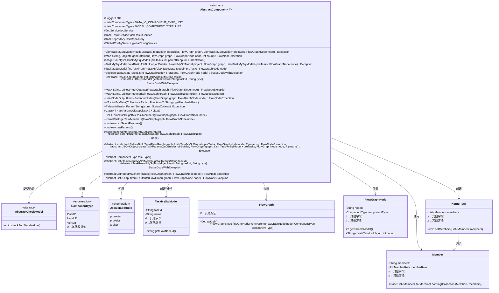
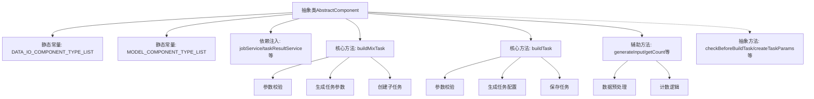

# 基础信息

|      |      |
|------|------|
| 名称 | AbstractComponent |
| 编码语言 | .java |
| 代码路径 | WeFe/board/board-service/src/main/java/com/welab/wefe/board/service/component/base/AbstractComponent.java |
| 包名 | com.welab.wefe.board.service.component.base |
| 依赖项 | ['com.alibaba.fastjson.JSON', 'com.alibaba.fastjson.JSONObject', 'com.alibaba.fastjson.TypeReference', 'com.welab.wefe.board.service.component.Components', 'com.welab.wefe.board.service.component.DataIOComponent', 'com.welab.wefe.board.service.component.OotComponent', 'com.welab.wefe.board.service.component.base.io', 'com.welab.wefe.board.service.database.entity.data_resource.TableDataSetMysqlModel', 'com.welab.wefe.board.service.database.entity.job.ProjectMySqlModel', 'com.welab.wefe.board.service.database.entity.job.TaskMySqlModel', 'com.welab.wefe.board.service.database.entity.job.TaskResultMySqlModel', 'com.welab.wefe.board.service.database.repository.TaskRepository', 'com.welab.wefe.board.service.dto.entity.job.TaskResultOutputModel', 'com.welab.wefe.board.service.dto.kernel.Member', 'com.welab.wefe.board.service.dto.kernel.machine_learning.KernelTask', 'com.welab.wefe.board.service.dto.kernel.machine_learning.TaskConfig', 'com.welab.wefe.board.service.exception.FlowNodeException', 'com.welab.wefe.board.service.model.FlowGraph', 'com.welab.wefe.board.service.model.FlowGraphNode', 'com.welab.wefe.board.service.model.JobBuilder', 'com.welab.wefe.board.service.service.CacheObjects', 'com.welab.wefe.board.service.service.JobService', 'com.welab.wefe.board.service.service.TaskResultService', 'com.welab.wefe.board.service.service.globalconfig.GlobalConfigService', 'com.welab.wefe.common.exception.StatusCodeWithException', 'com.welab.wefe.common.fieldvalidate.AbstractCheckModel', 'com.welab.wefe.common.util.JObject', 'com.welab.wefe.common.web.util.ModelMapper', 'com.welab.wefe.common.wefe.enums.ComponentType', 'com.welab.wefe.common.wefe.enums.JobMemberRole', 'com.welab.wefe.common.wefe.enums.ProjectType', 'com.welab.wefe.common.wefe.enums.TaskStatus', 'org.apache.commons.collections.CollectionUtils', 'org.apache.commons.lang3.StringUtils', 'org.slf4j.Logger', 'org.slf4j.LoggerFactory', 'org.springframework.beans.factory.annotation.Autowired', 'org.springframework.stereotype.Service', 'java.lang.reflect.ParameterizedType', 'java.lang.reflect.Type', 'java.util', 'java.util.function.Function', 'java.util.stream.Collectors'] |
| 概述说明 | 抽象组件类AbstractComponent定义了数据处理和建模任务的基础逻辑，包含任务构建、参数校验、输入输出处理等功能，支持多种组件类型和角色协作。 |

# 说明

这是一个抽象类AbstractComponent，用于构建和管理机器学习流程中的任务。它定义了数据输入输出组件类型列表和建模组件类型列表，包含任务构建、参数检查、结果获取等核心功能。类中注入了多个服务类如JobService、TaskResultService等，提供了构建混合任务和普通任务的方法，处理任务输入输出、成员分配等逻辑。抽象方法需要子类实现，包括参数检查、任务参数创建、任务类型定义、输入输出声明等。支持水平、垂直和混合类型的机器学习任务，包含数据对齐检查、任务状态管理等辅助功能。

# 类列表 Class Summary

| 名称   | 类型  | 说明 |
|-------|------|-------------|
| AbstractComponent | class | 抽象类AbstractComponent定义了组件基类，包含数据IO和建模组件类型列表，提供任务构建、参数校验、输入输出处理等方法，支持混合任务创建和结果查询。 |

## 类 AbstractComponent

|      |      |
|------|------|
| 访问范围 | @Service;public abstract |
| 类型 | class |
| 名称 | AbstractComponent |
| 说明 | 抽象类AbstractComponent定义了组件基类，包含数据IO和建模组件类型列表，提供任务构建、参数校验、输入输出处理等方法，支持混合任务创建和结果查询。 |

### UML类图

这段类图展示了AbstractComponent抽象类及其相关依赖关系。AbstractComponent是一个泛型抽象类（T需继承AbstractCheckModel），作为工作流任务构建的核心组件，提供了任务创建、参数校验、输入输出处理等基础功能。它与任务模型(TaskMySqlModel)、流程图(FlowGraph)、节点(FlowGraphNode)等核心类交互，并通过枚举类型ComponentType和JobMemberRole控制组件类型和成员角色。该设计支持多种机器学习工作流场景，包含混合任务构建、参数校验、任务依赖管理等关键功能，体现了职责分离和模板方法的设计模式。

### 内部方法调用关系图

该流程图展示了抽象组件类AbstractComponent的核心结构，包含静态常量定义、服务依赖注入、两个主要任务构建方法（buildMixTask和buildTask）以及辅助工具方法。特别突出了混合任务构建的多步骤流程（参数校验→参数生成→子任务创建）和常规任务构建流程（校验→配置→持久化），同时保留了与子类实现的抽象方法连接。类设计体现了联邦学习任务编排的核心逻辑，通过模板方法模式支持多种机器学习组件的扩展。

### 字段列表 Field List

| 名称  | 类型  | 说明 |
|-------|-------|------|
| DATA_IO_COMPONENT_TYPE_LIST = Arrays.asList(            ComponentType.DataIO,            ComponentType.HorzLRValidationDataSetLoader,            ComponentType.VertLRValidationDataSetLoader,            ComponentType.HorzXGBoostValidationDataSetLoader,            ComponentType.VertXGBoostValidationDataSetLoader    ) | List<ComponentType> | 定义了一个不可变静态列表DATA_IO_COMPONENT_TYPE_LIST，包含五种组件类型：DataIO、横向纵向LR验证数据集加载器、横向纵向XGBoost验证数据集加载器。 |
| MODEL_COMPONENT_TYPE_LIST = Arrays.asList(            ComponentType.HorzLR,            ComponentType.VertLR,            ComponentType.HorzSecureBoost,            ComponentType.VertSecureBoost,            ComponentType.MixLR,            ComponentType.MixSecureBoost,            ComponentType.HorzNN,            ComponentType.VertNN    ) | List<ComponentType> | 公开静态常量MODEL_COMPONENT_TYPE_LIST定义了8种模型组件类型，包括水平和垂直的LR、SecureBoost、MixLR、MixSecureBoost及神经网络类型。 |
| globalConfigService | GlobalConfigService | 自动注入全局配置服务实例。 |
| taskRepository | TaskRepository | 使用@Autowired自动注入TaskRepository实例。 |
| taskResultService | TaskResultService | 自动注入TaskResultService服务实例。 |
| LOG = LoggerFactory.getLogger(this.getClass()) | Logger | 定义当前类的受保护日志对象，使用LoggerFactory获取实例。 |
| jobService | JobService | 使用@Autowired自动注入JobService实例。 |

### 方法列表

| 名称  | 类型  | 说明 |
|-------|-------|------|
| findInputNodes | List<NodeOutputItem> | 查找输入节点方法：遍历匹配器列表，获取每个匹配器的输出项并返回结果列表。若匹配器为空则返回空列表。 |
| findMyData | T | 该方法遍历集合，通过函数获取成员ID并与缓存比较，返回匹配项或null。 |
| hasParams | boolean | 方法hasParams返回布尔值true，表示存在参数。 |
| getOutputs | Map<String, Object> | 该方法获取流程图中节点的输出项，按数据类型分组后返回映射表。若输出项为空则返回null，否则将分组后的输出项名称列表存入结果对象并返回。 |
| getInputs | Map<String, Object> | 方法getInputs获取流程图中节点的输入数据。若未手动指定输入，则自动查找输入节点并按数据类型分组。结果以JObject返回，若无输入则构造空数据节点。 |
| getMixTaskMembers | List<KernelTask> | 该方法根据节点类型和角色（发起者、仲裁者、提供者）生成混合任务成员列表，处理不同组件类型的逻辑差异，并设置相关参数。 |
| buildMixTask | List<TaskMySqlModel> | 构建混合任务方法，检查参数后创建任务配置，生成子任务列表并保存。包含角色判断、随机种子设置及任务状态处理。 |
| generateInput | Map<String, Object> | 方法生成输入数据：解析JSON输入，遍历数据条目，为字符串添加计数后缀，更新数据后返回。异常时记录日志并返回原始输入。 |
| getTaskResult | TaskResultOutputModel | 方法getTaskResult根据taskId和type查询任务结果，若不存在返回null，否则映射为TaskResultOutputModel返回。可能抛出StatusCodeWithException异常。 |
| getTaskAllResult | List<TaskResultOutputModel> | 获取指定任务ID的所有结果，过滤空值并映射为输出模型列表。若无结果返回null。 |
| parentHasIntersectedDataSet | boolean | 检查节点是否有父级交集数据集。遍历父节点，若为交集类型或派生自交集的DataIO类型则返回真，否则返回假。 |
| getTaskMembers | KernelTask | 该方法根据节点类型获取数据集项，生成任务成员列表。若节点需仲裁者且当前成员为发起方，则添加仲裁者成员。最后设置任务成员并返回。 |
| stopCreateTask | boolean | 方法stopCreateTask检查是否停止创建任务，默认返回false，可能抛出异常。 |
| findTaskFromPretasks | TaskMySqlModel | 该方法从预任务列表中查找与指定节点ID匹配的第一个任务，未找到则返回null。 |
| deserializationParam | T | 方法将JSON字符串反序列化为指定类对象，若JSON为空则默认"{}"，校验并标准化后返回。异常时抛出StatusCodeWithException。 |
| buildTask | TaskMySqlModel | 构建任务方法，检查发起方合法性，创建任务参数，设置任务属性，根据项目类型配置任务，保存并返回任务实例。 |
| checkBeforeBuildTask | void | 抽象方法，用于在构建任务前检查流程图的节点、前置任务及参数，可能抛出流程节点异常。 |
| createTaskParams | JSONObject | 抽象方法，用于创建任务参数JSON对象，输入包括任务构建器、流程图、前置任务列表、节点和参数，可能抛出异常。 |
| taskType | ComponentType | 抽象方法，返回组件类型。 |
| getAllResult | List<TaskResultMySqlModel> | 获取指定任务ID的所有结果数据，返回TaskResultMySqlModel类型的列表。 |
| getResult | TaskResultMySqlModel | 抽象方法：根据任务ID和类型获取MySQL模型结果，可能抛出状态码异常。 |
| inputs | List<InputMatcher> | 抽象方法，根据流程图和节点返回输入匹配器列表，可能抛出流程节点异常。 |
| outputs | List<OutputItem> | 抽象方法outputs，接收FlowGraph和FlowGraphNode参数，返回OutputItem列表，可能抛出FlowNodeException异常。 |
| getCount | int | 该方法计算满足指定深度的任务数量，返回当前计数与匹配任务数的最小值。若输入无效则直接返回当前计数。 |
| getParamsClass | Class<T> | 获取泛型参数类：递归查找父类直至找到参数化类型，返回首个类型参数。若无则继续向上查找。 |
| canSelectFeatures | boolean | 该方法返回固定值false，表示不支持选择功能。 |
| needIntersectedDataSetBeforeMe | boolean | 该方法返回布尔值false，表示无需前置交集数据集。 |

