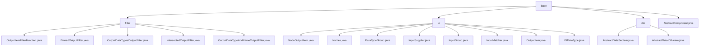

# 基础信息

|      |      |
|------|------|
| 名称 | base |
| 编码语言 | .java |
| 代码路径 | WeFe/board/board-service/src/main/java/com/welab/wefe/board/service/component/base |
| 包名 | docs.board.board-service.src.main.java.com.welab.wefe.board.service.component.base |
| 概述说明 | 模块1：通过OutputItemFilterFunction接口实现输出项过滤，支持分箱检测等5类场景。依赖Java标准库。  模块2：管理节点输入输出数据，含InputMatcher匹配策略和JSON转换。处理训练数据匹配等场景。  模块3：提供数据交互基类，强制校验必填字段，支持泛型数据集操作。实现数据权限控制和服务路由。  模块4：抽象类AbstractComponent管理ML任务，定义组件类型、任务构建等核心功能，支持多种学习任务类型。 |

# 说明

## 概述  
该模块核心职责是构建联邦学习流程中的数据交互体系，包含输出过滤、输入匹配和结构化转换三大功能。通过函数式接口（如OutputItemFilterFunction/InputSupplier）和抽象基类（AbstractComponent）实现策略模式，类似事件总线和工厂模式的结合体。关键数据结构包括FlowGraphNode（流程节点）、InputGroup（结构化输入）、NodeOutputItem（扩展输出项）及IODataType枚举（类型分类）。外部依赖仅Java标准库和内部服务（如JobService）。例如BinnedOutputFilter实现分箱检测，InputMatcher支持三种匹配策略。

## 主要业务场景  
模块支撑联邦学习全流程数据交互，典型场景包括：1）输出过滤（如分箱数据检测/类型匹配）；2）输入动态匹配（通过InputMatcher优先级策略）；3）异构数据处理（如AbstractDataIOParam路由表格/图片服务）。业务流程遵循"校验-匹配-转换"模式，例如IntersectedOutputFilter校验节点继承关系，InputGroup转换JSON结构。API集成涵盖静态方法（intersected）和动态组合（types列表），交互方式类似数据管道，支持水平/垂直/混合任务构建。

### 包内部结构视图

该流程图展示了WeFe项目中board-service模块的组件基础结构。顶层为base目录，包含filter、io、dto三个子目录及AbstractComponent.java文件。filter目录下包含5个过滤器实现类，io目录下包含8个输入输出相关类，dto目录下包含2个抽象数据传输对象类。整体结构清晰展现了组件基础模块的文件组织关系。

# 文件列表

| 名称   | 类型  | 说明 |
|-------|------|-------------|
| [AbstractComponent.java](AbstractComponent.md) | file | 抽象组件类AbstractComponent定义了数据处理和建模任务的基础逻辑，包含任务构建、参数校验、输入输出处理等功能，支持多种组件类型和角色协作。 |
| [dto](dto/_module.md) | package | AbstractDataSetItem是继承AbstractCheckModel的抽象类，含必填字段memberId、memberRole、dataSetId及对应getter/setter。AbstractDataIOParam也是抽象类，含泛型数据集列表dataSetList，提供根据角色筛选数据集的方法，支持图片和表格数据查询。 |
| [io](io/_module.md) | package | NodeOutputItem继承OutputItem，封装节点输出信息，含组件类型、节点ID、任务名称属性。Names类管理数据集、模型等名称常量。DataTypeGroup枚举定义数据分组类型。InputSupplier是获取节点输入的函数式接口。InputGroup管理输入数据分组并转为JSON。InputMatcher匹配节点输入项，支持三种策略。OutputItem封装输出项，含名称和数据类型。IODataType枚举定义各类数据类型及分组。 |
| [filter](filter/_module.md) | package | OutputItemFilterFunction是函数式接口，用于过滤输出项。BinnedOutputFilter检查数据是否分箱。OutputDataTypesOutputFilter按数据类型过滤。IntersectedOutputFilter判断是否为交集数据。OutputDataTypeAndNameOutputFilter按类型和名称过滤。 |

