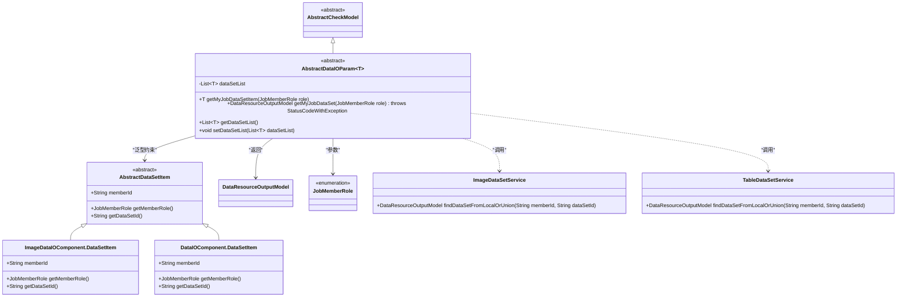
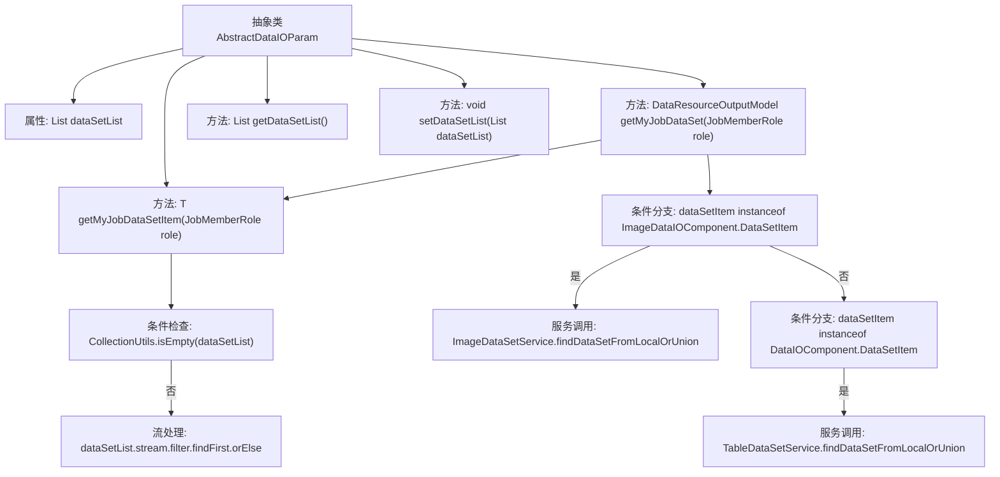

# 基础信息

|      |      |
|------|------|
| 名称 | AbstractDataIOParam |
| 编码语言 | .java |
| 代码路径 | WeFe/board/board-service/src/main/java/com/welab/wefe/board/service/component/base/dto/AbstractDataIOParam.java |
| 包名 | com.welab.wefe.board.service.component.base.dto |
| 依赖项 | ['com.welab.wefe.board.service.component.DataIOComponent', 'com.welab.wefe.board.service.component.deep_learning.ImageDataIOComponent', 'com.welab.wefe.board.service.dto.entity.data_resource.output.DataResourceOutputModel', 'com.welab.wefe.board.service.service.CacheObjects', 'com.welab.wefe.board.service.service.data_resource.image_data_set.ImageDataSetService', 'com.welab.wefe.board.service.service.data_resource.table_data_set.TableDataSetService', 'com.welab.wefe.common.exception.StatusCodeWithException', 'com.welab.wefe.common.fieldvalidate.AbstractCheckModel', 'com.welab.wefe.common.web.Launcher', 'com.welab.wefe.common.wefe.enums.JobMemberRole', 'org.apache.commons.collections4.CollectionUtils', 'java.util.List'] |
| 概述说明 | 抽象类AbstractDataIOParam<T>包含数据集列表和两个方法：getMyJobDataSetItem根据角色筛选数据项，getMyJobDataSet获取对应数据资源。支持图像和表格两种数据类型。 |

# 说明

这是一个名为AbstractDataIOParam的抽象类，继承自AbstractCheckModel。它包含一个泛型数据集列表dataSetList，泛型类型T需继承AbstractDataSetItem。类中提供了两个核心方法：getMyJobDataSetItem根据角色筛选当前用户的数据集项，返回匹配项或null；getMyJobDataSet则通过角色获取完整数据集，支持图片和表格两种数据类型，分别调用ImageDataSetService和TableDataSetService从本地或联合数据源查询。类还包含标准的getter/setter方法用于操作数据集列表。

# 类列表 Class Summary

| 名称   | 类型  | 说明 |
|-------|------|-------------|
| AbstractDataIOParam | class | 抽象类AbstractDataIOParam定义数据处理逻辑，包含获取数据集项和数据集的方法，支持图像和表格数据类型，提供数据集列表的getter/setter。 |

## 类 AbstractDataIOParam

|      |      |
|------|------|
| 访问范围 | public abstract |
| 类型 | class |
| 名称 | AbstractDataIOParam |
| 说明 | 抽象类AbstractDataIOParam定义数据处理逻辑，包含获取数据集项和数据集的方法，支持图像和表格数据类型，提供数据集列表的getter/setter。 |

### UML类图

该类图展示了一个抽象类`AbstractDataIOParam`，它继承自`AbstractCheckModel`并使用泛型`T`约束为`AbstractDataSetItem`的子类。主要功能包括通过角色获取数据集项和数据集，依赖`ImageDataSetService`和`TableDataSetService`进行具体数据操作。包含两个数据集项实现类，通过枚举`JobMemberRole`标识成员角色，最终返回`DataResourceOutputModel`类型结果。

### 内部方法调用关系图

该流程图展示了抽象类AbstractDataIOParam的核心结构和主要方法调用关系。类包含一个泛型数据集列表属性和四个关键方法，其中getMyJobDataSetItem方法通过流式处理筛选数据项，getMyJobDataSet方法根据不同类型的数据项调用不同的服务获取数据。流程清晰展现了空集合检查、条件分支和服务调用的逻辑路径，体现了数据获取和类型分发的处理过程。

### 字段列表 Field List

| 名称  | 类型  | 说明 |
|-------|-------|------|
| dataSetList | List<T> | 类中定义的泛型列表变量，用于存储数据集。 |

### 方法列表

| 名称  | 类型  | 说明 |
|-------|-------|------|
| getMyJobDataSet | DataResourceOutputModel | 方法根据角色获取数据集，若为图像类型调用ImageDataSetService，表类型调用TableDataSetService，否则返回空。 |
| getDataSetList | List<T> | 获取数据集列表的方法，返回类型为泛型列表。 |
| setDataSetList | void | 设置数据集列表的方法，将输入参数赋值给类的成员变量dataSetList。 |
| getMyJobDataSetItem | T | 方法getMyJobDataSetItem根据角色筛选数据集列表，返回当前用户ID和指定角色匹配的首个条目，若无则返回null。 |

