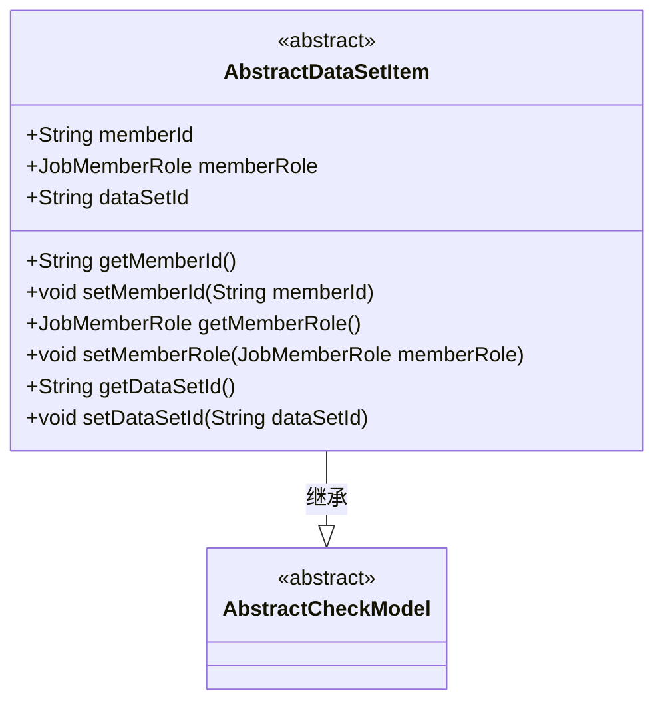
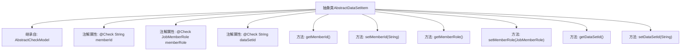

# 基础信息

|      |      |
|------|------|
| 名称 | AbstractDataSetItem |
| 编码语言 | .java |
| 代码路径 | WeFe/board/board-service/src/main/java/com/welab/wefe/board/service/component/base/dto/AbstractDataSetItem.java |
| 包名 | com.welab.wefe.board.service.component.base.dto |
| 依赖项 | ['com.welab.wefe.common.fieldvalidate.AbstractCheckModel', 'com.welab.wefe.common.fieldvalidate.annotation.Check', 'com.welab.wefe.common.wefe.enums.JobMemberRole'] |
| 概述说明 | 抽象类AbstractDataSetItem继承AbstractCheckModel，包含必填字段memberId、memberRole和dataSetId及其getter/setter方法。 |

# 说明

这是一个名为AbstractDataSetItem的抽象类，继承自AbstractCheckModel。该类定义了三个必须的字段：memberId表示成员ID，memberRole表示成员角色，dataSetId表示数据集ID。每个字段都通过@Check注解标记为必填项，并指定了对应的中文名称。类中还包含了这三个字段的getter和setter方法，用于获取和设置字段值。

# 类列表 Class Summary

| 名称   | 类型  | 说明 |
|-------|------|-------------|
| AbstractDataSetItem | class | 抽象类AbstractDataSetItem继承AbstractCheckModel，包含必填字段成员Id、成员角色和数据集Id，并提供getter/setter方法。 |

## 类 AbstractDataSetItem

|      |      |
|------|------|
| 访问范围 | public abstract |
| 类型 | class |
| 名称 | AbstractDataSetItem |
| 说明 | 抽象类AbstractDataSetItem继承AbstractCheckModel，包含必填字段成员Id、成员角色和数据集Id，并提供getter/setter方法。 |

### UML类图

这段类图展示了一个抽象类`AbstractDataSetItem`继承自`AbstractCheckModel`的结构。`AbstractDataSetItem`包含三个公有字段（memberId、memberRole、dataSetId）和对应的getter/setter方法，所有字段都带有`@Check`注解标记的校验规则。作为抽象类，它提供了数据集成员相关的基础属性和方法，但需要子类实现具体功能。类图中清晰地表现了继承关系和类成员结构，字段的公有可见性和方法签名都准确呈现。

### 内部方法调用关系图

该流程图展示了AbstractDataSetItem抽象类的结构，该类继承自AbstractCheckModel。包含三个带有@Check注解的成员变量（memberId、memberRole、dataSetId），以及对应的getter和setter方法。每个属性都标记为必填(require=true)，用于数据校验。类结构清晰体现了JavaBean的设计模式，通过方法封装属性访问，同时继承了父类的校验功能。

### 字段列表 Field List

| 名称  | 类型  | 说明 |
|-------|-------|------|
| memberId | String | 成员Id字段，必填校验。 |
| dataSetId | String | 检查数据集ID，必填字段。 |
| memberRole | JobMemberRole | 成员角色检查，必填字段。 |

### 方法列表

| 名称  | 类型  | 说明 |
|-------|-------|------|
| getMemberId | String | 这是一个Java方法，返回成员ID字符串。方法名为getMemberId，返回类型为String，直接返回成员变量memberId的值。 |
| setDataSetId | void | 设置数据集ID的方法，将输入参数赋值给类的成员变量dataSetId。 |
| getMemberRole | JobMemberRole | 方法getMemberRole返回成员角色对象memberRole。 |
| setMemberRole | void | 设置成员角色方法，将传入的成员角色赋值给当前对象的成员角色属性。 |
| setMemberId | void | 设置成员ID的方法，将输入参数赋值给类的成员变量memberId。 |
| getDataSetId | String | 获取数据集ID的方法，返回字符串类型的数据集ID。 |

