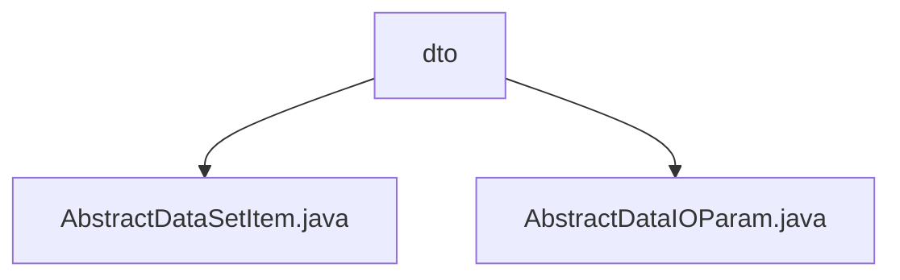

# 基础信息

|      |      |
|------|------|
| 名称 | dto |
| 编码语言 | .java |
| 代码路径 | WeFe/board/board-service/src/main/java/com/welab/wefe/board/service/component/base/dto |
| 包名 | docs.board.board-service.src.main.java.com.welab.wefe.board.service.component.base.dto |
| 概述说明 | AbstractDataSetItem是继承AbstractCheckModel的抽象类，含必填字段memberId、memberRole、dataSetId及对应getter/setter。AbstractDataIOParam也是抽象类，含泛型数据集列表dataSetList，提供根据角色筛选数据集的方法，支持图片和表格数据查询。 |

# 说明

## 概述  
该模块核心职责是提供数据交互的抽象基类，规范数据集项和参数的结构化处理。接口规范要求成员ID、角色和数据集ID为必填字段（通过@Check注解强制校验），并支持泛型数据集列表的动态操作。关键数据结构包括AbstractDataSetItem（含memberId/memberRole/dataSetId三元组）和AbstractDataIOParam（包装泛型数据集列表）。外部依赖仅涉及ImageDataSetService和TableDataSetService两种数据查询服务。例如通过getMyJobDataSet方法可自动路由到图片或表格数据处理服务。

## 主要业务场景  
模块采用"数据管道"模式处理异构数据源，主要流程为：先通过AbstractDataSetItem校验基础字段，再由AbstractDataIOParam根据角色动态筛选数据集。典型应用包括联合学习中的数据权限控制（例如不同角色访问不同数据集）和数据类型自适应处理（自动调用对应服务）。交互模式类似工厂方法，通过getMyJobDataSetItem实现条件过滤，getMyJobDataSet完成服务路由。例如表格数据查询会透传参数至TableDataSetService执行。

### 包内部结构视图

该流程图展示了WeFe项目中board-service模块下dto目录的结构关系。dto作为父节点包含两个子节点：AbstractDataSetItem.java和AbstractDataIOParam.java，这两个文件都是数据传输对象的基础抽象类，用于规范组件间的数据交互格式。

# 文件列表

| 名称   | 类型  | 说明 |
|-------|------|-------------|
| [AbstractDataSetItem.java](AbstractDataSetItem.md) | file | 抽象类AbstractDataSetItem继承AbstractCheckModel，包含必填字段memberId、memberRole和dataSetId及其getter/setter方法。 |
| [AbstractDataIOParam.java](AbstractDataIOParam.md) | file | 抽象类AbstractDataIOParam<T>包含数据集列表和两个方法：getMyJobDataSetItem根据角色筛选数据项，getMyJobDataSet获取对应数据资源。支持图像和表格两种数据类型。 |

