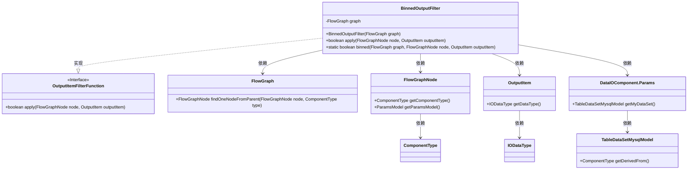
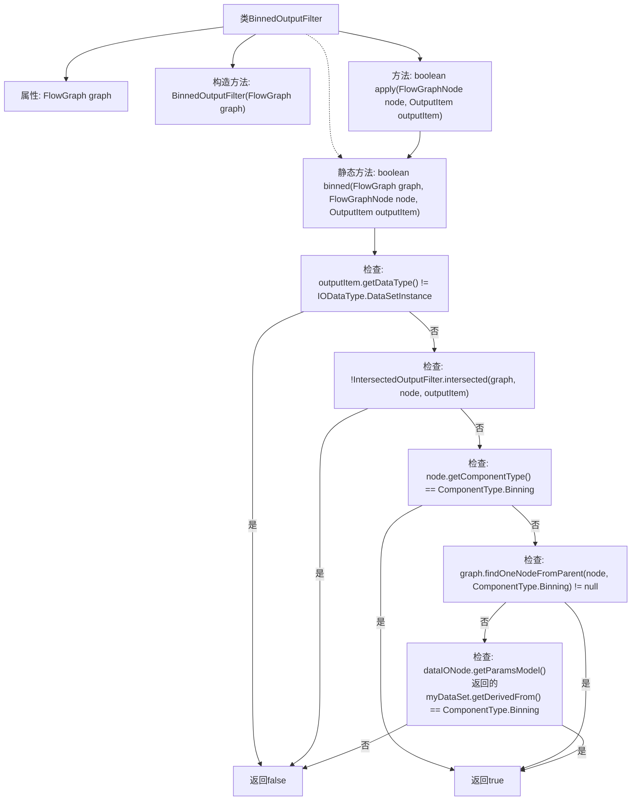

# 基础信息

|      |      |
|------|------|
| 名称 | BinnedOutputFilter |
| 编码语言 | .java |
| 代码路径 | WeFe/board/board-service/src/main/java/com/welab/wefe/board/service/component/base/filter/BinnedOutputFilter.java |
| 包名 | com.welab.wefe.board.service.component.base.filter |
| 依赖项 | ['com.welab.wefe.board.service.component.DataIOComponent', 'com.welab.wefe.board.service.component.base.io.IODataType', 'com.welab.wefe.board.service.component.base.io.OutputItem', 'com.welab.wefe.board.service.database.entity.data_resource.TableDataSetMysqlModel', 'com.welab.wefe.board.service.model.FlowGraph', 'com.welab.wefe.board.service.model.FlowGraphNode', 'com.welab.wefe.common.wefe.enums.ComponentType'] |
| 概述说明 | BinnedOutputFilter类判断节点数据是否经过分箱处理，检查数据类型、对齐状态、节点类型及父节点或数据源是否为分箱类型。 |

# 说明

BinnedOutputFilter类实现了OutputItemFilterFunction接口，用于判断节点数据是否经过分箱处理。其核心方法binned通过多条件验证：输出数据类型需为DataSetInstance；数据必须对齐；当前节点或父节点包含分箱组件；或数据源来自分箱处理。满足任一条件即返回true，否则返回false。

# 类列表 Class Summary

| 名称   | 类型  | 说明 |
|-------|------|-------------|
| BinnedOutputFilter | class | BinnedOutputFilter类用于判断节点数据是否经过分箱处理，检查数据类型、对齐状态、节点类型及父节点或数据源是否包含分箱组件。 |

## 类 BinnedOutputFilter

|      |      |
|------|------|
| 访问范围 | public |
| 类型 | class |
| 名称 | BinnedOutputFilter |
| 说明 | BinnedOutputFilter类用于判断节点数据是否经过分箱处理，检查数据类型、对齐状态、节点类型及父节点或数据源是否包含分箱组件。 |

### UML类图

这段代码定义了一个`BinnedOutputFilter`类，实现了`OutputItemFilterFunction`接口，用于判断输出项是否经过分箱处理。该类通过检查数据来源、组件类型和父节点来判断数据是否经过分箱。类图中展示了`BinnedOutputFilter`与`FlowGraph`、`FlowGraphNode`、`OutputItem`等类的依赖关系，以及它实现的接口`OutputItemFilterFunction`。整个结构清晰地反映了代码中各个组件之间的交互和数据流动。

### 内部方法调用关系图

该流程图描述了BinnedOutputFilter类的逻辑结构，重点展示了binned方法的决策流程。该方法通过5层条件检查判断数据是否为分箱(binning)处理后的数据：数据类型验证、数据对齐验证、当前节点类型验证、父节点链验证、以及数据源派生验证。每个检查环节用箭头连接，形成完整的逻辑判断链，最终返回布尔值结果。流程图清晰呈现了方法内部的嵌套条件结构和返回路径。

### 字段列表 Field List

| 名称  | 类型  | 说明 |
|-------|-------|------|
| graph | FlowGraph | 私有不可变流程图对象。 |

### 方法列表

| 名称  | 类型  | 说明 |
|-------|-------|------|
| apply | boolean | 该方法重写apply函数，调用binned方法处理节点和输出项，返回布尔结果。 |
| binned | boolean | 该方法判断数据是否经过分箱处理：检查输出数据类型、数据对齐、当前节点或父节点是否为分箱类型，或数据源是否来自分箱数据。 |

