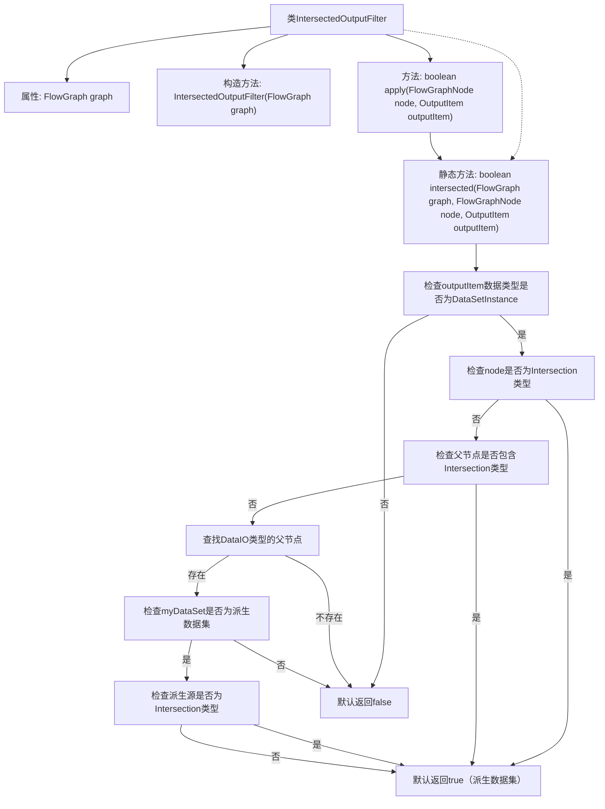

# 基础信息

|      |      |
|------|------|
| 名称 | IntersectedOutputFilter |
| 编码语言 | .java |
| 代码路径 | WeFe/board/board-service/src/main/java/com/welab/wefe/board/service/component/base/filter/IntersectedOutputFilter.java |
| 包名 | com.welab.wefe.board.service.component.base.filter |
| 依赖项 | ['com.welab.wefe.board.service.component.DataIOComponent', 'com.welab.wefe.board.service.component.base.io.IODataType', 'com.welab.wefe.board.service.component.base.io.OutputItem', 'com.welab.wefe.board.service.database.entity.data_resource.TableDataSetMysqlModel', 'com.welab.wefe.board.service.model.FlowGraph', 'com.welab.wefe.board.service.model.FlowGraphNode', 'com.welab.wefe.common.wefe.enums.ComponentType'] |
| 概述说明 | IntersectedOutputFilter类用于判断输出项是否为交集数据。通过检查节点类型、父节点是否包含交集组件，以及数据源是否来自派生数据集来确定结果。若数据源为派生数据集，默认视为已对齐。 |

# 说明

IntersectedOutputFilter是一个实现OutputItemFilterFunction接口的类，用于判断输出项是否为交集数据。其核心逻辑通过intersected静态方法实现：首先检查数据类型是否为DataSetInstance，若当前节点或父节点为Intersection类型则返回true。对于DataIO节点，若非派生数据集则返回false；若派生自Intersection或为任意派生数据集则视为交集数据。该方法通过流程图节点和组件类型进行多级条件判断，最终确定数据是否对齐。

# 类列表 Class Summary

| 名称   | 类型  | 说明 |
|-------|------|-------------|
| IntersectedOutputFilter | class | IntersectedOutputFilter类用于判断输出项是否为交集数据，通过检查节点类型、父节点及数据源派生关系来确定结果。 |


## 类 IntersectedOutputFilter

|      |      |
|------|------|
| 访问范围 | public |
| 类型 | class |
| 名称 | IntersectedOutputFilter |
| 说明 | IntersectedOutputFilter类用于判断输出项是否为交集数据，通过检查节点类型、父节点及数据源派生关系来确定结果。 |


### UML类图

```mermaid
classDiagram
    class IntersectedOutputFilter {
        -FlowGraph graph
        +IntersectedOutputFilter(FlowGraph graph)
        +boolean apply(FlowGraphNode node, OutputItem outputItem)
        +static boolean intersected(FlowGraph graph, FlowGraphNode node, OutputItem outputItem)
    }

    class FlowGraph {
        +FlowGraphNode findOneNodeFromParent(FlowGraphNode node, ComponentType type)
    }

    class FlowGraphNode {
        +ComponentType getComponentType()
        +ParamsModel getParamsModel()
    }

    class OutputItem {
        +IODataType getDataType()
    }

    class DataIOComponent {
        class Params {
            +TableDataSetMysqlModel getMyDataSet()
        }
    }

    class TableDataSetMysqlModel {
        +boolean isDerivedResource()
        +ComponentType getDerivedFrom()
    }

    class ComponentType {
        <<Enumeration>>
        Intersection
        DataIO
    }

    class IODataType {
        <<Enumeration>>
        DataSetInstance
    }

    IntersectedOutputFilter --> FlowGraph : 依赖
    IntersectedOutputFilter --> FlowGraphNode : 依赖
    IntersectedOutputFilter --> OutputItem : 依赖
    FlowGraphNode --> ComponentType : 依赖
    FlowGraphNode --> DataIOComponent.Params : 依赖
    DataIOComponent.Params --> TableDataSetMysqlModel : 依赖
    OutputItem --> IODataType : 依赖
```

这段代码实现了一个输出过滤器，用于判断给定的输出项是否与流程图中定义的交叉节点相关。主要逻辑包括：检查数据类型是否为实例、判断当前节点是否为交叉节点、查找父节点中的交叉节点、验证派生数据集的来源等。该过滤器通过多层条件判断来确定输出项的有效性，体现了对数据流图的深度分析和严格的边界条件处理。


### 内部方法调用关系图



该流程图描述了IntersectedOutputFilter类的核心逻辑，主要展示如何通过多级条件判断来确定输出项是否属于交集数据。从数据类型检查开始，依次验证节点类型、父节点链、数据源派生关系等条件，最终得出布尔判断结果。流程包含5个主要判断分支和2个默认返回路径，完整覆盖了代码中的所有条件检查场景。

### 字段列表 Field List

| 名称  | 类型  | 说明 |
|-------|-------|------|
| graph | FlowGraph | 私有不可变流程图实例。 |

### 方法列表

| 名称  | 类型  | 说明 |
|-------|-------|------|
| apply | boolean | Java方法重写，检查节点与输出项是否相交，返回布尔值。 |
| intersected | boolean | 检查数据是否对齐：数据类型需为实例；当前或父节点为对齐类型；数据源为派生且来自对齐类型则视为对齐，否则默认非对齐。 |


