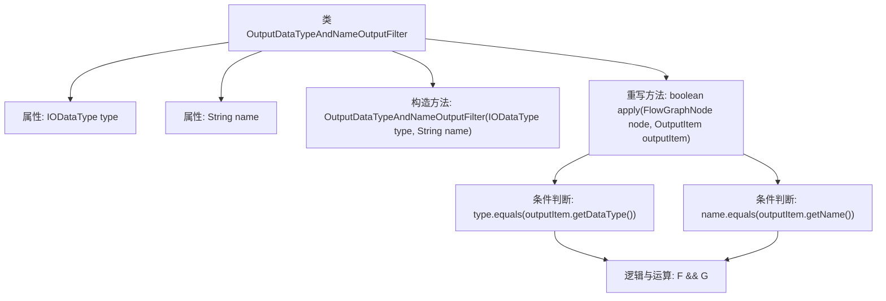

# 基础信息

|      |      |
|------|------|
| 名称 | OutputDataTypeAndNameOutputFilter |
| 编码语言 | .java |
| 代码路径 | WeFe/board/board-service/src/main/java/com/welab/wefe/board/service/component/base/filter/OutputDataTypeAndNameOutputFilter.java |
| 包名 | com.welab.wefe.board.service.component.base.filter |
| 依赖项 | ['com.welab.wefe.board.service.component.base.io.IODataType', 'com.welab.wefe.board.service.component.base.io.OutputItem', 'com.welab.wefe.board.service.model.FlowGraphNode'] |
| 概述说明 | OutputDataTypeAndNameOutputFilter类实现OutputItemFilterFunction接口，通过构造器接收数据类型和名称参数，apply方法检查输出项是否匹配指定类型和名称。 |

# 说明

OutputDataTypeAndNameOutputFilter是一个实现OutputItemFilterFunction接口的Java类，用于根据数据类型和名称过滤输出项。该类包含两个私有成员变量：type（IODataType类型）和name（字符串类型），通过构造函数初始化。apply方法接收FlowGraphNode和OutputItem参数，检查输出项的数据类型和名称是否与类中存储的type和name匹配，返回布尔值表示是否通过过滤。

# 类列表 Class Summary

| 名称   | 类型  | 说明 |
|-------|------|-------------|
| OutputDataTypeAndNameOutputFilter | class | OutputDataTypeAndNameOutputFilter类实现OutputItemFilterFunction接口，通过数据类型和名称过滤输出项。构造函数接收类型和名称参数，apply方法检查输出项是否匹配。 |


## 类 OutputDataTypeAndNameOutputFilter

|      |      |
|------|------|
| 访问范围 | public |
| 类型 | class |
| 名称 | OutputDataTypeAndNameOutputFilter |
| 说明 | OutputDataTypeAndNameOutputFilter类实现OutputItemFilterFunction接口，通过数据类型和名称过滤输出项。构造函数接收类型和名称参数，apply方法检查输出项是否匹配。 |


### UML类图

```mermaid
classDiagram
    class OutputDataTypeAndNameOutputFilter {
        -IODataType type
        -String name
        +OutputDataTypeAndNameOutputFilter(IODataType type, String name)
        +boolean apply(FlowGraphNode node, OutputItem outputItem)
    }

    <<Interface>> OutputItemFilterFunction {
        +boolean apply(FlowGraphNode node, OutputItem outputItem)
    }

    OutputDataTypeAndNameOutputFilter ..|> OutputItemFilterFunction : 实现
    OutputDataTypeAndNameOutputFilter --> IODataType : 依赖
    OutputDataTypeAndNameOutputFilter --> OutputItem : 依赖
    OutputDataTypeAndNameOutputFilter --> FlowGraphNode : 依赖
```

类图描述：OutputDataTypeAndNameOutputFilter类实现了OutputItemFilterFunction接口，包含两个私有成员变量type和name，通过构造函数初始化。核心方法是apply()，接收FlowGraphNode和OutputItem参数，比较输出项的数据类型和名称是否匹配。该类依赖IODataType、OutputItem和FlowGraphNode三个外部类，实现了基于类型和名称的输出项过滤功能。


### 内部方法调用关系图



该流程图展示了OutputDataTypeAndNameOutputFilter类的结构和工作原理。该类通过构造方法初始化数据类型(type)和名称(name)两个属性，并在apply方法中实现过滤逻辑：检查输出项的数据类型和名称是否与预设值匹配。两个条件通过逻辑与运算组合，最终返回布尔结果。流程图清晰呈现了属性定义、构造方法和核心过滤逻辑的调用关系。

### 字段列表 Field List

| 名称  | 类型  | 说明 |
|-------|-------|------|
| name | String | 私有不可变字符串变量name。 |
| type | IODataType | 私有不可变IODataType类型变量。 |

### 方法列表

| 名称  | 类型  | 说明 |
|-------|-------|------|
| apply | boolean | 该方法检查节点类型和名称是否匹配输出项的数据类型和名称，返回布尔结果。 |


