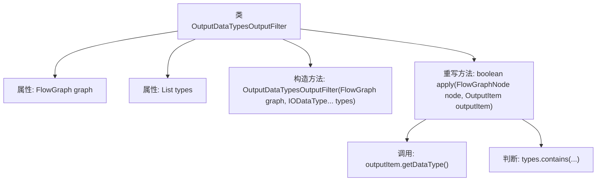

# 基础信息

|      |      |
|------|------|
| 名称 | OutputDataTypesOutputFilter |
| 编码语言 | .java |
| 代码路径 | WeFe/board/board-service/src/main/java/com/welab/wefe/board/service/component/base/filter/OutputDataTypesOutputFilter.java |
| 包名 | com.welab.wefe.board.service.component.base.filter |
| 依赖项 | ['com.welab.wefe.board.service.component.base.io.IODataType', 'com.welab.wefe.board.service.component.base.io.OutputItem', 'com.welab.wefe.board.service.model.FlowGraph', 'com.welab.wefe.board.service.model.FlowGraphNode', 'java.util.Arrays', 'java.util.List'] |
| 概述说明 | OutputDataTypesOutputFilter类实现OutputItemFilterFunction接口，根据指定数据类型过滤输出项。构造函数接收FlowGraph和数据类型列表，apply方法检查输出项数据类型是否匹配。 |

# 说明

这是一个名为OutputDataTypesOutputFilter的Java类，实现了OutputItemFilterFunction接口。该类用于根据数据类型过滤输出项，包含两个成员变量：FlowGraph类型的graph和IODataType列表类型的types。构造函数接收一个FlowGraph对象和可变数量的IODataType参数，并将后者转换为列表存储。核心方法是apply，接收FlowGraphNode和OutputItem参数，通过检查输出项的数据类型是否在预设类型列表中来决定是否保留该输出项。

# 类列表 Class Summary

| 名称   | 类型  | 说明 |
|-------|------|-------------|
| OutputDataTypesOutputFilter | class | OutputDataTypesOutputFilter类实现OutputItemFilterFunction接口，根据指定数据类型列表过滤输出项。构造函数接收FlowGraph和数据类型数组，apply方法检查输出项数据类型是否匹配。 |


## 类 OutputDataTypesOutputFilter

|      |      |
|------|------|
| 访问范围 | public |
| 类型 | class |
| 名称 | OutputDataTypesOutputFilter |
| 说明 | OutputDataTypesOutputFilter类实现OutputItemFilterFunction接口，根据指定数据类型列表过滤输出项。构造函数接收FlowGraph和数据类型数组，apply方法检查输出项数据类型是否匹配。 |


### UML类图

```mermaid
classDiagram
    class OutputDataTypesOutputFilter {
        -FlowGraph graph
        -List~IODataType~ types
        +OutputDataTypesOutputFilter(FlowGraph graph, IODataType... types)
        +boolean apply(FlowGraphNode node, OutputItem outputItem)
    }
    <<Interface>> OutputItemFilterFunction {
        +boolean apply(FlowGraphNode node, OutputItem outputItem)
    }
    class IODataType {
        // 数据类型枚举或类
    }
    class FlowGraph {
        // 流程图结构类
    }
    class FlowGraphNode {
        // 流程图节点类
    }
    class OutputItem {
        -IODataType dataType
        +IODataType getDataType()
    }

    OutputDataTypesOutputFilter ..|> OutputItemFilterFunction : 实现
    OutputDataTypesOutputFilter --> FlowGraph : 依赖
    OutputDataTypesOutputFilter --> IODataType : 依赖
    OutputDataTypesOutputFilter --> FlowGraphNode : 依赖
    OutputDataTypesOutputFilter --> OutputItem : 依赖
    OutputItem --> IODataType : 依赖
```

这段代码展示了一个实现`OutputItemFilterFunction`接口的过滤器类`OutputDataTypesOutputFilter`，它通过检查`OutputItem`的数据类型是否符合预设类型列表来决定是否过滤输出项。类图中清晰呈现了该过滤器与流程图结构、节点、输出项及数据类型之间的依赖关系，核心功能是通过`apply`方法实现基于数据类型的过滤逻辑，体现了策略模式的设计思想。


### 内部方法调用关系图



这段代码定义了一个实现OutputItemFilterFunction接口的过滤类，用于检查输出项的数据类型是否符合预设类型列表。流程图展示了类结构，包含两个私有属性(graph和types)、一个可变参数构造方法，以及核心的apply方法实现逻辑。apply方法通过获取outputItem的数据类型，并在types列表中检查是否存在匹配项来决定是否过滤该输出项。

### 字段列表 Field List

| 名称  | 类型  | 说明 |
|-------|-------|------|
| types | List<IODataType> | 私有不可变列表，存储IODataType类型元素。 |
| graph | FlowGraph | 私有不可变FlowGraph对象graph。 |

### 方法列表

| 名称  | 类型  | 说明 |
|-------|-------|------|
| apply | boolean | 方法检查输出项数据类型是否在指定集合中，返回布尔结果。 |


