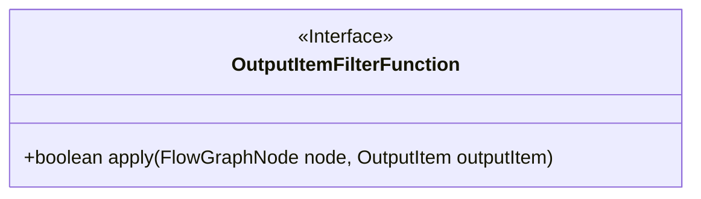
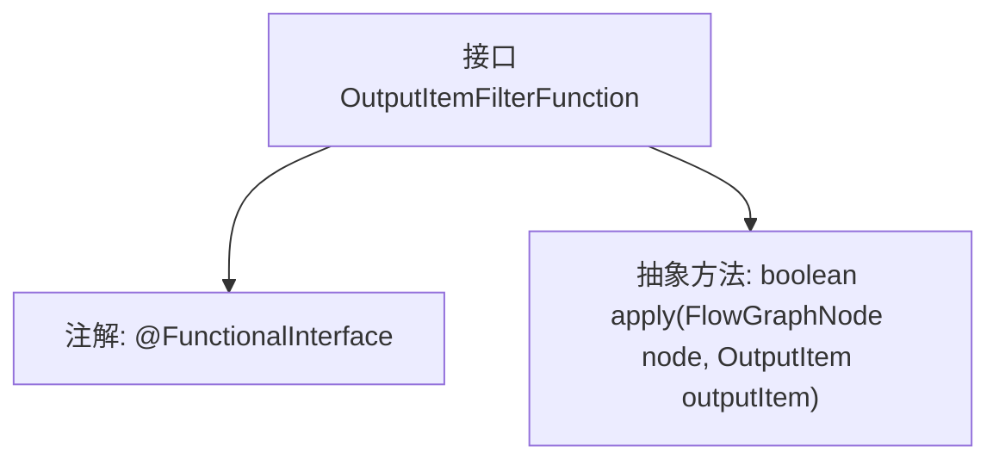

# 基础信息

|      |      |
|------|------|
| 名称 | OutputItemFilterFunction |
| 编码语言 | .java |
| 代码路径 | WeFe/board/board-service/src/main/java/com/welab/wefe/board/service/component/base/filter/OutputItemFilterFunction.java |
| 包名 | com.welab.wefe.board.service.component.base.filter |
| 依赖项 | ['com.welab.wefe.board.service.component.base.io.OutputItem', 'com.welab.wefe.board.service.model.FlowGraphNode'] |
| 概述说明 | 功能接口OutputItemFilterFunction，定义方法apply，接收FlowGraphNode和OutputItem参数，返回布尔值。 |

# 说明

这是一个名为OutputItemFilterFunction的函数式接口，用于判断输出项是否符合过滤条件。接口定义了apply方法，接收FlowGraphNode节点和OutputItem输出项作为参数，返回布尔值表示是否通过过滤。该接口使用@FunctionalInterface注解标记，表明它是函数式接口，只能包含一个抽象方法。

# 类列表 Class Summary

| 名称   | 类型  | 说明 |
|-------|------|-------------|
| OutputItemFilterFunction | interface | 这是一个函数式接口，定义了一个方法apply，用于判断节点和输出项是否符合条件。 |

## 类 OutputItemFilterFunction

|      |      |
|------|------|
| 访问范围 | @FunctionalInterface;public |
| 类型 | interface |
| 名称 | OutputItemFilterFunction |
| 说明 | 这是一个函数式接口，定义了一个方法apply，用于判断节点和输出项是否符合条件。 |

### UML类图

该类图展示了一个函数式接口`OutputItemFilterFunction`，它定义了单一抽象方法`apply`，接收`FlowGraphNode`和`OutputItem`作为参数并返回布尔值。作为函数式接口，它适用于Lambda表达式或方法引用场景，主要用于实现节点与输出项的过滤逻辑。接口标注`@FunctionalInterface`确保其符合函数式编程规范。

### 内部方法调用关系图

这段流程图描述了OutputItemFilterFunction接口的结构，这是一个函数式接口（由@FunctionalInterface注解标记），包含单个抽象方法apply。该方法接收FlowGraphNode和OutputItem两个参数并返回布尔值，用于实现自定义过滤逻辑。图形清晰展示了接口的核心组成：函数式注解和唯一的抽象方法定义，符合Java函数式接口的标准模式。

### 字段列表 Field List

| 名称  | 类型  | 说明 |
|-------|-------|------|

### 方法列表

| 名称  | 类型  | 说明 |
|-------|-------|------|
| apply | boolean | 方法apply接收节点和输出项，返回布尔值表示操作是否成功。 |

