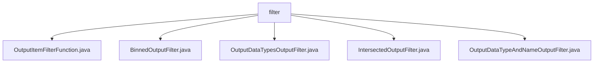

# 基础信息

|      |      |
|------|------|
| 名称 | filter |
| 编码语言 | .java |
| 代码路径 | WeFe/board/board-service/src/main/java/com/welab/wefe/board/service/component/base/filter |
| 包名 | docs.board.board-service.src.main.java.com.welab.wefe.board.service.component.base.filter |
| 概述说明 | OutputItemFilterFunction是函数式接口，用于过滤输出项。BinnedOutputFilter检查数据是否分箱。OutputDataTypesOutputFilter按数据类型过滤。IntersectedOutputFilter判断是否为交集数据。OutputDataTypeAndNameOutputFilter按类型和名称过滤。 |

# 说明

## 概述  
该模块核心职责是通过函数式接口OutputItemFilterFunction实现多种输出项过滤策略，类似事件总线模式。接口规范要求实现类必须包含apply方法，接收FlowGraphNode和OutputItem参数并返回布尔值。关键数据结构包括FlowGraphNode（流程图节点）、OutputItem（输出项）和IODataType（数据类型枚举）。外部依赖仅为Java标准库。例如BinnedOutputFilter通过分箱组件特征判断数据有效性。

## 主要业务场景  
模块提供五类典型过滤场景：分箱数据检测（BinnedOutputFilter）、数据类型匹配（OutputDataTypesOutputFilter）、交集数据识别（IntersectedOutputFilter）、复合条件过滤（OutputDataTypeAndNameOutputFilter）。业务流程均遵循"节点-输出项"校验模式，例如IntersectedOutputFilter通过组件继承关系判断数据来源。API集成案例包括静态方法调用（如intersected）和动态条件组合（如types列表匹配）。

### 包内部结构视图

该流程图展示了WeFe项目中filter目录下的文件结构关系。根节点为filter文件夹，其下包含5个Java类文件，分别实现不同的过滤功能：OutputItemFilterFunction处理输出项过滤，BinnedOutputFilter实现分箱输出过滤，OutputDataTypesOutputFilter处理输出数据类型过滤，IntersectedOutputFilter实现交集过滤，OutputDataTypeAndNameOutputFilter则同时处理数据类型和名称过滤。

# 文件列表

| 名称   | 类型  | 说明 |
|-------|------|-------------|
| [OutputItemFilterFunction.java](OutputItemFilterFunction.md) | file | 功能接口OutputItemFilterFunction，定义方法apply，接收FlowGraphNode和OutputItem参数，返回布尔值。 |
| [BinnedOutputFilter.java](BinnedOutputFilter.md) | file | BinnedOutputFilter类判断节点数据是否经过分箱处理，检查数据类型、对齐状态、节点类型及父节点或数据源是否为分箱类型。 |
| [OutputDataTypesOutputFilter.java](OutputDataTypesOutputFilter.md) | file | OutputDataTypesOutputFilter类实现OutputItemFilterFunction接口，根据指定数据类型过滤输出项。构造函数接收FlowGraph和数据类型列表，apply方法检查输出项数据类型是否匹配。 |
| [IntersectedOutputFilter.java](IntersectedOutputFilter.md) | file | IntersectedOutputFilter类用于判断输出项是否为交集数据。通过检查节点类型、父节点是否包含交集组件，以及数据源是否来自派生数据集来确定结果。若数据源为派生数据集，默认视为已对齐。 |
| [OutputDataTypeAndNameOutputFilter.java](OutputDataTypeAndNameOutputFilter.md) | file | OutputDataTypeAndNameOutputFilter类实现OutputItemFilterFunction接口，通过构造器接收数据类型和名称参数，apply方法检查输出项是否匹配指定类型和名称。 |

