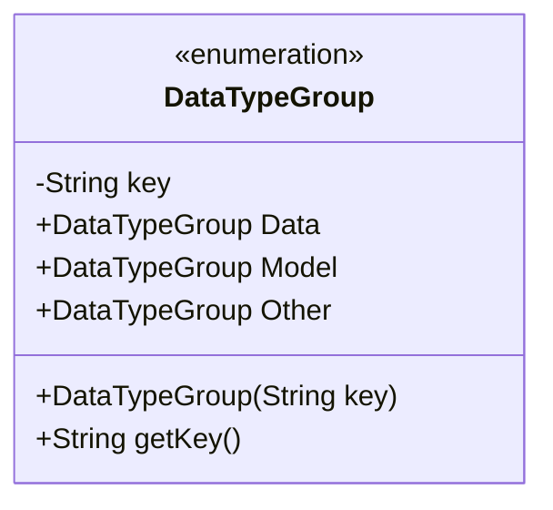
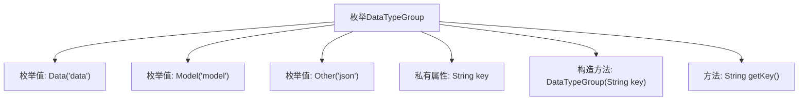

# 基础信息

|      |      |
|------|------|
| 名称 | DataTypeGroup |
| 编码语言 | .java |
| 代码路径 | WeFe/board/board-service/src/main/java/com/welab/wefe/board/service/component/base/io/DataTypeGroup.java |
| 包名 | com.welab.wefe.board.service.component.base.io |
| 依赖项 | [] |
| 概述说明 | 枚举DataTypeGroup定义了三种数据类型：Data（键为"data"）、Model（键为"model"）和Other（键为"json"），通过getKey()方法获取键值。 |

# 说明

这是一个名为DataTypeGroup的枚举类，定义了三种数据类型分组：Data、Model和Other。每个枚举值都有一个对应的字符串键值，Data对应"data"，Model对应"model"，Other对应"json"。枚举类包含一个私有构造方法用于初始化键值，以及一个公开的getKey方法用于获取键值。整个结构简洁明了，用于表示不同类型数据的分组标识。

# 类列表 Class Summary

| 名称   | 类型  | 说明 |
|-------|------|-------------|
| DataTypeGroup | enum | DataTypeGroup枚举定义了三种数据类型：Data（"data"）、Model（"model"）、Other（"json"），每个类型有对应的key值，可通过getKey()获取。 |

## 类 DataTypeGroup

|      |      |
|------|------|
| 访问范围 | public |
| 类型 | enum |
| 名称 | DataTypeGroup |
| 说明 | DataTypeGroup枚举定义了三种数据类型：Data（"data"）、Model（"model"）、Other（"json"），每个类型有对应的key值，可通过getKey()获取。 |

### UML类图

这段代码定义了一个枚举类DataTypeGroup，包含三个枚举常量：Data、Model和Other。每个枚举常量都有一个关联的字符串key，通过构造函数初始化并通过getKey()方法获取。枚举类用于表示不同类型的数据分组，其中Data对应"data"，Model对应"model"，Other对应"json"。这种设计适合需要固定类型集合且每个类型需要携带附加信息的场景。

### 内部方法调用关系图

该流程图展示了DataTypeGroup枚举的结构，包含三个枚举值(Data/Model/Other)、一个私有key属性和两个方法(构造方法和getKey)。枚举通过构造函数初始化key值，并通过getKey方法提供访问。这种设计模式常用于定义固定类型的常量集合，每个枚举实例都绑定特定字符串标识符。

### 字段列表 Field List

| 名称  | 类型  | 说明 |
|-------|-------|------|

### 方法列表

| 名称  | 类型  | 说明 |
|-------|-------|------|

