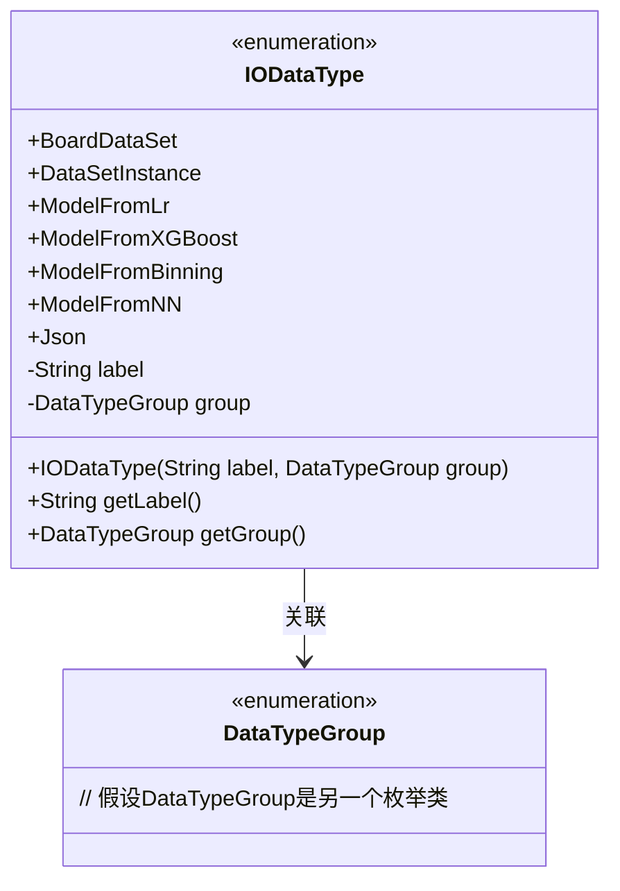

# 基础信息

|      |      |
|------|------|
| 名称 | IODataType |
| 编码语言 | .java |
| 代码路径 | WeFe/board/board-service/src/main/java/com/welab/wefe/board/service/component/base/io/IODataType.java |
| 包名 | com.welab.wefe.board.service.component.base.io |
| 依赖项 | [] |
| 概述说明 | 枚举IODataType定义了数据类型，包括原始数据集、加载数据集、逻辑回归模型、XGBoost模型、分箱模型、深度学习模型和Json结果，每个类型有标签和分组属性。 |

# 说明

该枚举定义了IODataType，包含多种数据类型，分为Data、Model和Other三类。具体类型包括原始数据集、加载后的数据集、逻辑回归模型、XGBoost模型、分箱模型、深度学习模型和Json结果。每个类型有对应的标签和所属分组，通过getLabel和getGroup方法可获取这些信息。

# 类列表 Class Summary

| 名称   | 类型  | 说明 |
|-------|------|-------------|
| IODataType | enum | 枚举IODataType定义了数据类型，包括原始数据集、加载数据集、逻辑回归模型、XGBoost模型、分箱模型、深度学习模型和Json结果，每个类型有标签和分组属性。 |

## 类 IODataType

|      |      |
|------|------|
| 访问范围 | public |
| 类型 | enum |
| 名称 | IODataType |
| 说明 | 枚举IODataType定义了数据类型，包括原始数据集、加载数据集、逻辑回归模型、XGBoost模型、分箱模型、深度学习模型和Json结果，每个类型有标签和分组属性。 |

### UML类图

该代码定义了一个枚举类IODataType，包含7个枚举常量，每个常量关联一个标签字符串和DataTypeGroup分组。类图展示了枚举结构、私有字段(label和group)、构造方法以及两个getter方法，并通过箭头表示与DataTypeGroup枚举的关联关系。该枚举用于分类标识不同类型的数据输入输出，如原始数据集、各类模型和JSON结果等。

### 内部方法调用关系图

```mermaid
graph TD
    A["枚举IODataType"]
    B["枚举值: BoardDataSet('原始数据集', DataTypeGroup.Data)"]
    C["枚举值: DataSetInstance('加载后的数据集', DataTypeGroup.Data)"]
    D["枚举值: ModelFromLr('逻辑回归模型', DataTypeGroup.Model)"]
    E["枚举值: ModelFromXGBoost('XGBoost模型', DataTypeGroup.Model)"]
    F["枚举值: ModelFromBinning('分箱后的模型', DataTypeGroup.Model)"]
    G["枚举值: ModelFromNN('深度学习模型', DataTypeGroup.Model)"]
    H["枚举值: Json('Json Result', DataTypeGroup.Other)"]
    I["属性: String label"]
    J["属性: DataTypeGroup group"]
    K["构造方法: IODataType(String label, DataTypeGroup group)"]
    L["方法: String getLabel()"]
    M["方法: DataTypeGroup getGroup()"]

    A --> B
    A --> C
    A --> D
    A --> E
    A --> F
    A --> G
    A --> H
    A --> I
    A --> J
    A --> K
    A --> L
    A --> M
```

该流程图展示了IODataType枚举的结构，包含8个枚举值、2个私有属性、1个构造方法和2个公共方法。每个枚举值通过构造方法初始化label和group属性，其中label描述数据类型名称，group表示所属分类（Data/Model/Other）。该设计用于统一管理不同数据类型的元信息，便于在IO操作中识别和处理不同类型的数据对象。

### 字段列表 Field List

| 名称  | 类型  | 说明 |
|-------|-------|------|

### 方法列表

| 名称  | 类型  | 说明 |
|-------|-------|------|

