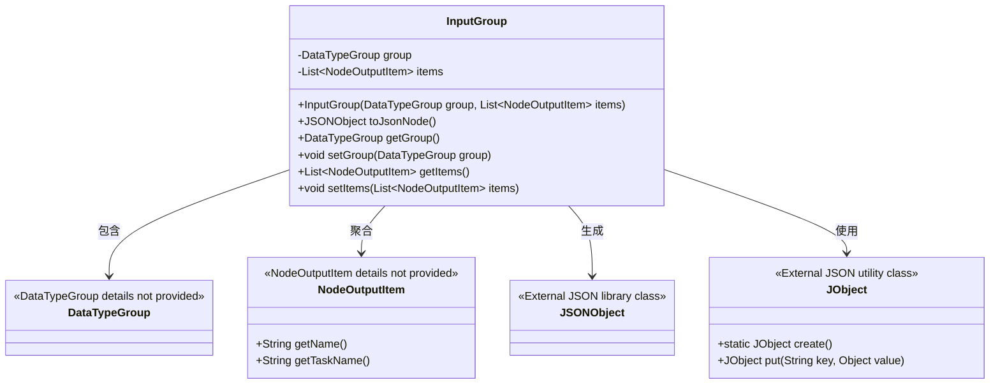
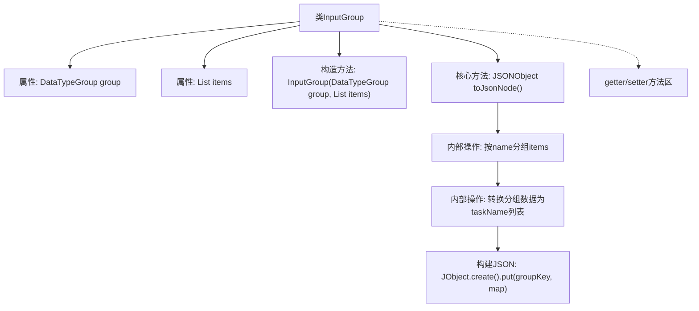

# 基础信息

|      |      |
|------|------|
| 名称 | InputGroup |
| 编码语言 | .java |
| 代码路径 | WeFe/board/board-service/src/main/java/com/welab/wefe/board/service/component/base/io/InputGroup.java |
| 包名 | com.welab.wefe.board.service.component.base.io |
| 依赖项 | ['com.alibaba.fastjson.JSONObject', 'com.welab.wefe.common.util.JObject', 'java.util.HashMap', 'java.util.List', 'java.util.Map', 'java.util.stream.Collectors'] |
| 概述说明 | InputGroup类包含DataTypeGroup和NodeOutputItem列表，提供toJsonNode方法将数据转换为内核所需的JSON结构，并包含getter/setter方法。 |

# 说明

InputGroup类是一个用于管理输入数据分组的Java类，包含DataTypeGroup类型的group属性和NodeOutputItem列表items属性。构造函数接收这两个参数进行初始化。核心方法toJsonNode将items按名称分组，并转换为包含任务名称列表的映射结构，最终封装为JSONObject返回。类还提供了group和items的getter/setter方法。整体功能是将输入数据组织为内核所需的结构化JSON格式。

# 类列表 Class Summary

| 名称   | 类型  | 说明 |
|-------|------|-------------|
| InputGroup | class | InputGroup类封装数据类型组和输出项列表，提供toJsonNode方法将数据按名称分组并转换为JSON格式，包含getter/setter方法。 |

## 类 InputGroup

|      |      |
|------|------|
| 访问范围 | public |
| 类型 | class |
| 名称 | InputGroup |
| 说明 | InputGroup类封装数据类型组和输出项列表，提供toJsonNode方法将数据按名称分组并转换为JSON格式，包含getter/setter方法。 |

### UML类图

这段类图展示了InputGroup的核心结构和关联关系。InputGroup作为数据转换器，包含DataTypeGroup枚举和NodeOutputItem列表，通过toJsonNode()方法将数据转换为JSON格式。它依赖DataTypeGroup确定数据分类，聚合多个NodeOutputItem对象收集输出数据，利用JObject工具构建JSON结构，最终返回JSONObject结果。该设计实现了数据分组、名称映射和JSON序列化的功能，适用于需要结构化输出到内核的场景。

### 内部方法调用关系图

该流程图展示了InputGroup类的完整结构，重点描述了toJsonNode()方法的处理流程。方法首先通过流式操作将items按名称分组，然后转换每个分组内的元素为任务名称列表，最后构建包含分组键和映射数据的JSON对象。类还包含标准的属性访问方法，整体设计实现了数据结构到JSON格式的高效转换，适用于内核处理场景。

### 字段列表 Field List

| 名称  | 类型  | 说明 |
|-------|-------|------|
| items | List<NodeOutputItem> | 私有节点输出项列表。 |
| group | DataTypeGroup | 私有数据类型组变量group。 |

### 方法列表

| 名称  | 类型  | 说明 |
|-------|-------|------|
| toJsonNode | JSONObject | 将items按名称分组，提取每组中的任务名列表，构建JSON对象并返回。 |
| getGroup | DataTypeGroup | 方法返回DataTypeGroup类型的group对象。 |
| setGroup | void | 设置数据类型组的公共方法，将输入参数赋值给类的成员变量group。 |
| getItems | List<NodeOutputItem> | 方法返回NodeOutputItem类型的列表items。 |
| setItems | void | 设置节点输出项列表。 |

